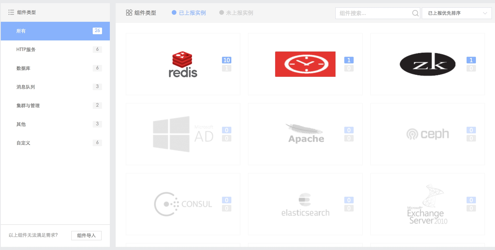

# 组件监控

蓝鲸监控支持对常见开源组件及商业中间件的性能指标监控，比如 Nginx 的每分钟客户端请求数(req_per_min)、等待中的连接数(waiting)等，或 Oracle 的并发等待时间(CONCURRENCY_WAIT_TIME)等，通过监控这些指标，防止出现进程状态存活，工作状态已经异常的情况。

图 1. 组件监控

图 2. Nginx 关键性能指标监控

图 3. Oracle 关键性能指标监控

蓝鲸监控除内置组件性能指标的采集能力，同时兼容 Prometheus Exporter 的导入及开发能力，用户通过自主开发采集器对接蓝鲸监控，可全面覆盖组件的采集能力。

>> 自定义开发组件采集器文档请参考：
>> - [蓝鲸体系开发指南 - 拓展开发 - 蓝鲸监控组件采集器开发文档](5.1/开发指南/扩展开发/monitor.md)
>> - [Prometheus Exporter 官方介绍](https://prometheus.io/docs/instrumenting/exporters/)
>> - [Prometheus Exporter 开发说明](https://prometheus.io/docs/instrumenting/writing_exporters/)
