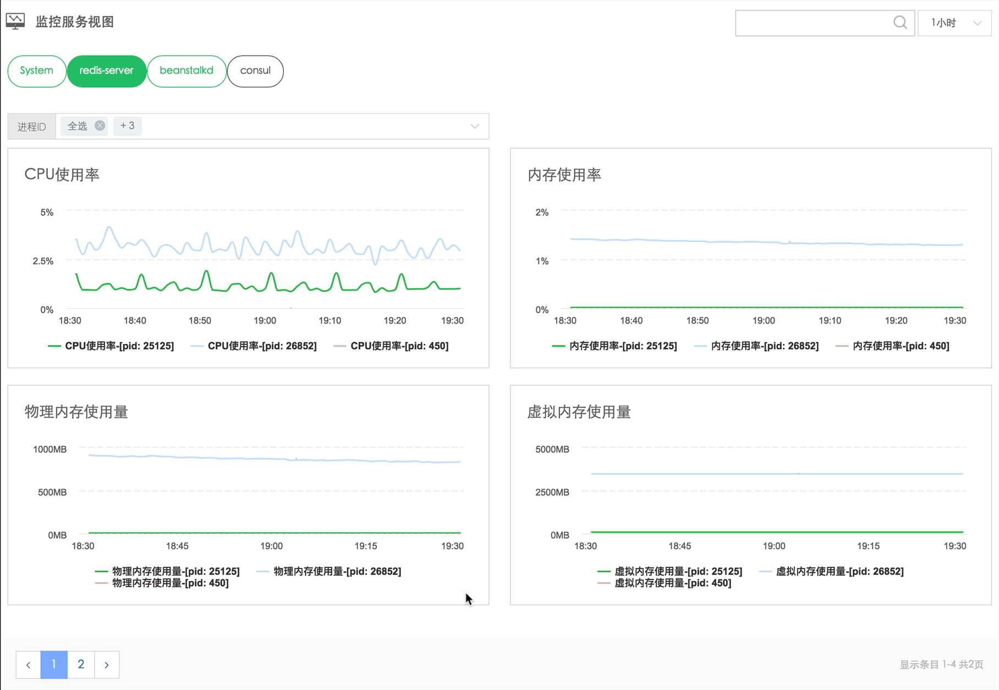

# 进程端口监控

蓝鲸监控会采集上报主机中 `应用程序` 的进程运行状态、端口监听状态、占用系统资源。配置进程监控的方法请参考 [快速入门文档](../快速入门/进程监控/process_monitor_front.md)。

> 同时适用于 `Linux` 和 `Windows`

图 1. 进程监控视图

## 监控指标说明

| 指标 | 单位 | 具体含义 | 备注 |
| --- | --- | --- | --- |
| Process.CPU | % | CPU 使用率 | 进程当前占用 CPU 的使用率 |
| Process.Mem | % | 内存使用率 | 进程当前占用内存的是使用率 |
| Process.FileDescriptor |  | 文件句柄数 |  lsof -p ${pid} 来获取单个进程占用的文件句柄数 |
| Process.RES | MB | 物理内存  |  任务已使用的物理内存大小 |
| Process.VIRT | MB |  虚拟内存 | 任务已使用的虚拟内存大小 |
