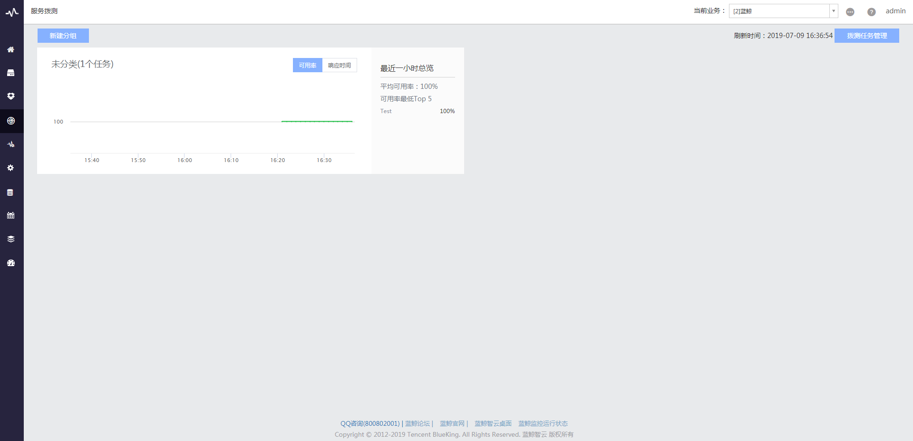
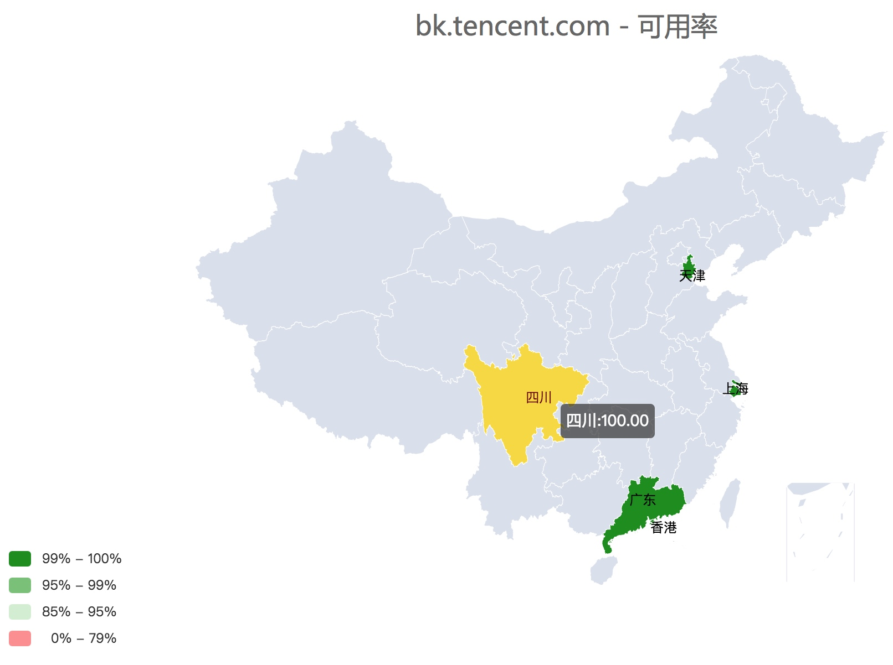
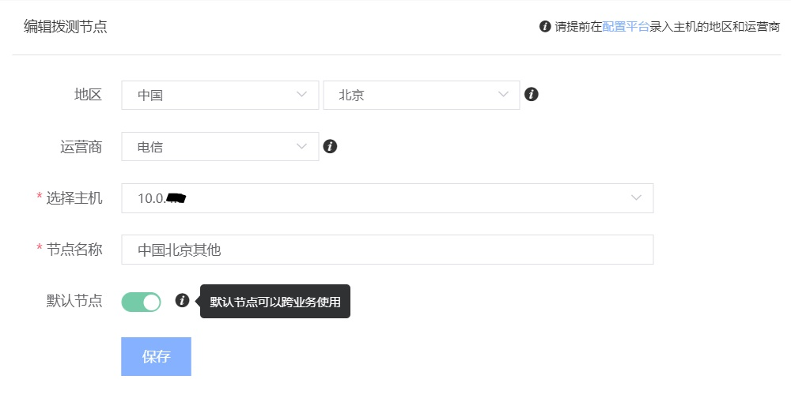

# 服务拨测

服务拨测是探测服务（应用）可用性的监控方式，通过拨测节点对目标服务进行周期性探测，主要通过`可用性`和`响应时间`来度量服务（应用）的状态。

服务拨测通过模拟用户的登陆/查询，实现**从被动投诉到主动发现的运维方式转变**，当前支持的拨测协议有 HTTP (包含 HTTPS ， GET 和 POST 方法）、 TCP 、 UDP 。

图 1. 服务拨测界面

图 2. 服务拨测可用率视图

图 3. 服务拨测响应时间视图

## 1. 支持自助管理节点

支持将部署了蓝鲸 Gse_Agent 的主机作为拨测节点，也可以在拨测节点管理对中节点进行删改。

图 4. 新增拨测节点

## 2. 支持内网服务探测

通过将部署 Gse_Agent 的主机作为拨测节点，实现对内网服务的探测。比如对公司 OA 网站可用性监测、后台模块间访问延迟监测。

## 3. 支持三种主流协议

支持 HTTP(S) 、 TCP 、 UDP 三种主流协议的探测

图 5. 新增拨测任务选择协议

## 4. 支持关联配置平台

关联配置平台，主机变动，自动维护拨测策略。

图 6. 关联配置平台新增拨测任务

## 5. 地图大屏展示

可适配大屏，满足展示需求。

图 7. 拨测可用率 大屏展示
