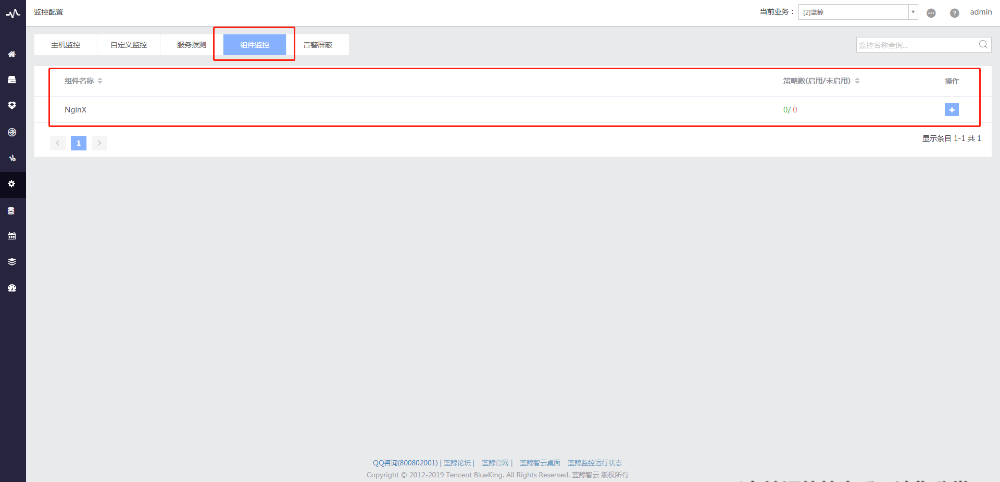

## 快速入门 - 组件监控

如何使用蓝鲸监控快速对开源组件、中间件服务进行监控，保障“业务中台”（待商榷）运行正常。

###  一. 前置步骤 {#host_monitor_front}

依赖组件：配置平台，管控平台，节点管理

 用户需要将受控主机导入配置平台并安装 Agent （超链配置平台快速入门），或通过节点管理直接在对应业务下安装 Agent 导入主机（超链节点管理快速入门），在组件监控配置完成后，Agent端提供的采集器会对主机进行持续规律的数据采集和上报。

### 二. 组件接入指引{#compoent_acsess}

蓝鲸监控目前覆盖 （Apache 、 Nginx 、Tomcat 、MySQL） 等开源组件、中间件服务的性能指标监控，具体配置请参照以下接入指引。

 
 图1. 接入指引

- 组件名称：
- 采集类型：说明该组件由什么采集器上报，采集器说明参考[文档]()
- 支持系统：支持该组件采集的系统类型
- 已验证版本：已验证的组件版本，若组件版本不一致，可能会导致采集异常或部分数据上报异常
- 组件接入指引：蓝鲸监控根据每个组件不同的数据和采集方式提供的接入说明

如果你使用的组件不在此列，或者是组件提供的接入提示说明不清晰/按说明无法成功接入，请联系蓝鲸助手QQ: [800802001](http://wpa.b.qq.com/cgi/wpa.php?ln=1&key=XzgwMDgwMjAwMV80NDMwOTZfODAwODAyMDAxXzJf) 反馈给蓝鲸监控团队。（文档中心反馈功能也可以接入这个反馈）

### 三. 组件采集上报 {#compoent_collect}

组件采集流程分为四步：

图2. 采集流程

以下以Nginx的性能指标采集为例：

3.1 准备环境及选择采集主机

大部分情况下需要组件支持和开启性能指标的访问方式，按照组件接入指引操作即可。

图3. 接入指引

3.2 填写采集参数

目标 IP 填入组件所在的主机 IP ，端口需要填写配置文件中配置 `/nginx_status` 的端口，探测 URI 默认即可。

图4. 配置组件采集参数

3.3 测试连通性

蓝鲸监控会根据填入的参数对目标主机下发采集器配置文件，启动采集器进行一次尝试性采集，并将采集结果展示到“详细信息”中，该步骤主要是为了检查采集器获取组件数据，上报回到蓝鲸监控的整个流程是否通畅正常，连通性检查通过后，用户通过“详细信息”中的上报结果可二次确认参数是否正确。如果该步骤中报错，请参考[常见问题]()解决。

图5. 测试连通性

3.4 启动采集器进程和保存配置

确认测试连通性成功，并且上报数据正确无误后，用户即可正式启动采集器进程，并且保存配置，保存成功说明采集上报成功，用户可以继续下一步：策略配置

图6. 启动采集器并保存配置

### 四. 视图 {#compoent_monitor_view}

待补充

### 五. 组件策略配置 {#compoent_monitor_config}

配置组件采集上报成功后，在监控配置 - 组件监控页面配置告警策略

图7. 配置组件告警策略

>> 注：成功配置采集上报的组件才会在此显示

每条策略可选择一个指标进行监控，如需监控同一个组件的多个指标，目前需要配置多条策略，其他具体配置规则可参考[主机监控告警策略说明]()

### 六. 查看告警 {#compoent_check_alarm}

待补充

组件出现告警后，可以在[故障自愈](http://docs.bk.tencent.com/product_white_paper/fta/)中配置组件监控的告警自动化处理方案。
