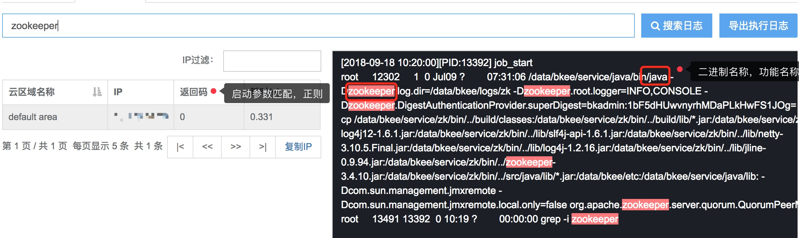

## 快速入门

以下入门指南文档包含监控对象的多类场景：网络层、主机层、组件层、服务拨测、自定义监控的快速接入，指南维度中包含采集、视图、策略配置、告警自动化处理这4个核心流程，此外还包含告警通知渠道等设置，用户通过阅读以下文档可以快速掌握蓝鲸监控基本功能的使用。
## 进程与端口监控

如何通过蓝鲸监控对主机内`应用程序`的进程状态、端口及资源占用进行监控。

方案：配置平台注册进程 → 自动下发采集配置 → 设定策略  → 产生告警 → 故障自愈

### 一. 前置步骤 {#process_monitor_front}

社区版V5.0及以上版本支持进程参数精确匹配及自动下发配置，社区版V5.0的用户请参考旧版[文档]()。

依赖组件：配置平台、管控平台、节点管理

- 需要进程监控的机器必须安装蓝鲸Agent
- Agent安装完成后，检查 Agent 端进程 processbeat 是否自动拉起，如果没有可先通过作业平台执行作业或者到后台手动拉起采集进程，采集失败原因可通过[常见问题文档]()排查。

```bash
# 通过作业平台或者在 Agent 端后台执行手动拉起操作
./usr/local/gse/plugins/bin/start.sh  processbeat
```

### 二. 配置平台注册进程 {#process_monitor_cmdb_config}

- 进程信息配置

  
  图1. 配置平台配置进程信息

  - 进程名称（必填）：对外显示的服务名，用户自定义，一般与进程实际服务名称对应，会在蓝鲸监控-主机监控-主机详情-进程服务中用于区分不同进程。

  - 功能名称（必填）：程序的二进制名称，比如 Kafka 的二进制是 java ，就填写 java 。

  - 启动参数匹配规则（非必填、重点）：实现精确匹配进程的重要规则，主要应用于如 Java 或 Python 等二进制名重复的进程， Agent 端采集器会通过该规则去识别进程 `cmdline` 符合参数的唯一进程。如果填入的参数不唯一就会识别到多个进程，如果进程二进制名本身唯一，可不填。

  - 绑定IP（非必填）：进程实际监听的 IP 地址，可不填，如果填必须是准确对应 IP的 地址，如 IP 错误，采集器会无法匹配进程导致数据上报异常。

  - 端口（非必填）：同“绑定IP”。

  - 协议（非必填）：同“绑定IP”。

- 多同名二进制进程时，通过作业平台后者后台校验参数是否唯一。

  
  图2. 作业平台检查进程 `cmdline ` 是否唯一 **截图待替换**

- 检查完唯一后，将进程绑定至主机所属模块下

  
  图3. 进程绑定模块

### 三. 自动下发采集器配置 {#process_monitor_distribution_config}

在配置平台上对进程的修改，会通过配置平台的事件推送功能自动下发至 Agent 上的 `/etc/gse/host/hostid` ，监控的进程端口采集器会捕获文件变化，做异常检测，并且将内容更新到采集器中，下发时间预计在2分钟内，页面进程端口更新信息在5分钟内。

配置平台事件推送说明：

  - 检查推送：gse_agentID 是否存在（推送人应为：migrate）

  

  - 修改进程管理信息后，该推送会在1分钟内将修改的配置推送到 Agent 端，因此每次修改完进程管理信息后，可到此处确认推送数是否有新增。

  - 到Agent端检查配置是否及时下发至正确目录：

    ```bash
    # Linux Agent 配置文件路径
    /var/lib/gse/host/hostid
    # Windows Agent 配置文件路径
    /gse/data/host/hostid
    # 检查文件内容，如果是 base64 编码，不可直接识别，说明推送异常，配置内容不符合进程管理页面的配置内容或者推送时间超过3分钟说明推送异常

    # 确认hostid更新正常后，切换到以下目录检查processbeat.conf是否跟随hostid更新配置内容
    # Linux
    /usr/local/gse/plugins/etc/processbeat.conf
    # Windows
    C:/gse/plugins/etc/processbeat.conf
    ```

### 四. 查看进程监控，配置告警策略 {#process_monitor_alarm_config}

查看进程监控

  - 确认processbeat进程配置更新后，在监控页面刷新页面，在主机监控页面-进程服务中查看进程端口资源上报是否正常

      - 进程：正常时标绿显示

      - 端口：点击进程，正常时标绿显示，端口不存在以红色显示，被占用则是黄色，灰色说明采集器未上报数据，需要按照数据未上报流程检查。

      - 资源/性能：正常时图表有连续不断的数据。

      - 检查进程是否精确匹配：
        - 如果是二进制为java或python的服务，检查进程端口资源是否只上报了配置的进程，如果配置的进程是唯一的，上报进程出现复数，说明精确匹配失败，需要确认匹配参数是否唯一。

- 配置告警策略：

在监控配置页，找到告警类型-进程端口，配置策略。策略配置流程参考[主机层监控]()文档。

  - 

  - 

### 五. 查看告警接入故障自愈 {#check_alarm_fta}

待补充
