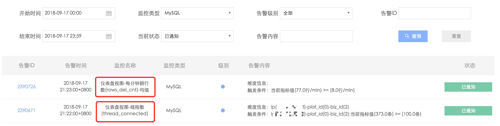
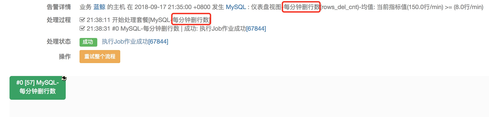
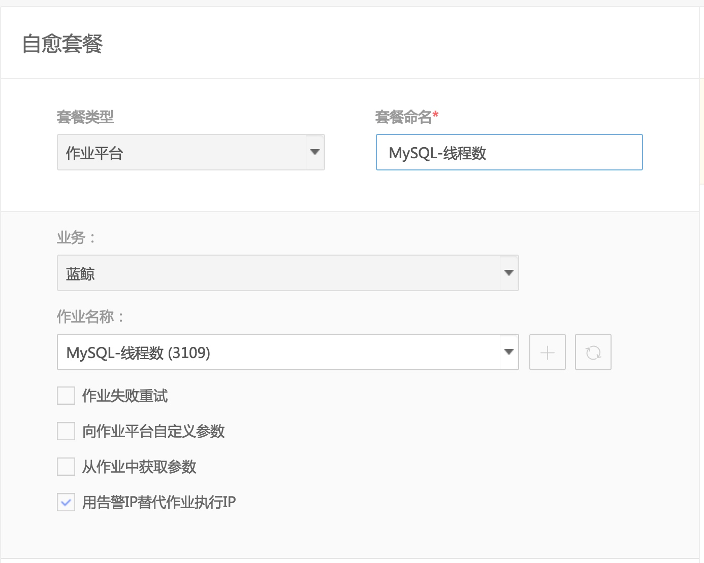
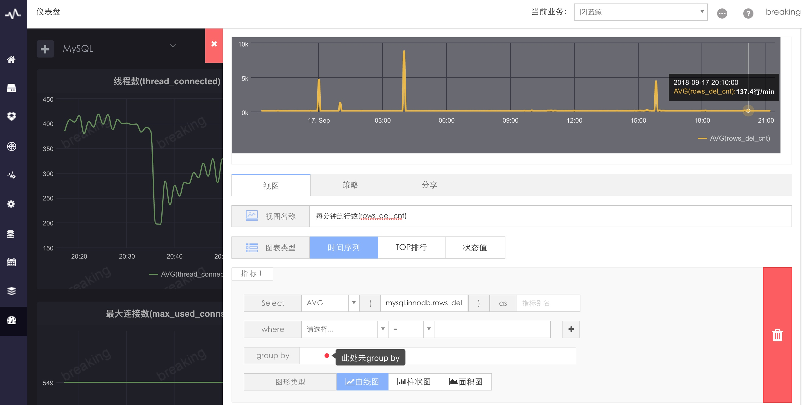

# 告警自动化处理
组件出现告警后，可以在 [故障自愈](5.1/FTA/Intro/README.md) 中配置组件监控的告警自动化处理方案。

## 1. 接入自愈

在故障自愈中接入自愈，告警类型选择 `[组件]MySQL`，通过`按内容筛选`功能区分不同的性能指标，在`自愈处理`中选择创建好的自愈套餐（一般你可以使用作业平台套餐，自己编写好作业）

> 此处以MySQL的2个关键性能指标(线程数、每分钟删行数)为例。

图1. 组件监控（MySQL:线程数）接入自愈示例

图2. 组件监控（MySQL:每分钟删行数）接入自愈示例

> 自愈场景的`按内容筛选`填写监控名称，从这里获取

图3. 获取组件监控的监控名称方法

## 2.自愈详情
可以看到，不同的监控项执行了对应的自愈套餐

图4. 组件监控（MySQL:线程数）接入自愈详情

图5. 组件监控（MySQL:每分钟删行数）接入自愈详情

## 3.注意事项

接入自愈选择`组件监控`的告警类型时，提示`蓝鲸监控的指标配置时维度包含IP、bk_cloud_id，否则在套餐中指定执行的IP`，意思是要确定故障自愈执行自愈套餐的执行IP。

## 3.1 蓝鲸监控传递执行IP

> 在指标配置时维度必须包含IP、bk_cloud_id，如此监控才能传递执行IP

在仪表盘配置视图时，group by 添加 `IP`、`bk_cloud_id`
F:\BlueKingDocsTest\5.1\FTA\Scenes\Solutions_Parameters.md
图6.仪表盘配置视图添加维度

在作业平台套餐中，默认勾选用`用告警IP替代作业执行IP`
 
图7. 在作业平台套餐中，默认勾选用`用告警IP替代作业执行IP`

## 3.2 套餐中指定执行IP
另一种场景是，求大盘均值，而不是单台服务器，则无法传递IP，则直接在套餐中固定IP。

在仪表盘中未指定group by

图8. 在仪表盘中未指定group by

在作业平台套餐中，取消勾选`用告警IP替代作业执行IP`

图9. 取消勾选作业平台套餐的`用告警IP替代作业执行IP`

在作业中固定执行主机

图10. 在作业中固定执行主机

## 4. 高级特性：向作业平台自定义传参

当A主机出现告警，可以在B主机上执行作业，并把A主机IP作为参数传给作业在B主机上执行，具体请访问 [套餐传入变量](5.1/FTA/Scenes/Solutions_Parameters.md)
