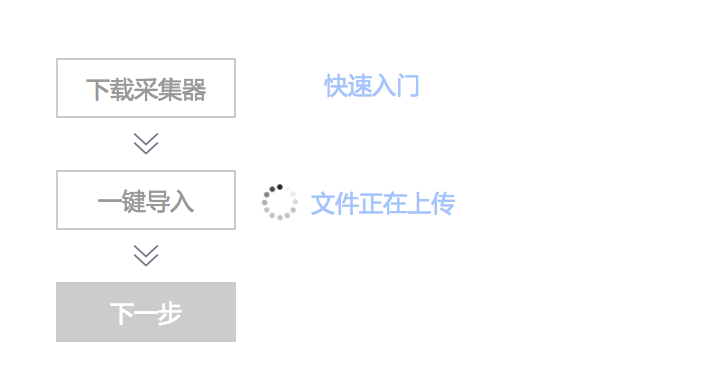
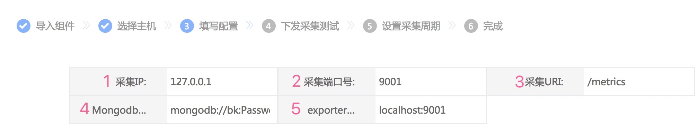
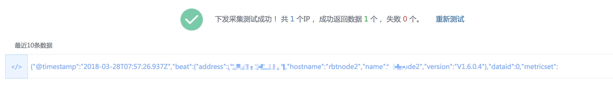
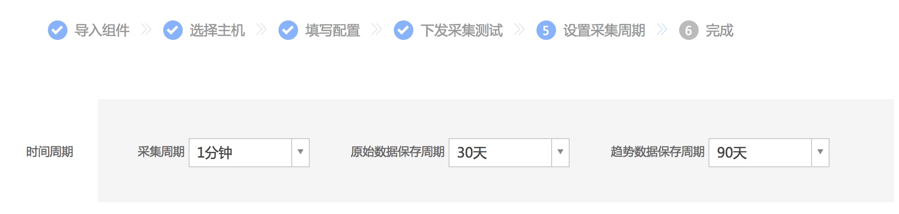
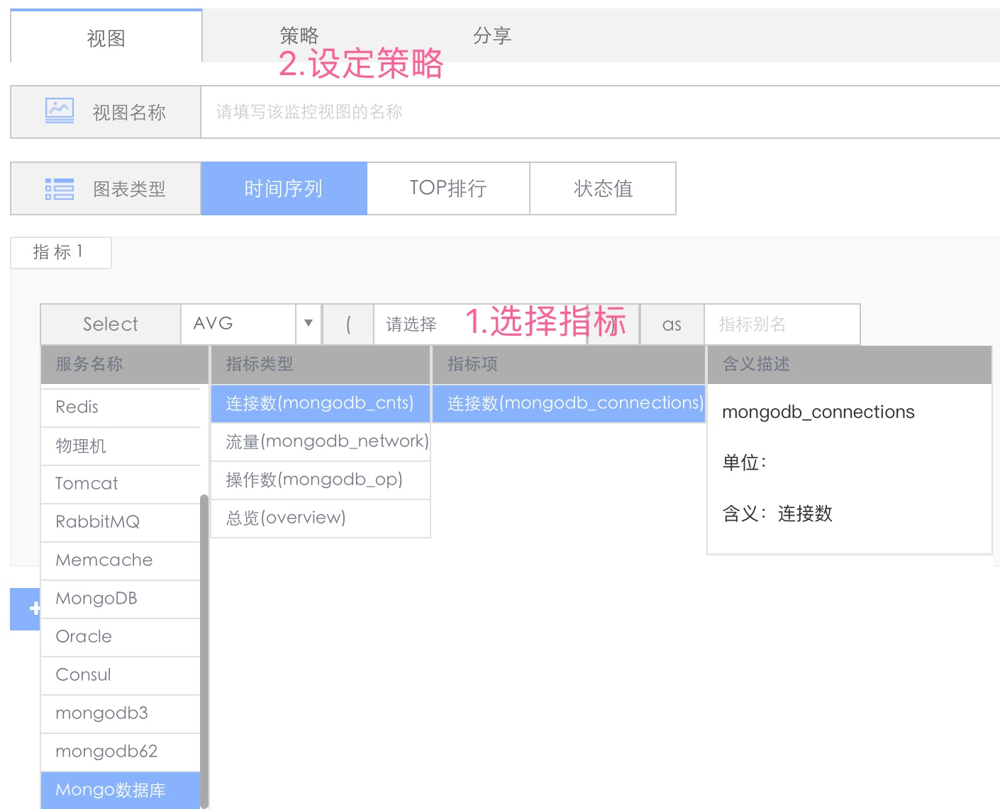

# 组件导入
兼容[Prometheus Exporter](https://prometheus.io/docs/instrumenting/exporters/)的导入能力，从 Github 获取源码编译二进制或直接获取 release，按照蓝鲸监控的组件导入规范，即可实现组件的一键导入、出图、监控及自动处理，同时你也可以将其分享至蓝鲸的[S-mart 市场](http://bk.tencent.com/s-mart/market)供行业伙伴使用，提升你的影响力。

## 1. 下载组件
从[S-mart 市场](http://bk.tencent.com/s-mart/market)下载组件采集器

接下来上传

## 2. 填写配置项

填写蓝鲸采集器获取 prometheus exporter metrics 的访问地址的参数（下图中 1、2、3） 和 exporter 启动的运行参数（下图中 4、5）

上述参数请在组件采集器对应的 [S-mart](http://bk.tencent.com/s-mart/market)说明中获取。

## 3. 采集测试

## 4. 设置采集周期

注： 趋势数据保存周期正在开发中.

## 5. 自动出图

## 6. 设定策略

在仪表盘中选中刚导入的组件名称，然后设定监控策略。

