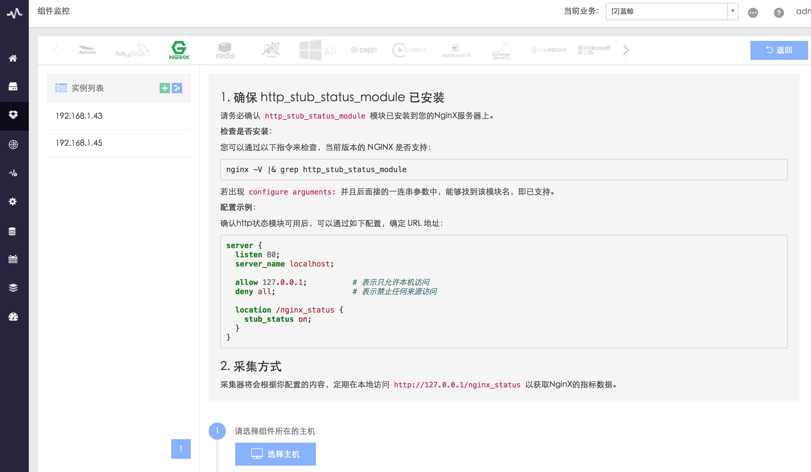

# 组件采集上报

组件采集流程分为四步：

图 2. 采集流程

以下以 Nginx 的性能指标采集为例：

3.1 准备环境及选择采集主机

大部分情况下需要组件支持和开启性能指标的访问方式，按照组件接入指引操作即可。

图 3. 接入指引

3.2 填写采集参数

目标 IP 填入组件所在的主机 IP ，端口需要填写配置文件中配置 `/nginx_status` 的端口，探测 URI 默认即可。

图 4. 配置组件采集参数

3.3 测试连通性

蓝鲸监控会根据填入的参数对目标主机下发采集器配置文件，启动采集器进行一次尝试性采集，并将采集结果展示到“详细信息”中，该步骤主要是为了检查采集器获取组件数据，上报回到蓝鲸监控的整个流程是否通畅正常，连通性检查通过后，用户通过“详细信息”中的上报结果可二次确认参数是否正确。如果该步骤中报错，请参考 [常见问题](5.1/常见问题/SaaS/bk_monitor.md) 解决。

图 5. 测试连通性

3.4 启动采集器进程和保存配置

确认测试连通性成功，并且上报数据正确无误后，用户即可正式启动采集器进程，并且保存配置，保存成功说明采集上报成功，用户可以继续下一步：策略配置

图 6. 启动采集器并保存配置
