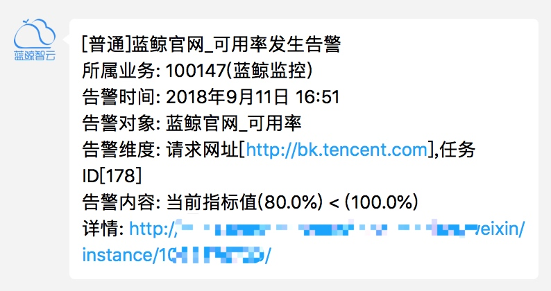
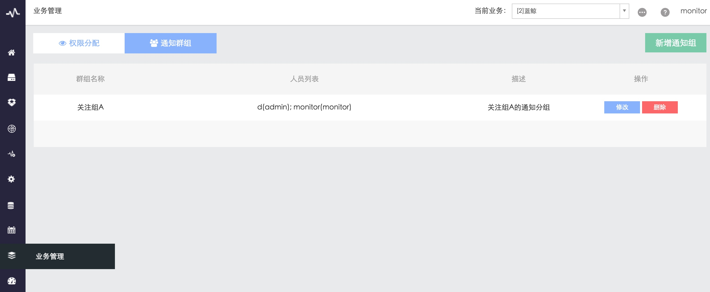

# 告警通知渠道

包含`告警通知渠道`配置 和 `接收人（通知群组）`设置

**告警通知渠道**

故障自愈是蓝鲸 PaaS 上一个 SaaS，通知渠道使用 PaaS 的通知 ESB 组件，在蓝鲸的独立部署版本（企业版、社区版）需要在开发者中心后台设置。

## 1. 在通知 ESB 组件中配置通知渠道

图 1. 蓝鲸集成平台（PaaS）的消息管理通知设置

详细设置请访问蓝鲸 PaaS 提供的设置文档

- [如何配置通知渠道，如邮件、微信、短信等?](5.1/PaaS平台/场景案例/noticeWay.md)
- [经验分享] 测试邮件服务是否正常](http://bk.tencent.com/s-mart/community/question/95#/)

## 2. 告警通知效果
通知渠道有 4 种：微信、电话、邮件、短信

图 2. 蓝鲸监控告警微信通知

图 3. 蓝鲸监控告警邮件通知

## 3. 接收人（通知群组）设置

除了从 CMDB 同步运维、测试、产品、开发外，还可以在监控中设立分组。

图 4. 添加通知群组

在配置策略的通知方式中可以找到刚添加的通知分组。

图 5. 选择通知方式

> CMDB 在新版中支持用户修改业务模型，支持新增角色，在后续的版本中监控会跟进。
