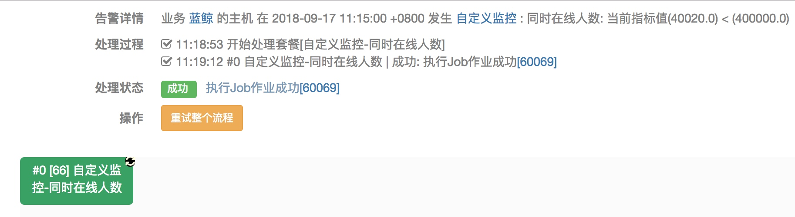
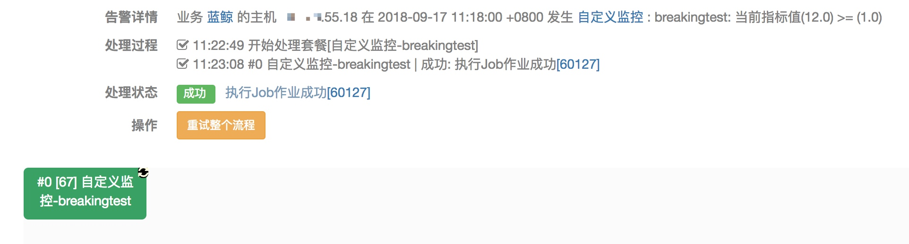

# 告警自动化处理

自定义监控出现告警，通过故障自愈可以实现告警自动化处理。

## 1. 接入自愈

在[故障自愈](http://docs.bk.tencent.com/product_white_paper/fta/)中接入自愈，告警类型选择 `自定义监控`，通过`按内容筛选`功能区分不同的自定义监控，在`自愈处理`中选择创建好的自愈套餐（一般你可以使用作业平台套餐，自己编写好作业）

> 此处以`同时在线人数`和`breakingtest`自定义监控接入自愈为例。

图 1. 自定义监控接入自愈示例 1

图 2. 自定义监控接入自愈示例 1

> 自愈场景的`按内容筛选`填写监控名称，从这里获取

图 3. 获取自定义监控的监控名称方法

## 2.自愈详情

可以看到，不同的监控项执行了对应的自愈套餐

图 4.自定义监控自愈详情 1

图 5.自定义监控自愈详情 2

## 3.注意事项

接入自愈选择`自定义监控`的告警类型时，提示`蓝鲸监控的指标配置时维度包含IP、bk_cloud_id，否则在套餐中指定执行的IP`，意思是确定故障自愈执行自愈套餐的执行 IP。

- 蓝鲸监控传递（在指标配置时维度必须包含 IP、bk_cloud_id，如此监控才能传递执行 IP）：图 5 是这种场景
    - 日志采集当前不支持跨云管理，所以默认将 bk_cloud_id（云区域 ID）传为 0

- 套餐中指定执行 IP：图 4 是这种场景

图 6. 套餐中执行执行 IP（取消勾选 `用告警IP替代作业执行IP`）
