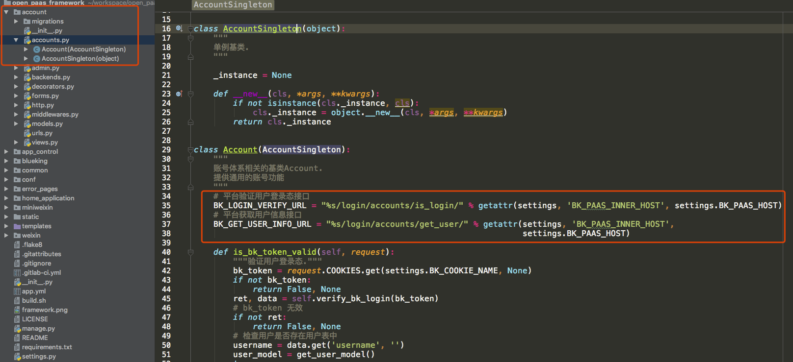

## 蓝鲸全站 HTTPS 改造方案

**思路**

1. `open_paas` nginx 配置 HTTPS。

2. 内部接口     统一走 HTTP。

3. 涉及前端跳转  统一走 HTTPS。

**运维同学关注 open_paas 部署相关**

### Nginx

申请得到 HTTPS 证书，并配置

以下实例仅供参考(测试环境使用)，具体生产配置请重新确认

```bash
# http 自动跳转 https
server {
        listen       xxxx:80;
        server_name  paas.bk.com;
        return 301 https://$server_name$request_uri;
}

server {
    listen       xxxx:443 ssl;
    server_name  paas.bk.com;

    access_log /data/bkce/logs/nginx/openpaas_access.log;
    error_log /data/bkce/logs/nginx/openpaas_error.log;

    client_max_body_size    512m;

    ssl on;
    ssl_certificate     /data/bkce/cert/bk_domain.cert;
    ssl_certificate_key /data/bkce/cert/bk_domain.key;
    ssl_protocols       TLSv1 TLSv1.1 TLSv1.2;
    ssl_ciphers         HIGH:!aNULL:!MD5;

    # ============================ paas ============================
    # PAAS_SERVICE HOST/PORT
    location / {
        proxy_pass http://SSL_OPEN_PAAS;
        proxy_pass_header Server;
        proxy_set_header X-Forwarded-For $proxy_add_x_forwarded_for;
        proxy_set_header X-Real-IP $remote_addr;
        proxy_set_header X-Scheme $scheme;
        proxy_set_header Host $http_host;
        proxy_redirect off;
        proxy_read_timeout 600;
    }
    .........
}
```

### open_paas 的部署

open_paas 的项目 paas/esb/login/console/appengine，增加了一个环境变量 `PAAS_INNER_DOMAIN`。

```python
PAAS_DOMAIN = '__PAAS_FQDN__:__PAAS_HTTPS_PORT__'
PAAS_INNER_DOMAIN = '__PAAS_HOST__:__PAAS_HTTP_PORT__'
```

需要确保

1. `PAAS_DOMAIN` 是外网地址，即到 `nginx` 的地址。

2. `PAAS_INNER_DOMAIN` 是内网地址，即到 `consul` 的地址。

此时，给到 `saas` 的环境变量都是`https`。

```python
BK_PAAS_HOST = "https://%s" % settings.PAAS_DOMAIN
BK_CC_HOST = "https://%s" % settings.HOST_CC
BK_JOB_HOST = 'https://%s' % settings.HOST_JOB

BK_PAAS_INNER_HOST = "http://%s" % settings.PAAS_INNER_DOMAIN
```

### 其他平台部署

需要提供，是的依赖方自行决定使用内部 or 外部域名。

- `PAAS_DOMAIN`  外部 https，nginx。

- `PAAS_INNER_DOMAIN` 内部 http，consul。

**SaaS 开发者关注 [开发框架](https://docs.bk.tencent.com/blueapps/) 改造**

#### conf/default.py

新增一个配置：conf/default.py 文件中大概 50 行处 `BK_PAAS_HOST = os.environ.get('BK_PAAS_HOST'，BK_PAAS_HOST)` 的后面添加

```python
BK_PAAS_INNER_HOST = os.environ.get('BK_PAAS_INNER_HOST',BK_PAAS_HOST)
```

此时，本地开发，没有 `BK_PAAS_INNER_HOST` 会走 `BK_PAAS_HOST`，走 `https` ; 在 PaaS 中部署，有这个环境变量，会走内网 `http`。


#### blueking/component/conf.py

blueking/component/conf.py 文件中大概 11 行处修改变量

组件调用， 将 `COMPONENT_SYSTEM_HOST` 修改为 `INNER_HOST`

```python
COMPONENT_SYSTEM_HOST = getattr(settings'BK_PAAS_INNER_HOST'settings.BK_PAAS_HOST)
```


#### account/accounts.py

account/accounts.py 文件中大概 34 行处修改变量，修改登录访问地址依赖  `BK_PAAS_INNER_HOST`

```python
BK_LOGIN_VERIFY_URL = "%s/login/accounts/is_login/" % getattr(settings,'BK_PAAS_INNER_HOST',settings.BK_PAAS_HOST)
BK_GET_USER_INFO_URL = "%s/login/accounts/get_user/" % getattr(settings,'BK_PAAS_INNER_HOST',settings.BK_PAAS_HOST)
```




### [ESB 调用方关注] API 网关用户 HTTPS 改造方案

API 网关 API 提供外部 HTTPS、内部 HTTP 两个协议，（内部表示与 API 网关部署在同一个环境，可使用同一个内部域名解析服务）。

#### 直接通过 URL 访问组件的情况

1. 通过 HTTPS 协议访问，使用 HTTPS 外部域名，Python 程序使用 reqeusts 包时，请求参数需添加 verify=False。

2. 通过 HTTP 协议访问，服务需要与 API 网关部署在同一环境，使用内部新域名即可，其他不需要变动。

注意：
1. 本地开发测试，需使用 HTTPS 协议。

2. 脚本等不确定服务器的场景，需使用 HTTPS 协议。

3. JOB、CC 等第三方系统，如果正式环境与 ESB 部署在同一环境，服务器可以解析内部域名，可以使用 HTTP 协议。


#### SaaS 使用组件 SDK 的情况

1. 检查 blueking/component/client.py BaseComponentClient.request 方法中，requests.request 包含 verify=False 参数。

```python
return requests.request(method,url,params=params,data=data,verify=False,headers=headers,**kwargs)
```


2. 配置更新(可选，以下配置，SaaS 正式环境会使用内部域名访问组件)。

```python
conf/default.py
BK_PAAS_INNER_HOST = os.environ.get('BK_PAAS_INNER_HOST',BK_PAAS_HOST)

blueking/component/conf.py
COMPONENT_SYSTEM_HOST = getatrr(settings,'BK_PAAS_INNER_HOST',settings.BK_PAAS_HOST)
```

3. 本地开发: 例如 saas/ 脚本，依赖线上服务地址，务必将依赖地址改成 `https`，否则 `nginx` 会自动将 `http` 转 301 至 `https`，参数信息会丢失，导致请求异常。


### [依赖登录关注] 其他登录系统

内部调用走 `PAAS_INNER_DOMAIN`(内部 consul 地址)，需要跳转(例如登录跳转)走`PAAS_DOMAIN`(因为是在用户浏览器上跳转的)。

- 配置  `PAAS_DOMAIN` 及 `PAAS_INNER_DOMAIN` 两个地址(需运营组给到替换变量)。

- 访问  `/login/accounts/is_login/`及`/login/accounts/get_user`及 ESB 等，走 `PAAS_INNER_DOMAIN`。

- 登录跳转走  `PAAS_DOMAIN`。
