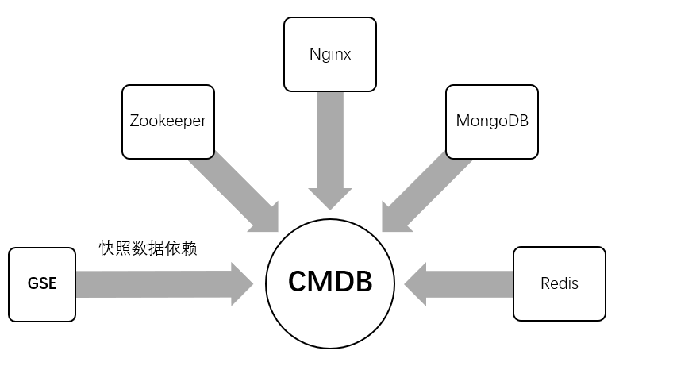

# 安装 CMDB

CMDB 是蓝鲸的配置平台，数据库采用 MongoDB ，服务发现和配置管理使用 ZooKeeper ，快照数据使用 Redis 存储，快照采集依赖 GSE。

CMDB 的架构可以参考 GitHub 上的 [蓝鲸智云配置平台的架构设计](https://github.com/Tencent/bk-cmdb/blob/master/docs/overview/architecture.md)

CMDB 依赖的组件和服务如下：



Github 上也有 CMDB 的安装说明，蓝鲸社区版集成时稍微做了些规范改造和安装自动化，需要了解为什么这样安装 MongoDB 的，可以阅读 [CMDB 部署文档](https://github.com/Tencent/bk-cmdb/blob/master/docs/overview/installation.md)。

## 安装 MongoDB

安装 CMDB 的依赖中， MongoDB 是最重要的存储依赖，且目前只有 CMDB 独享，故先介绍 MongoDB 的安装：

```bash
./bkcec install mongodb
./bkcec initdata mongodb
./bkcec start mongodb
```

详解：

1. MongoDB 二进制在蓝鲸的 `service/` 目录下已经自包含，所以安装时直接用 rsync 将 `src/service/mongodb` 目录同步到 `bkce/service/` 下即可。

2. MongoDB 的配置文件模板只有一个 mongodb.yaml ，里面具体配置的含义，请参考 [MongoDB 官方的配置说明文档](https://docs.mongodb.com/manual/reference/configuration-options/)

3. 初始化 MongoDB ：

    - 首先以不开启鉴权的方式启动 MongoDB ，并创建管理员 `sysadmin` 的角色，和 · 里定义的 `$MONGODB_USER` 用户，并配置为 `sysadmin` 角色。

    - 创建 `bk_cmdb` 用户，创建 CMDB 数据库，并授予 `bk_cmdb` 用户读写它的权限。

    - 关闭 MongoDB 进程。

4. 调用 `$INSTALL_PATH/service/mongodb/bin/mongodb.sh start` 启动 MongoDB。

## 安装 ZooKeeper

ZooKeeper 在这里的用途是作为 CMDB 的服务发现组件：

```bash
./bkcec install zk
./bkcec start zk
```

详解:

1. 拷贝 Java 和 ZooKeeper 代码目录到 `$INSTALL_PATH/service/` 下。

2. 渲染配置文件模板，主要是 `zoo.cfg` ，并创建软连接到 `$INSTALL_PATH/etc/zoo.cfg`。

3. 启动 ZooKeeper。

## 安装配置平台

需要特别注意的是 `CMDB` 先启动，再初始化数据：

```bash
./bkcec install cmdb
./bkcec start cmdb
./bkcec initdata cmdb
```

详解：

1. 安装配置平台
    - 安装依赖，从 `dependences.env` 里读取到 CMDB 依赖 Nginx。需要先 Yum 安装 nginx。

    - rsync 将 `src/cmdb`  拷贝到 `bkcec/` 下。

    - 创建一个名为 CMDB 的虚拟环境，给 `Supervisord` 使用。

    - 渲染 CMDB 模板文件。

    - 软连接 `bkcec/etc/nginx.conf` 到 `/etc/nginx/nginx.conf` 覆盖 Nginx 默认的配置。

    - 将 `globals.env` 里配置的 `CMDB_FQDN` 域名写入 `/etc/hosts`。


2. 启动配置平台

    - 需要等待 ZK 服务可用，通过 `dig +short zk.service.consul` 是否解析成功来判断。

    - 启动 Nginx ，如果 Nginx 进程已经启动，则执行 `reload`。

    - `workon cmdb; supervisord -c $INSTALL_PATH/etc/supervisor-cmdb-server.conf` 启动 CMDB 后台进程。

    - 启动 CMDB 后，cmdb_adminserver 会将所有进程的配置文件写入 ZK 节点内，其他进程启动时从 ZK 读取配置。

3. 初始化配置平台
    -  初始化 CMDB 前需要保证所有 CMDB 后台进程的端口均可用。如果不可用说明启动 CMDB 虽然进程 `RUNNING` ，但是端口未监听，此时可以尝试重启 CMDB 。

    - 调用 cmdb_adminserver 的 http 接口（/migrate/v3/migrate/community/0），来初始化 CMDB 。

## 安装管控平台

配置平台的快照数据，依赖蓝鲸组件 `GSE` 后台：

```bash
./bkcec install gse
./bkcec initdata gse
./bkcec start gse
```

详解：

1. 安装 GSE
    - 拷贝 GSE 后台， cert 目录 到 `$INSTALL_PATH/` 下。

    - 根据 `globals.env` 里是否自动获取外网 IP 配置，来设定 GSE 需要监听的 IP 地址。
    - 渲染配置模板。

    - 将 Agent ， Proxy ，和证书打包，并传到 Nginx 的 `miniweb` 下，供安装 Agent 时使用。

2. 初始化 GSE 的 ZK 默认配置。
3. 启动 GSE 后台进程。
