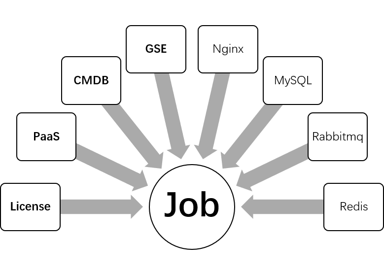

## 安装 JOB 作业平台

JOB 是蓝鲸的作业平台，它依赖管控平台的 GSE 和每台服务器上安装 GSE_Agent 才能工作。另外它也需要从配置平台读取业务权限和主机 IP 列表，所以要在安装 `CMDB` 成功后，再安装 JOB



JOB 依赖的开源组件 `MySQL` 、 `Redis` 、 `RabbitMQ` 、 `Nginx` ，其中只有 `RabbitMQ` 还未安装。

### 安装 RabbitMQ

RabbitMQ 除了 JOB 使用，在蓝鲸社区版中，用到了 Celery 组件的 SaaS 和后台也依赖，SaaS 上下架所用到的 Paas_Agent 组件依赖 RabbitMQ 的 management 插件功能。这个功能在 rabbitmq 3.0 以上才支持，所以 通过 YUM 安装 RabbitMQ 时确保版本在 3.0 以上。

```bash
./bkcec install rabbitmq
./bkcec initdata rabbitmq
```

详解：

1. 安装 RabbitMQ-Server
    - `yum install rabbitmq-server` 安装 RabbitMQ 前需要安装 Erlang，如果配置好 Yum 源，可以自动安装依赖。

    - 安装 RabbitMQ 后，系统会自动创建 RabbitMQ 用户，蓝鲸社区版里会将 RabbitMQ 默认的目录配置到 $INSTALL_PATH 下，所以需要创建这些目录，并授权：

    ```bash
    install -d -o rabbitmq -g rabbitmq $INSTALL_PATH/etc/rabbitmq
    install -d -o rabbitmq -g rabbitmq $INSTALL_PATH/public/rabbitmq
    install -d -o rabbitmq -g rabbitmq $INSTALL_PATH/public/rabbitmq/mnesia
    install -d -o rabbitmq -g rabbitmq $INSTALL_PATH/logs/rabbitmq
    ```

    - 生成 RabbitMQ 的配置

    ```bash
    render_cfg_templates service "*#rabbitmq#*"
    echo '[rabbitmq_management，rabbitmq_management_agent].' >$INSTALL_PATH/etc/rabbitmq/enabled_plugins
    ```

2. 启动 RabbitMQ

  ```bash
  systemdctl start rabbitmq-server
  ```

3. 初始化 RabbitMQ，会添加账户，vhost，设置权限，具体内容，请参考 `initdata_rabbitmq` 函数

### 安装作业平台

开始安装作业平台

```bash
./bkcec install job
./bkcec initdata job
./bkcec start job
```

详解：

1. 安装作业平台（install_job 函数）

    - 安装 Java 依赖。

    - 拷贝 JOB 工程代码。

    - 添加 hosts。

    - 渲染配置模板。

    - 转换 JOB 和 GSE 通信用的公钥和密钥格式（gen_job_cert）。

2. 启动作业平台

  ```bash
  $INSTALL_PATH/job/job/bin/job.sh start
  ```

3. 初始化作业平台，导入 SQL 文件

### 安装 gse_agent

在蓝鲸后台自身所在主机（install.config 中配置的 IP ），安装上 GSE_Agent。

```bash
./bkcec install gse_agent
```
