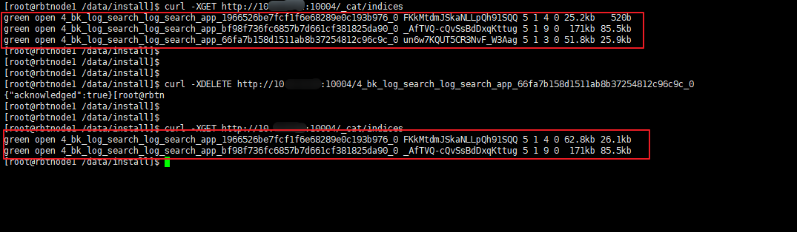

# 蓝鲸日常维护

## 磁盘清理

可能产生比较大数据量的目录有：

- /data/bkce/logs

- /data/bkce/public

- /data/bkce/service

logs 目录可以按需设置自动清理 N 天前的日志。

public 目录一般不能手动删除，一般比较大的组件可能有

- MySQL 数据库太大

- Kafka 数据

- Elasticsearch 数据

## MySQL 日志清理
> MySQL中的 binlog 日志记录了数据库中数据的变动，便于对数据的基于时间点和基于位置的恢复，但是 binlog 也会日渐增大，占用很大的磁盘空间，因此，要对 binlog 使用正确安全的方法清理掉一部分没用的日志。

**注意：** 下述方法仅供参考，具体以实际生产环境情况进行调整。

**手动清理 binlog**

若社区版设置了多台 MySQL，需查看主库和从库正在使用的 binlog 是哪个文件

    ```bash
        MySQL [(none)]> show master status\G
    *************************** 1. row ***************************
                File: mysql-bin.000006
            Position: 97013298
        Binlog_Do_DB:
    Binlog_Ignore_DB:
    1 row in set (0.00 sec)

    MySQL [(none)]> show slave status\G
    Empty set (0.00 sec)
    ```
删除 binlog 日志之前，对 binlog 进行备份。

清理方法一：删除指定日期以前的日志索引中binlog日志文件
    ```bash
    purge master logs before '201x-xx-xx 17:20:00';
    ```

清理方法二：删除指定日志文件的日志索引中binlog日志文件
    ```bash
    purge master logs to'mysql-bin.00000x';
    ```

**注意：**

- 时间和文件名一定不可以写错，尤其是时间中的年和文件名中的序号，以防不小心将正在使用的 binlog 删除。

- 切勿删除正在使用的 binlog。

- 使用该语法，会将对应的文件和 mysql-bin.index 中的对应路径删除。

**自动清理 binlog 日志**

使用如下方法查询当前 binlog 的过期时间，若为 0 表示不过期。

```bash
mysql> show variables like 'expire_logs_days';
+------------------+-------+
| Variable_name    | Value |
+------------------+-------+
| expire_logs_days |   0   |
+------------------+-------+
```
使用如下方法设置 binlog 过期时间，设置 30 表示 30 天后自动清理之前的过期日志。该方法只是临时启用，重启 MySQL 服务之后则失效。永久生效则需将参数添加至 MySQL 配置文件。

```bash
mysql> set global expire_logs_days = 30;
```
## Kafka 日志清理
> Kafka 将数据持久化到了硬盘上，允许配置一定的策略对数据清理，清理的策略有两个，删除和压缩。
**注意：** 下面清理策略，请根据实际业务，服务器状况，及需求来定制。

**方法一：** 调整配置文件
```bash
# 配置文件位置
/data/bkce/service/kafka/config/server.properties

# 可以增加 log.cleanup.policy 这个数据清理方式设置，此行为为删除动作
log.cleanup.policy=delete

# 下面有 2 种方式，保留时间或大小，请自行根据实际情况调整此处设置，1G 为 1073741824 。具体保留大小根据实际情况设置
# 注意：下面为直接删除，删除后的消息不可恢复
log.retention.hours=168（超过指定时间168小时后，删除旧的消息）
log.retention.bytes=10737418240（超过指定大小 10G 后，删除旧的消息）

```
设置完毕后，重启服务来生效。

**方法二：** Kafka 设置 Topic 过期时间

```bash
# 设置过期时间，只能用毫秒（retention.ms），或者 bytes（retention.bytes）

$ /data/bkce/service/kafka/bin/kafka-topics.sh --zookeeper zk.service.consul:2181/common_kafka --topic snapshot2 --alter --config retention.ms=17280000
$ WARNING: Altering topic configuration from this script has been deprecated and may be removed in future releases.
          Going forward, please use kafka-configs.sh for this functionality
$ updated config for topic "snapshot2"

```

## Elasticsearch 日志清理
- 查看目前所有的索引
    ```bash
    source /data/install/utils.fc  
    curl -s "http://$ES_IP:$ES_REST_PORT/_cat/indices"
    ```

- 删除索引
  ```bash
  # index_name 是索引名称
    curl -XDELETE http://$ES_IP:$ES_REST_PORT/index_name
  ```
    
