## 产品功能 {#Function}

蓝鲸配置平台提供了全新自定义 CI 管理，用户不仅可以方便地实现内置 CI 属性的拓展，同时也能够根据不同的企业需求动态新增 CI 和关联关系。除此之外，主机数据快照、自动发现、变更事件主动推送等功能增强了 CMDB 的联动能力，提升配置录入的效率和配置信息的准确性。在技术构建上，架构的核心聚焦于资源，把 CMDB 管理的原子资源分为主机、进程和通用对象三种类型，并构建了对这些资源的原子操作层。在原子操作之上，配置平台又构建了更贴近用户操作的场景层，场景层通过对不同资源的组合操作来完成用户的请求。

蓝鲸配置平台并非只是资产管理和统计，还无缝对接到蓝鲸自动化运维体系，覆盖进程配置管理、作业执行、任务调度编排、日志检索分析、监控告警、故障自愈等多样化运维场景。

### 功能列表 {#function_list}

<table><tbody>
<tr><td>	特性	</td><td>	子特性	</td><td>	功能描述	</td></tr>
<tr><td rowspan="2" >	基础资源
</td><td>	业务	</td><td>	支持对业务的新建、归档及还原。	</td></tr>
<tr><td>	主机	</td><td>	核心功能包含主机的录入、分配到业务、删除主机等。 </td></tr>
<tr><td rowspan="5" >	业务资源
<tr><td>	业务主机	</td><td>	将主机从业务空闲池分配到具体的业务模块中，以进行合理的资源管理。</td></tr>
<tr><td>	业务拓扑	</td><td>	业务拓扑是对部署结构的一种抽象表示，是配置平台进行主机管理的基础，提供用户结构自定义、拓扑属性自定义等功能。默认的业务拓扑由业务、集群、模块三层构建而成，而集群/模块是基于拓扑管理的基础上的进一步细化，支持单一集群、模块维度的管理，同时提供了批量修改，集群克隆等功能。	</td></tr>
<tr><td>	进程管理	</td><td>	帮助业务管理进程端口等基础信息，支持新增业务进程和绑定进程到模块等。</td></tr>
<tr><td>	动态分组	</td><td>	当业务下的拓扑结构过于复杂的时候，可以通过动态分组功能，定义常用的查询条件，支持动态分组列表查看和新增动态分组等。	</td></tr>
<tr><td rowspan="1" >	审计与分析
</td><td>	操作审计	</td><td>	所有用户在配置平台上的操作，都有对应的记录可以追溯，用户可以在操作审计菜单项下查看历史操作信息。	</td></tr>
<tr><td rowspan="2" >	权限控制	
</td><td>	业务权限管理	</td><td>	支持业务的主要负责人对业务下所有集群、模块、主机等的管理。	</td></tr>
<tr><td>	系统权限管理	</td><td>	支持管理员对于和业务没有直接关系的功能，如系统功能、普通自定义实例，以 “角色+权限” 方式设定权限。	</td></tr>
<tr><td rowspan="5" >	模型管理
</td><td>	模型	</td><td>	配置平台内置的模型有业务、集群、模块、主机、进程、云区域，此外还可以通过自定义新增模型。 支持现有模型查看、模型分组、模型创建、模型编辑、模型字段唯一校验、模型字段分组、模型删除、模型从停用恢复、模型字段导出和导入等。</td></tr>
<tr><td>	模型拓扑	</td><td>	模型拓扑是支持用户可视化查看当前模型关系的拓扑视图，并进行简单管理的功能，支持创建模型之间关联、删除模型之间关联、模型从拓扑视图移除等。	</td></tr>
<tr><td>	业务模型	</td><td>	配置平台默认的主线业务拓扑只有 “业务-集群-模块-主机“ 四层，系统支持新增自定义层级，最多可以新增 3 个拓扑层级。	</td></tr>
<tr><td>	关联类型	</td><td>
关联类型指两个模型之间的关联定义。只有定义了关联类型，才能够创建对应的数据实例之间的关系。支持新增关联类型、创建模型关联、编辑模型关联等。	</td></tr>
<tr><td>	事件推送	</td><td>	事件推送功能能够实现当配置信息发生变化的时候，实时通知到关联的系统中，目前支持 HTTP 的推送方式。支持创建事件推送和事件推送状态查询等。	</td></tr>
<tr><td>	我的收藏	</td><td>		</td><td>	查看在首页收藏常用的资源。	</td></tr>
</tbody></table>


### 首页{#Home}
如图，红色横向框展示的是对上一次登陆功能使用记录的展示，以及最下方主机管理功能、模型功能的直观展示，可以直接进入到该模型查询数据，省去了需要在左侧功能栏才能进入到对应的功能查看数据的繁琐步骤。也可以对某个功能进行收藏(红色竖向框)。

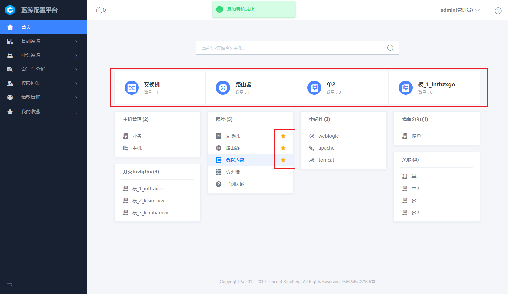


### 基础资源{#Resource}

基础资源包含业务和主机。业务是蓝鲸配置平台的基础对象，可以定义业务角色分工（如产品、测试、开发、运维）、业务的生命周期等。主机管理是配置平台的核心功能，主要具备几点功能点：拓扑维度的主机概况展示、便捷的主机筛选、丰富的增值功能和主机属性自定义展示。


#### 业务 {#Buz}

在作业平台、监控、标准运维等系统中，均以已有 `业务` 为基础进行运作。
业务是蓝鲸持续部署环节比较重要的概念，主要用于资源和配置隔离，在配置平台创建的业务，默认同时应用于作业平台、标准运维、蓝鲸监控、故障自愈等场景。


用户在有权限的基础上对业务进行管理，包含查看业务列表，新建、归档及还原等操作。

新建一个业务，包含：

- 选择业务拓扑类型，包含三级拓扑和二级拓扑。

- 填写新建业务的基础信息，包含业务名称，产品人员，业务运维等字段。


单一业务的修改，可修改的字段包括业务名称，运维人员以及自定义属性。一个及一个以上的业务同时修改您指定的字段属性。其中属性名列的修改字段是可以指定的。

#### 主机 {#Engine}

为了标准化管理和提高主机资源利用率，设计了资源池模式，所有主机需要统一先录入到主机资源池中，然后再分配至具体的业务下的空闲机池，同时也可以删除不需要的主机。核心功能包含主机的录入、分配到业务、删除主机等。


目前在配置平台导入主机分以下两种，一种是 `Excel 批量导入`。另一种是通过 `节点管理` 进行导入。

- **方法 1：通过 Excel 批量导入**

当主机在直连区域（蓝鲸中控环境可以直接访问区域）时，可以使用此方法。

- **方法 2：节点管理进行导入**

切换到自动导入的 Tab 页，通过点击跳转到链接可以打开 "Agent 安装" 应用，根据节点管理对 Agent 的安装流程，相关主机信息会自动同步到配置平台对应业务下的资源池中。


**主机删除** 选中目标主机以后，点击 【删除】 按钮可以删除不需要的主机，需要注意的是主机被删除以后，不可以还原，请谨慎操作。


### 业务资源 {#BuzResource}

业务资源是集合了对业务层管理的使用功能，包含业务主机、业务拓扑、进程管理、动态分组 4 个功能板块。实现业务的精细划分以及拓扑直观展示。


#### 业务主机 {#BuzEngine}

默认从主机资源池分配到业务的主机会放到 "空闲机" 模块下，我们需要分配到具体的业务模块中，以进行合理的资源管理。

#### 业务拓扑  {#BuzTopology}

业务拓扑是对部署结构的一种抽象表示，是配置平台进行主机管理的基础，在业务架构以及类型越来越复杂的今天，只有建立合适的业务模型，才能结构化的管理好主机。配置平台提供用户结构自定义、拓扑属性自定义等功能。

a.	拓扑结构自定义，配置平台支持用户定义 `业务-集群-模块` 此种三级的数据结构或者业务-模块这类两级数据结构，用户可以针对不同的场景选择性的建立适合于自己业务的结构。


b.	集群、模块属性自定义，配置平台中集群、模块的属性除名称、负责人等标准属性外还提供自定义属性管理，用户可以通过各种自定属性的使用，进一步从各种维度对主机进行分类管理。


主机管理是配置平台的核心功能，在保留传统的列表管理同时还能结合拓扑进行跨云管理。主要具备以下功能点：

a.	拓扑维度的主机概况展示，通过页面左边的拓扑树能展示主机在各集群和模块下的分布情况。

b.	跨云管理主机，在配置平台可以便捷的管理不同云下的主机，不会受内网 IP 冲突等影响。

c.	便捷的主机筛选，用户可以在配置平台通过各种自己想要的条件过滤主机。

d.	丰富的增值功能，配置平台提供表格导出、实时数据查看、主机模块变更等供协助用户更好的管理主机。

e.	主机属性自定义展示，在主机管理页面用户可以选择性的展示自己需要的主机字段，同时用户可以导入配置平台不提供的一些主机字段。

f.	实时数据展示，在主机详情页面会展示主机详情、系统状态、计划任务、Hosts 文件、路由信息等主机快照数据。


**动态拓展的业务层级** 不同企业中的业务层级、名称、管理属性都有差异，动态拓展的业务层级让业务的管理更贴合习惯。

配置平台初始化以后，默认会创建名为 "蓝鲸" 的业务，需要注意的是，蓝鲸业务并非是示例业务，在部署都会依赖此配置，在配置平台中已经限制了对此业务的拓扑修改，用户在修改此业务下主机、进程等配置时候，需要充分理解蓝鲸的部署逻辑。否则可能会导致整体平台出现异常。


- 查看蓝鲸业务拓扑，可以通过点击导航 "业务资源 - 业务拓扑" ，左上角业务选择框中选择 "蓝鲸" 业务，可以看到下方展示了整个蓝鲸的部署拓扑。


#### 进程管理  {#ProcessManagement}

模块被定义为一组强相关进程的集合，"进程管理" 功能可以帮助业务管理进程端口等基础信息，比较典型的应用场景有蓝鲸的监控系统对进程进行监控。

一个模块下的服务器通常执行的是同一个功能，由一个或者多个业务进程构成，"进程管理" 功能可以帮助业务管理进程以及其端口、进程和模块的绑定关系。在监控系统中也会用到此特性。

a.	新建进程，创建一个进程，支持三种模式
- 没有监听端口的进程
- 监听一个端口的进程
- 监听多个端口的进程

b.	在新增进程的高级属性下，可以保存进程更加详细的信息，包含：启动命令，停止命令，重启命令，自动拉起选项等。需要注意的是，配置平台只是作为进程端口信息的存储，在蓝鲸监控系统或者用户自定义的应用中实现具体功能。

c.	进程绑定模块，新增了一个自定义进程以后，可以通过 "绑定" 功能，把进程绑定到之前定义的业务模块上。在真实运营场景中，其他系统通过查询模块下的主机，可以最终得到哪些主机上运行了哪些进程。


**（1）新增业务进程**

通过左侧导航打开 "业务资源 - 进程管理" 功能页，点击 【新建】按钮。

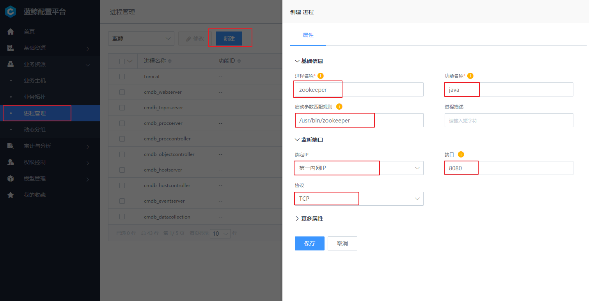

进程相关的重要名词解释：

**进程名称**：进程的唯一标识，便于用户区分出业务下不同的进程，名称需要保证业务下唯一。

**功能名称**：程序的二进制名称，比如 Zookeeper 的二进制名称是 java，则填写 java。

**进程描述**：对于进程的进一步详细描述，也可以理解为此进程的备注信息。

**端口**：当进程启动会监听端口时，可以根据进程实际情况填写端口信息，填写规则有：

1. 单个进程填写 `80`；
2. 多个进程填写 `80，90`，表示进程监听了 80，90 两个端口，以逗号隔开；
3. 多个连续进程填写 `80-90`，表示进程监听了 80，81，82...89，90 一共 11 个端口；
4. 混合包含连续和不连续端口填写 "80，90-92"，表示监听了80，90，91，92一共 4 个端口；

**协议**：所监听端口的使用的协议，当前支持配置 TCP，UPD 两种协议。

**绑定 IP**： 所监听端口绑定在哪个 IP 下，可选项有 0.0.0.0、127.0.0.1、第一内网（ "内网IP" 字段记录的 IP）、第一外网（ "外网IP" 字段记录的 IP）。

此外，更多属性分组里可以配置进程的更多信息，如功能 ID、工作路径、启动命令、启动用户等，因对应的进程管理 SaaS 尚未内置到蓝鲸中，用户可选配置。

**（2）绑定进程到模块**

在配置平台设计中，主机资源一定属于某个业务模块，进程通过绑定到模块，可以很方便的批量把进程信息配置到主机之上。通过主机和进程的关系，进而实现主机上进程监控或者对进程进行启停等管理。

点击一个已经创建好的进程，切换到模块绑定 Tab 标签，点击目标模块后方的 【未绑定】 按钮，完成对模块的绑定。


#### 动态分组  {#DynamicGroup}

当业务下的拓扑结构过于复杂的时候，可以通过动态分组功能，定义常用的查询条件。例如：集群属性的 “服务状态” 为 "开放" 的主机列表。这些动态分组可以直接在作业平台、标准运维中对主机进行查询的时候使用。

用户可以在配置平台点击新增一个动态分组，在新增时首先选择分组对象，是针对集群、模块还是主机以及分组期望的输出是什么。然后选择与或非逻辑是等于、不等于还是存在或者非存在，选择好与或逻辑之后输入期望的的值，点击预览则会展示当前分组的输出，同时分组支持多个条件的组合。


**（1）动态分组列表**

可以在 "业务资源 - 动态分组" 看到当前业务下的已经配置的查询列表。

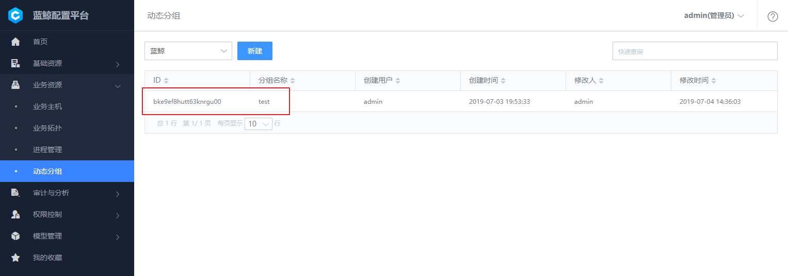

**（2）新增动态分组**

通过点击 `新增` 增加一个动态分组。

配置分为两方面的内容：

- 分组内容：是指分组后期待页面显示的字段内容都有哪些。
- 分组条件：是指根据怎样的条件将主机划分到不同的组内。


### 审计与分析 {#OperationAnalysis}

所有用户在配置平台上的操作，都有对应的记录可以追溯，用户可以在操作审计菜单项下查看具体的历史操作。


#### 操作审计 {#OperationAudit}

操作审计是面向管理员功能，能够查询到所有用户在配置平台上的操作。通过导航打开 "审计与分析 - 操作审计" 进入功能页。


### 权限控制 {#PermissionsControl}

配置平台支持两层权限配置：业务功能权限管理、系统功能权限管理。

#### 业务功能权限管理 {#BuzPermissionsManagement}

当新建业务时，"业务运维" 被认为是业务的主要负责人，默认拥有此业务最高权限，包含业务下所有集群、模块、主机等的管理权限。如下图配置，monitor 用户拥有 "测试业务 1" 所有的权限。


默认状态下，产品、测试、开发、操作人员可以在配置平台看到业务的资源情况，但是对业务下数据没有修改权限。管理员可以根据企业的实际需要，授予角色特定的权限。

具体操作可以通过侧边导航打开 "权限控制-业务权限管理"，选择目标角色，勾选需要授予的权限即可。


需要注意的是，这里角色的权限配置是对整个企业的所有业务生效，而非单个业务。


#### 系统功能权限管理 {#SysPermissionsManagement}

对于和业务没有直接关系的功能，如系统功能、普通自定义实例，管理员可以通过常用的 "角色+权限" 方式设定权限。以下以网络设备管理员为例，分为两个步骤设定角色权限：

**（1）创建角色**

通过侧边导航打开 "权限控制-系统权限管理"，点击 `新建` 打开对话框。

角色名填写 "网络管理员" ，成员中指定需要授权的人员，这里设定了 monitor 为网络管理员。

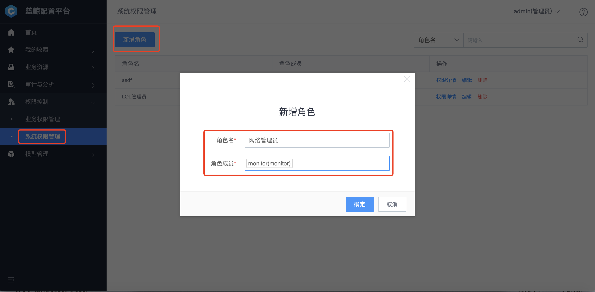

**（2）角色授权**

通过角色创建以后，可以在角色列表中看到新增的角色，点击 【权限详情】 按钮进入权限配置页，可以对该角色的权限进行细粒度的划分。

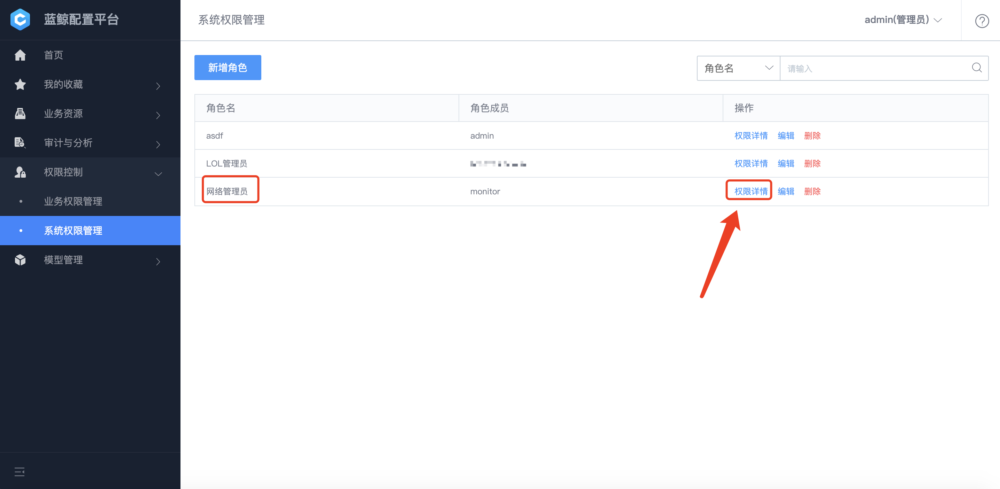

### 模型管理 {#ModelManagement}

**自定义企业信息模型** 。 配置平台提供了灵活的模型定义功能，支持企业根据自身的业务架构，进行自定义特定的信息模型。

配置平台中管理的信息实例，均是基于模型构造而成。目前内置的模型有业务、集群、模块、主机、进程、云区域。如果内置模型不能够满足，可以通过自定义新增、编辑模型，从而构造出企业特有的 CMDB。    

需要注意的是，模型管理定位为配置平台的底层功能，需要配置平台管理员权限才可以操作。

#### 模型  {#Model}

配置平台内置的模型有业务、集群、模块、主机、进程、云区域，此外还可以通过自定义新增模型。 支持现有模型查看、模型分组、模型创建、模型编辑、模型字段唯一校验、模型字段分组、模型删除、模型从停用恢复、模型字段导出和导入等。

**（1）现有模型查看**

使用管理员账户登录以后，可以通过 "模型管理 - 模型" 中查看到当前系统中存在的模型。

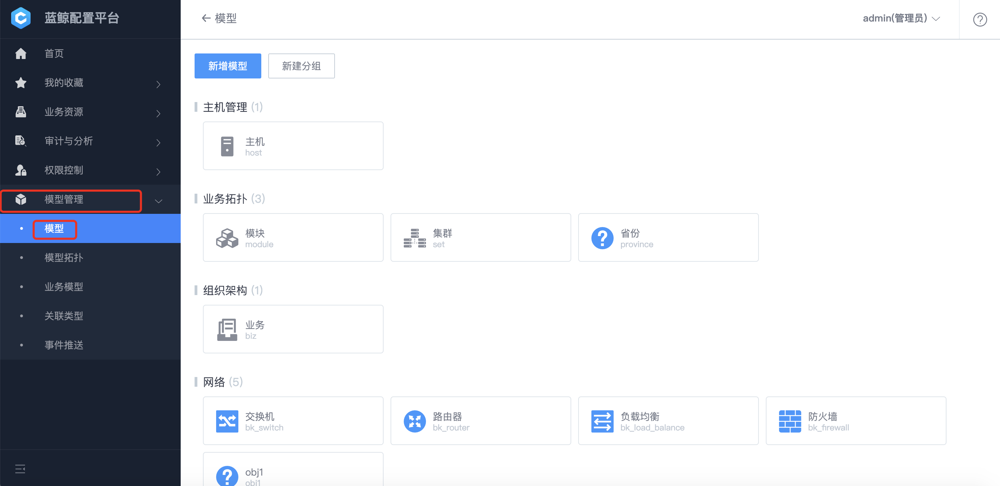

查看某个模型下的相关属性。

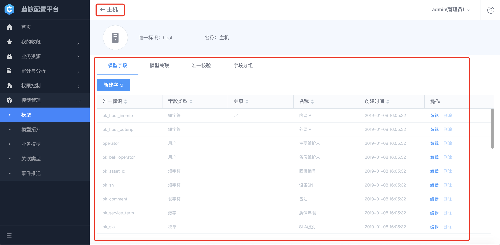

**（2）模型分组**

系统支持对模型按照使用的功能进行分组。分组有 "系统内置" 和 "用户自定义" 两种类型，当前系统内置分组有 "主机管理"、"业务拓扑"、"组织机构"、"网络"、"中间件"。

a. 用户自定义分组：

新建分组：可以通过 【新建分组】 按钮进行新增。需要注意的是，分组名称在系统中具有唯一性。


编辑分组：点击分组名右侧的 【编辑笔】 按钮对名称进行调整。

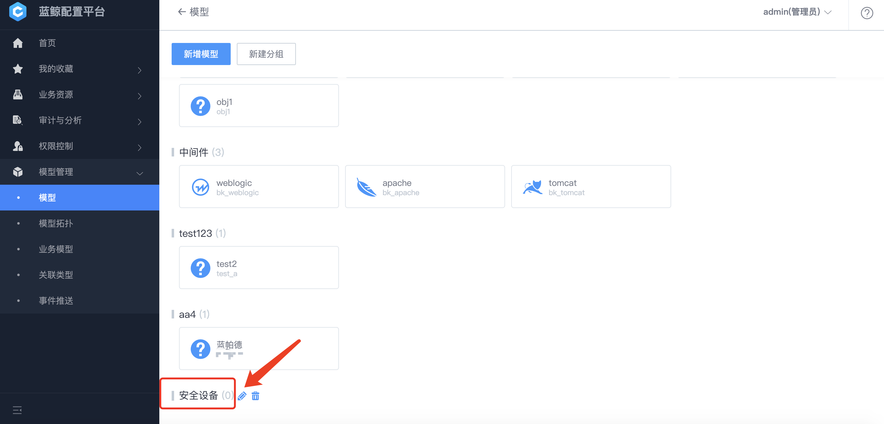


删除分组：选中目标分组，点击右侧 【删除】 按钮。需要注意的是，只有当分组下没有模型的时候，才可以删除此分组。


b. 系统内置分组：

目前包含 "主机管理"、"业务拓扑"、"组织构架"、"网络"、"中间件"，内置分组不可以编辑，但可以在其下建立模型。

**（3）模型创建**

配置平台内置一些通用的模型，当现有的模型不能够满足需要的时候，可以通过新建的方式增加模型。

点击左上角的 【新建模型】 按钮，打开新增模型的对话框，然后选择所属分组，选择模型图标（后续可自定义图标），填写模型唯一标识以及名称，最后点击保存新建完成。

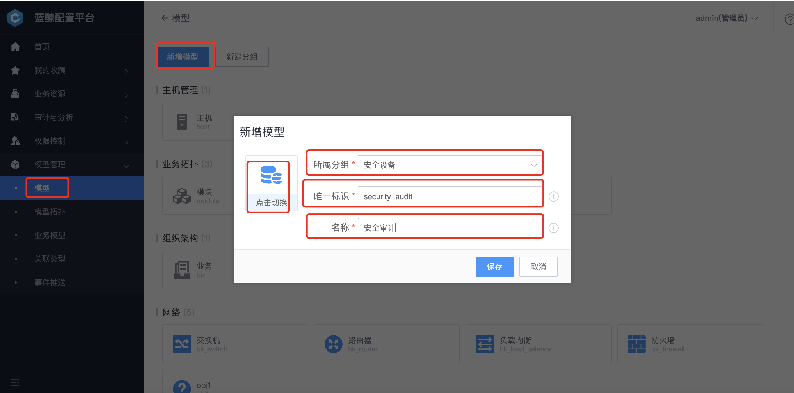

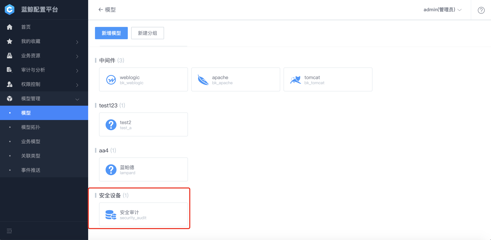


**（4）模型编辑**

模型创建完之后，可以修改模型的名称、图标。但唯一标识不能修改。

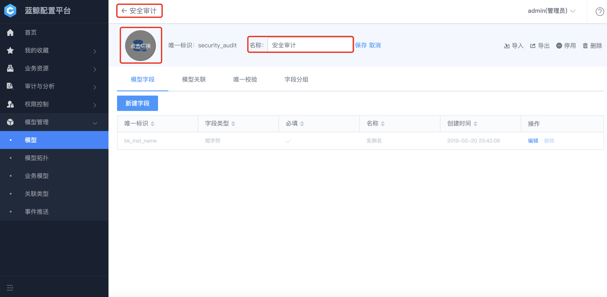

**（5）模型字段唯一校验**

CMDB 设计了唯一性校验以避免出现重复的脏数据，即有以下逻辑：

1. 创建实例时，如果发现唯一校验规则出现重复，会认为是错误请求而阻止创建。
2. 编辑实例时，通过唯一规则找到确定的一个实例，如果发现匹配多个实例或者实例并不存在，系统会判定为一次错误编辑请求。

管理员在创建一个全新的自定义模型时，会自动内置 `bk_inst_name` 字段，并默认设定作为唯一校验字段。

管理员可以根据实际的数据实例管理需要，设定多种规则如下：

1. 多组规则独立判定。例如：对于服务器，同时设定数据实例必须满足 "固资编号" 和 "设备 SN" 同时满足全局唯一。
2. 单组规则包含多个字段，实现联合唯一判定。例如：对于机架，必须满足 "机房名 + 机架名 唯一"， "机房名：东莞机房，机架名：机架 1" 与 "机房名：东莞机房，机架名：机架 2" 认为合法。

通过以下步骤可以实现唯一校验规则的修改或新建：

1. 通过导航点击 "模型-选中需要修改的模型"，进入模型列表页面，找到需要修改的模型，点击进入对应的管理界面。
2. 切换到 "唯一校验" 功能面板，即可对需要调整的分组进行编辑，或者新增行的校验分组。


需要注意的是，校验分组有 "是否为必须校验" 的设定，一个模型只能够设定一组校验规则为 "必须校验"，其他分组为非必须。非必须分组当用户没有填写字段值时，不会触发校验。此外系统内置的关键模型为了保证系统的正常运作，不允许修改 "必须校验" 分组。

**（6）模型字段分组**

实际应用中，对于模型的属性字段，我们需要对其进行归类排序，这时候可以使用字段分组功能。在模型编辑页面通过切换到 "字段分组" Tab 标签，可以进入此功能。


**字段排序**：鼠标悬停在目标字段上方，通过拖拽字段可以调整字段顺序以及字段的所属分组。


**分组编辑**：字段分组可以灵活的调整页面的上下排序位置，也可以新建和删除分组。


注意：用户在模型上新增的字段，会被自动放入到 "默认分组" 中。

**（7）模型删除**

目前仅支持模型的 `停用` 和 `删除` 两种操作。

- **停用：** 隐藏此模型和实例配置界面，但是实例数据仍然会保留。当用户只是暂时不需要暴露此类型的实例（或者禁止任何用户修改）可以使用此功能。


- **删除：** 模型删除前需要确认实例均已经删除，否则模型删除失败。删除模型是不可逆操作，用户需谨慎决定。

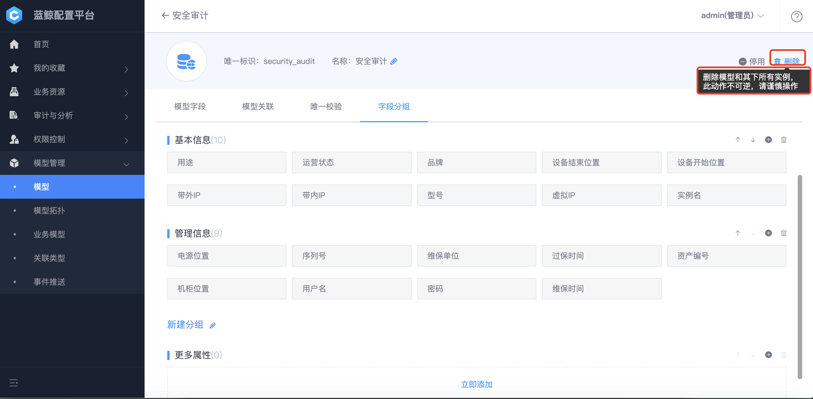

**（8）模型从停用恢复：**

当模型分组中存在被禁用的模型时，该模型图标右上角会显示红色的 "已停用"。点开模型编辑页面点击 "启用" 即可重新启用该模型。


**（9）模型字段导出和导入**

当用户需要创建类似的模型, 或者对模型进行备份的时候, 可以通过先将模型字段进行 "导出" 备份。然后新建一个模型，通过 "导入" 功能实现模型的复制。

需要注意的是，导出的 Excel 中可能会包含部分代码片段，没有专业指导的情况下请勿编辑这些代码，以免导入以后系统出现不可预知的异常。


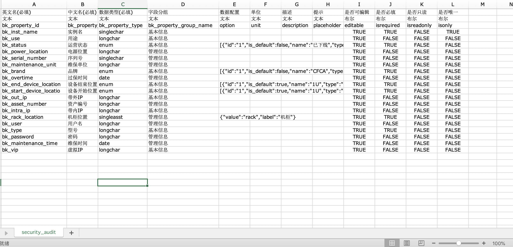

####  实例管理 {#InstanceManagement}

实例指的是根据模型的定义创建出来的配置项，同一个模型的数据项，结构一致，属性值有差异。

当模型创建以后，用户可以在配置平台首页中，看到此模型名称，点击进入到实例管理页面。


**（1）新增实例**

进入到实例的管理界面中，通过点击上方的【立刻创建】 按钮新增实例。


**（2）实例编辑和删除**

实例仅支持 `编辑`、`删除` 有两种方式。

**单个实例**

通过点击列表中的单个实例，可以展开实例的查看页面。通过下方 【编辑】 按钮，可以进入到实例的编辑状态。点击删除则是删除实例，需要注意的是，实例删除以后不可撤销，但是可以通过实例 "删除历史查看" 功能查看到已经删除的实例信息


**多个实例**

列表中每个实例前都有一个勾选框，用户可以先勾选需要批量操作的实例。当勾选数量大于 1 个以后，上方的 【编辑】、【删除】 变成可用，用户可以通过这两个按钮对已选中实例进行批量修改和删除。


**（3）实例关联关系查看**

关联关系和属性采用分离管理的方式，通过点击实例详情以后通过切换到 "关联" Tab，可以查看当前实例的关联。


**（4）实例关联关系编辑**

实例的关联关系构建依赖模型之间已存在关联关系。

**添加关联**（以主机管理路由器为例）：


**删除关联**:

同添加关联操作一致，打开关联管理面板，找到当前关联实例，点击 "取消关联" 完成关联的删除。


**（5）实例操作历史查看**

对于 CMDB 里面管理的每个实例(包含主机或者用户自定义实例)，均能够在实例详情中，看到其操作记录列表，默认按照时间倒叙排列。

用户可以通过时间范围和操作账号进行操作列表的筛选查看。


点击变更内容可以查看操作的详情。

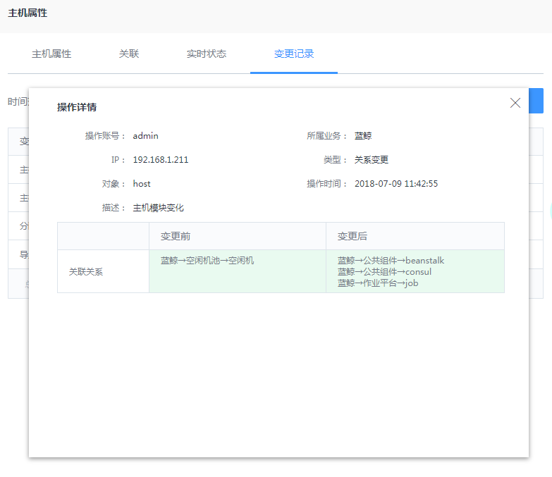

#### 模型拓扑 {#ModelTopology}

模型拓扑是支持用户可视化查看当前模型关系的拓扑视图，并进行简单管理的功能。通过导航 "模型-模型拓扑" 进入功能界面。


**（1）创建模型之间关联**

1. 点击 "编辑拓扑" 进入可视化关联管理模式。
2. 画布左侧栏列出了当前系统的所有模型分组和模型，模型分组后面数字显示为 0，表示该模型分组下的所有模型都已经在模型拓扑画布里；数字为 m，表示该模型分组下还有 m 个模型没有在模型拓扑画布里，点开可以查看具体模型。

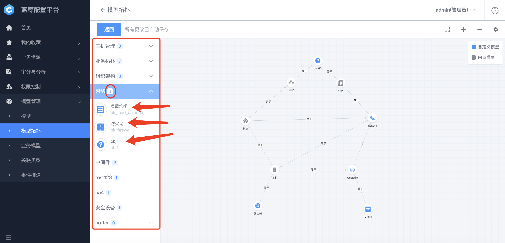

3. 将模型拖入画布中，鼠标移动到模型上方，在浮出的按钮中，点击 【创建关联】 按钮，此时从当前模型到鼠标之间会出现一条虚线，鼠标选中其他任意模型，单机即可完成连线。


4. 在关联连线完成后弹出的对话框中，填写 "关联描述"，根据需要修改其他参数即可创建关联（关联类型的创建可查看 [新增关联类型](4.产品功能/Introduction.md#AssociationType)）。


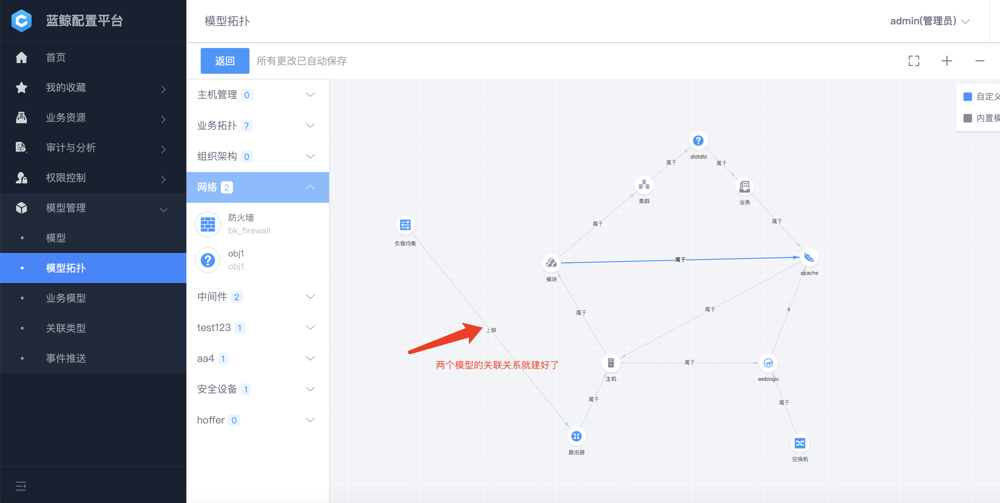

**（2）删除模型之间关联**

1. 点击 编"辑拓扑" 进入可视化关联管理模式。
2. 直接点击模型之间连线，打开关联详情。
3. 点击 "删除关联" 完成删除关联。


**注：** 如果两个模型之间有多种关联，鼠标指向模型关系的连线，在浮出的菜单中，选择需要编辑的关联进入到对应的详情页。


如点开数字 2 后删除 "默认关联" 这条，如下：


##### （3）模型从拓扑视图移除

1. 点击 "编辑拓扑" 进入可视化关联管理模式。
2. 鼠标移动到模型上方，在浮出的按钮中，点击 【删除模型】 按钮。
   - 删除模型必须先清除模型的关联关系。
   - 模型已经实例化不能删除。
   - 删除模型只是把模型从画布里移回左边的模型分组栏，不会真正的从系统删除该模型。


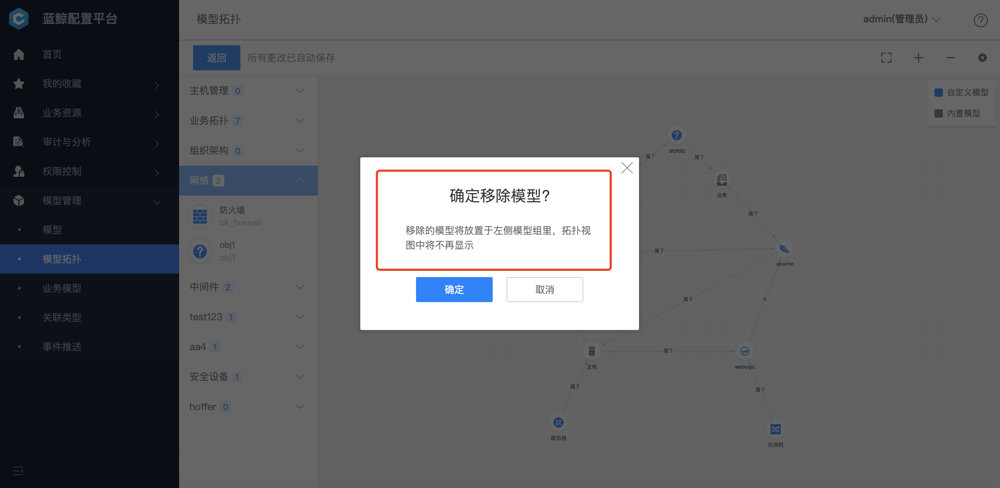

####  业务模型  {#BuzModel}

蓝鲸配置平台中，默认的主线业务拓扑只有 `业务-集群-模块-主机` 四层，而在不同企业的实际场景里，往往是不能满足对一个业务或系统的拓扑规划，所以支持了在业务跟集群之间的自定义拓扑层级，目前系统设定最多可以新增 3 个拓扑层级，也就是主线拓扑最多可以达到 7 个层级。

**（1）默认业务拓扑层级**


**（2）新增自定义层级**

点击主线拓扑上 "业务" 下方的加号，弹出新建层级窗口，填写层级信息。


在业务拓扑页面也可以看到新增的拓扑层级，可以从此层级开始新建集群-模块。


#### 关联类型 {#AssociationType}

模型关联是指两个模型之间的关联定义。只有定义了模型关联，才能够创建对应的数据实例之间的关系。

模型关联定义的关键概念解释如下：

1. 模型关联是独立的。即用户定义模型 A 和模型 B 之间的关联关系，此关系并不属于模型 A 或者模型 B 。
2. 关联类型。关联类型能够帮助用户识别同类关联，例如主机和交换机、主机和路由器均有关联，我们可以设定这两个关联都属于 "上联" 类型，在具体的主机实例中，可以通过查询具体主机的 "上联" 获取此主机所有上联的网络设备。
3. "源-目标约束"。在真实环境中，关系是存在约束定义的，例如一个硬盘只能够属于一个主机，一个主机可以有多个硬盘。为了避免用户录入数据出现错误，我们可以设定，主机到硬盘的关系中 "源-目标约束" 为 1-N。
4. 关联描述。对关联关系的补充描述，当关联关系类型不能够准确表达关联配置的时候，可以补充此描述。

模型之间的关系管理为了方便管理提供了两个入口，本小节主要介绍通过 "模型管理-模型" 功能进行关联管理。另外一种管理方式可以参考 [模型拓扑](4.产品功能/Introduction.md#ModelTopology) 小节描述。

**（1）关联类型首页**


**（2）新增关联类型**


**（3）创建模型关联**

这里假定我们需要创建模型 A 和模型 B 之间的关联。

1. 点击模型 A 或者模型 B 进入模型管理详情页面，上文提到关联是独立的，所以只需要操作 A 或 B 其中一种即可。
2. 切换到 "模型关联" 功能页，点击 【新建关联】 按钮。
3. 在弹出对话框中，配置源和目标模型，修改关联类型和约束保存即可。

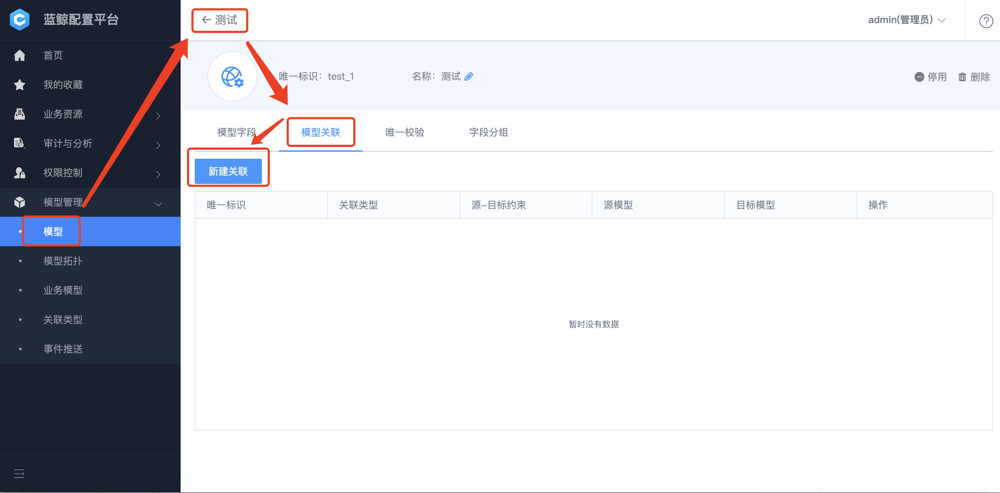


**（4）编辑模型关联**

模型之间的关联创建以后，可以修改关联的描述信息：关联类型、关联描述。其他标识和约束不可以修改。


#### 事件推送 {#EventPush}

**信息变更实时推送** 。实时推送功能解决了系统之间信息同步的频繁轮询和不实时问题。确定了订阅方式以后，当配置平台中相应模型发生变更时，订阅系统能够实时收到通知。

事件推送功能能够实现当配置信息发生变化的时候，实时通知到关联的系统中，目前支持 HTTP 的推送方式。

此功能属于高级功能，使用此功能前需要先为目标系统开发可接收 HTTP 请求的接口，接口接收的内容可参考如下 json：

``` json
{
"event_id": 100,
"event_type": "instdata",
"action": "update",  
"action_time": "2018-01-01 18:00 +08:00",
"obj_type": "set",
"cur_data": {},
"pre_data": {},
"dstb_id": 1,
"dstb_time": "2018-01-01 18:00 +08:00",
"subscription_id": 16
}
```

**（1）创建事件推送**

目标系统接口完成开发以后，接下来需要在新增一个推送。

通过侧边导航打开 "模型管理 - 事件推送" ，点击 【新建】 按钮。


在新增推送的对话框中，主要关注完善三部分内容：
1. 推送名称：用于区分不同推送，同业务下需要保持唯一。
2. URL：目标系统接收推送请求的 URL，要求蓝鲸配置平台部署环境访问此 URL 链路畅通。
3. 事件订阅：根据目标系统的需要，可选择性勾选事件的内容。
当填写完成 URL 后，可以使用 "测试推送" 功能中查看到详细的推送信息和进行推送测试（调试配置平台是否能够访问到目标系统的 API）。


**（2）事件推送状态查询**

创建好一个事件推送以后，可以在推送的列表中直观看到当前推送接收数量和失败情况。


### 我的收藏 {#Collection}

查看在首页收藏常用的资源。


