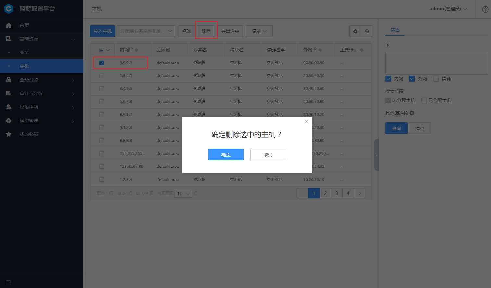

# 基础资源

基础资源包含业务和主机。业务是蓝鲸配置平台的基础对象，可以定义业务角色分工（如产品、测试、开发、运维）、业务的生命周期等。主机管理是配置平台的核心功能，主要具备几点功能点：拓扑维度的主机概况展示、便捷的主机筛选、丰富的增值功能和主机属性自定义展示。

## 业务

在作业平台、监控、标准运维等系统中，均以已有 `业务` 为基础进行运作。
业务是蓝鲸持续部署环节比较重要的概念，主要用于资源和配置隔离，在配置平台创建的业务，默认同时应用于作业平台、标准运维、蓝鲸监控、故障自愈等场景。

用户在有权限的基础上对业务进行管理，包含查看业务列表，新建、归档及还原等操作。

新建一个业务，包含：

- 选择业务拓扑类型，包含三级拓扑和二级拓扑。

- 填写新建业务的基础信息，包含业务名称，产品人员，业务运维等字段。

单一业务的修改，可修改的字段包括业务名称，运维人员以及自定义属性。一个及一个以上的业务同时修改您指定的字段属性。其中属性名列的修改字段是可以指定的。

## 主机 

为了标准化管理和提高主机资源利用率，设计了资源池模式，所有主机需要统一先录入到主机资源池中，然后再分配至具体的业务下的空闲机池，同时也可以删除不需要的主机。核心功能包含主机的录入、分配到业务、删除主机等。

目前在配置平台导入主机分以下两种，一种是 `Excel 批量导入`。另一种是通过 `节点管理` 进行导入。

- **方法 1：通过 Excel 批量导入**

当主机在直连区域（蓝鲸中控环境可以直接访问区域）时，可以使用此方法。

- **方法 2：节点管理进行导入**

切换到自动导入的 Tab 页，通过点击跳转到链接可以打开 "Agent 安装" 应用，根据节点管理对 Agent 的安装流程，相关主机信息会自动同步到配置平台对应业务下的资源池中。

**主机删除** 选中目标主机以后，点击 【删除】 按钮可以删除不需要的主机，需要注意的是主机被删除以后，不可以还原，请谨慎操作。

