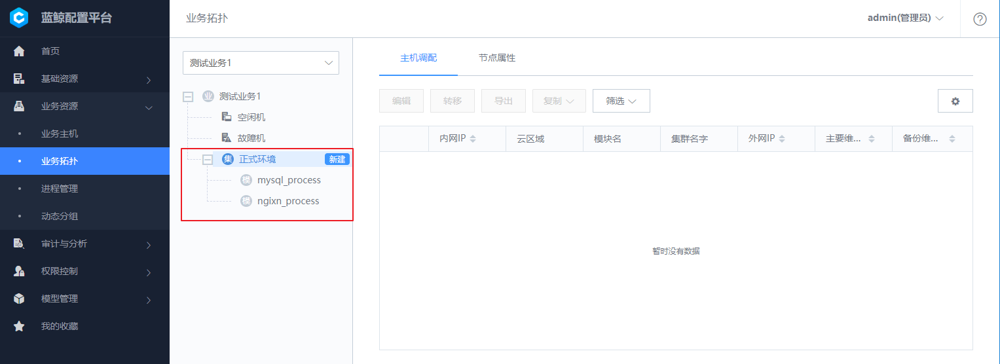
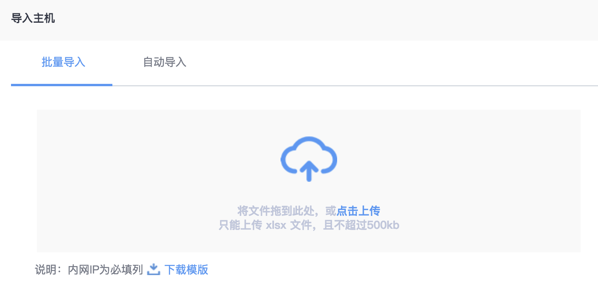
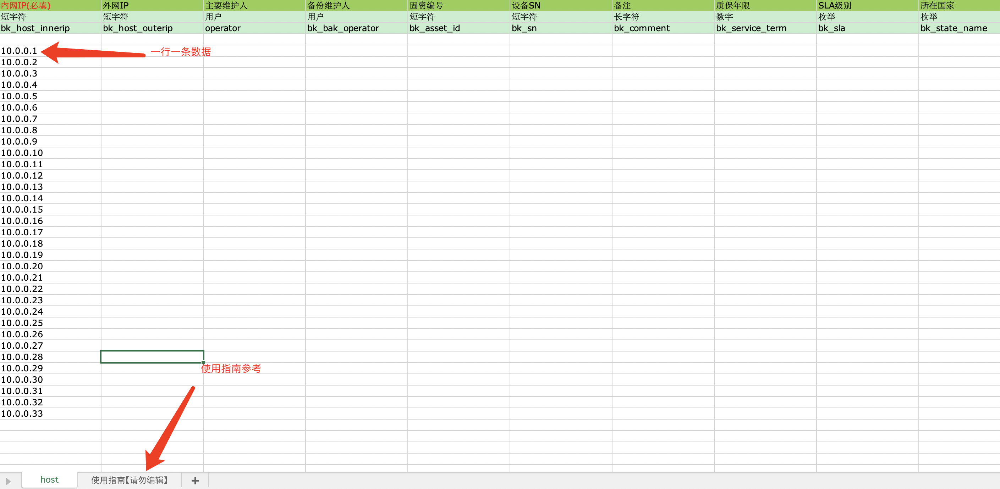
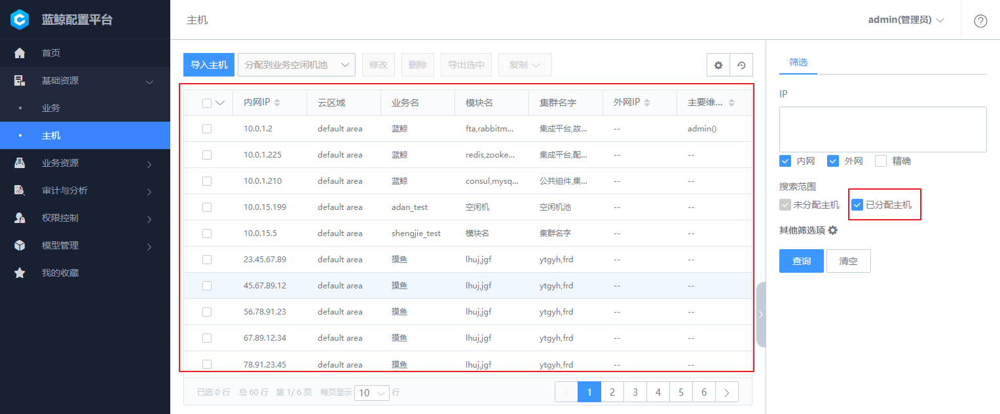
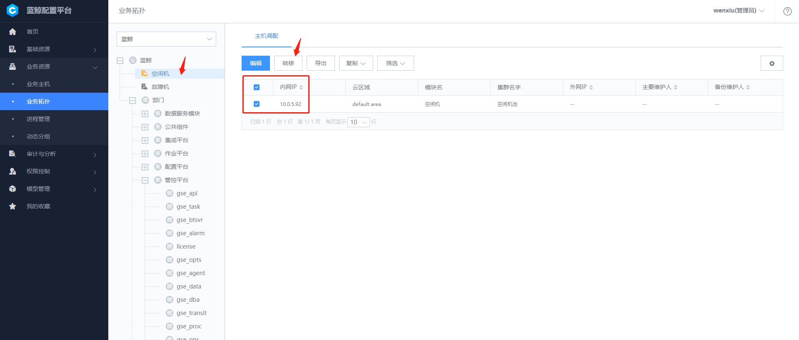
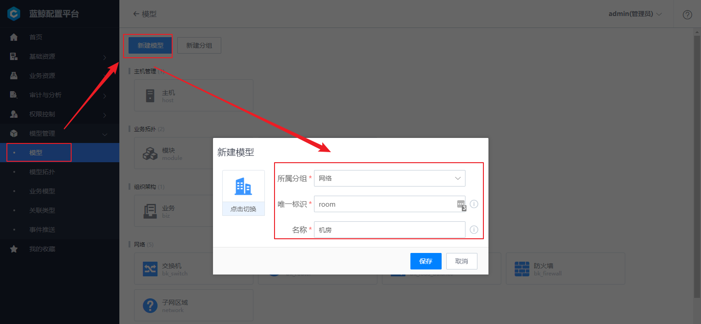
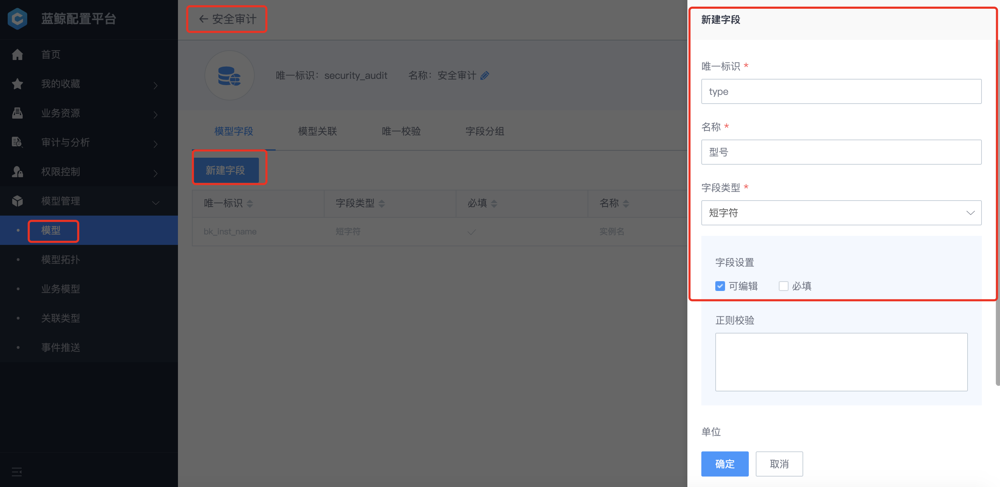
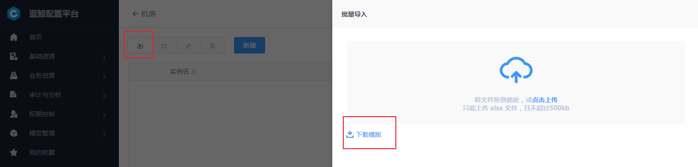
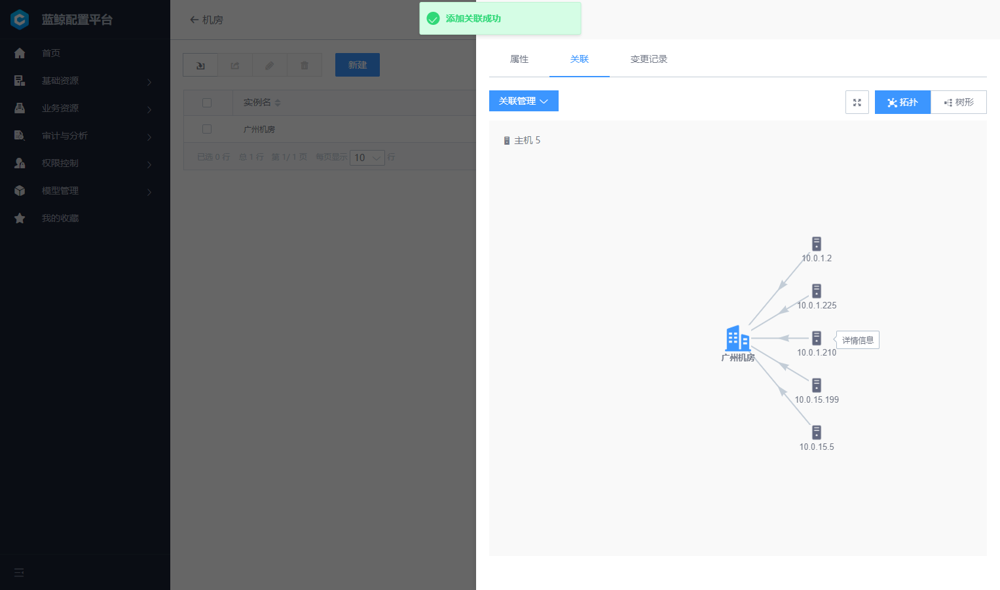

##  快速入门 {#Guide}

快速入门致力于让企业快速玩转 CMDB，满足大部分企业的的应用场景。

### 如何创建业务并导入主机到业务中 {#Case1}

具体步骤：

**创建业务 -- 创建业务拓扑 -- 导入主机到资源池 -- 查看未分配到业务的主机 -- 分配主机到业务空闲机池 -- 分配主机到业务模块**

#### (1) 创建业务

业务是蓝鲸持续部署环节比较重要的概念，主要用于资源和配置隔离，在配置平台创建的业务，默认同时应用于作业平台、标准运维、蓝鲸监控、故障自愈等场景。

通过导航栏点击 "基础资源 - 业务"，进入业务管理功能页，然后点击 【新建】 按钮。

**注意：** 初始状态下，业务只有配置平台管理员能够新增和管理业务。管理员可以根据实际企业需要，通过权限分组的方式，给指定用户组分配业务管理权限。具体操作详情见 [权限控制](4.产品功能/Introduction.md/#PermissionsControl) 小节。

- 业务是蓝鲸体系内较为关键的资源，所以业务不提供删除功能，当业务不再需要的业务可以使用 **业务归档** 功能把业务从列表中移除。

- 当业务归档的时候，用户需要确认其他 SaaS 已经没有使用此业务，包含并不限于业务下的定时任务、监控配置已经停止，否则会产生过多异常。

业务被归档以后，所有 SaaS 均无法看到此业务。

- 归档的业务需要还原时，可以使用 **业务归档的还原** 功能恢复到正常使用状态：

业务归档还原以后，可以在业务的归档列表中，看到已经归档的业务。

点击 【恢复业务】 可把业务恢复到正常使用状态，为了方便用户辨识，从归档恢复的业务会默认在业务名称后方加上（recovery）标识，用户根据需要修改业务名称即可。

#### (2)创建业务拓扑

创建业务以后，在 "业务资源 - 业务拓扑" 中，可以看到下拉菜单中增加了刚刚新增的业务。业务创建完成会自动创建 "空闲机"，"故障机" 两个模块。

此时我们可以对业务定义业务拓扑。点击拓扑树上的业务，后方出现的 【新建】按钮可以创建业务的直接下级即 "集群" 和其直接下级 "模块"。

#### (3)导入主机到资源池

为了标准化管理和提高主机资源利用率，设计了资源池模式，所有主机需要统一先录入到主机资源池中，然后再分配到业务中。

导航进入 "基础资源 -- 主机" 页面，点击【导入主机】按钮进行导入主机。

目前在配置平台导入主机分以下两种，一种是 `Excel 批量导入`，一种是通过 `节点管理` 进行自动导入。

首先点击 "基础资源 -- 主机" 页面的 【导入主机】 按钮打开导入对话框。

**方法 1：通过 Excel 批量导入**

当主机在直连区域（蓝鲸中控环境可以直接访问区域）时，可以使用此方法。点击 【下载模版】 按钮，下载到符合格式好的 Excel 文档。

打开 Excel 文档以后，可以到内网 IP 是必填属性，其他属性如果不需要导入，可以把相关列删除。Excel 中第二个 Sheet 中有详细的填写说明，建议首次使用用户先查看此说明。

**注意：** 录入同样内网 IP，是属性覆盖的操作，可以使用此特性对主机属性进行批量更新。

**方法 2：节点管理进行自动导入**

切换到自动导入的 Tab 页，通过点击跳转到链接可以打开 `Agent安装` 应用，根据节点管理对 Agent 的安装流程，相关主机会自动录入到配置平台对应业务下的的资源池中。

#### (4) 查看未分配到业务的主机

通过侧边导航 "基础资源 -- 主机" ，默认功能页面中即显示了当前企业中尚未分配到业务的主机。

- 查看企业内所有主机：

在主机资源池管理页面，同构勾选查询范围下的已分配主机，进行查询，可以查询到当前企业中所有的主机资源

#### (5) 分配主机到业务空闲机池

选中目标主机后，选择上方分配到指定业务，默认是放到业务的空闲机池。

#### (6) 分配主机到业务模块

导航进入 "业务资源 -- 业务拓扑" 页面

可以看到主机已经被分配到业务的 "空闲机" 模块中，勾选需要转移的主机，点击上方的 【转移】 按钮，在对话框中选择目标模块，点击 【保存】 完成转移。

> Note :
需要注意，考虑到实际业务的应用场景，主机转移有以下特性：
1. 一个主机可以属于多个模块。
2. 主机归属于空闲机、故障机时，不可同时属于其他业务模块（当选中空闲机、故障机时系统会提示是否去除其他选中模块）。
3. 主机需要归还企业的资源池时，必须先转移到空闲机模块。

### 主机由 A 业务模块转移到 B 业务模块 {#Case2}

具体步骤：

**主机分配到 A 业务空闲机池 -- 主机上交资源池 -- 主机分配到 B 业务空闲机池 -- 主机分配到 B 业务模块**

> Note：
主机的业务属性变更信息不会与节点管理同步，所以在主机转移之前请在节点管理卸载主机的 Agent ,主机转移之后再在节点管理重装 Agent 。

#### (1) 主机分配到 A 业务空闲机池

导航栏进入 "业务资源 -- 业务拓扑" 页面。

查看 A 业务模块下的主机，勾选需要转移的主机，点击上方的 【转移】 按钮，在对话框中选择目标模块 "空闲机"，点击 【保存】 完成转移。

- 增量更新，保留主机已有模块：
A，B 两个业务可以共享主机，主机既在 A 业务下，又在 B 业务下

- 完全替换，不保留现有主机模块：
主机只在 B 业务下

#### (2) 主机上交资源池

导航进入 "业务资源 -- 业务拓扑" 页面

查看业务的 "空闲机" 模块，勾选刚刚转移过来的主机，点击上方的 【转移】 按钮，在对话框中选择 "资源池"，点击 【保存】 完成转移。

#### (3) 主机分配到 B 业务空闲机池

详情参照 [如何创建业务并导入主机到业务中，（5）分配主机到业务空闲机池](5.快速入门/Guide.md#Case1)

#### (4) 主机分配到 B 业务模块

详情参照 [如何创建业务并导入主机到业务中，（6）分配主机到业务空模块](5.快速入门/Guide.md#Case1)

### 快速入门模型和模型拓扑管理 {#Case3}

随着企业的发展，CMDB 会逐步承担更多的基础配置责任，蓝鲸配置平台通过构建了底层的 "模型"，提供了动态拓展的能力，帮助企业在线实现 CMDB 的能力升级。以下通过以一个机房例子介绍如何操作：

具体步骤：

**创建机房模型 -- 完善机房属性 -- 完善关联关系 -- 创建实例**

#### (1) 创建机房模型

配置平台内置一些通用的模型，当现有的模型不能够满足需要的时候，可以通过新建的方式增加模型。

点击左上角的 【新建模型】 按钮，打开新建模型的对话框，然后选择所属分组，选择模型图标（后续可自定义图标），填写模型唯一标识以及名称，最后点击保存新建完成

创建模型需要填写 "英文名称" 和 "中文名称"：

**英文名称**：是模型在系统中的唯一标识，需要保证不可重复。

**中文名称**：是用户直接看到的描述名称。

点击确认后新的模型创建成功。新的模型会自带一个默认的必填唯一字段 "实例名"，用户可根据模型的实际定位修改此字段的中文名称，但是英文名称因为作为系统底层唯一标识不可调整。

在实际上，我们需要管理的不仅仅只有一个字段，通过点击“新建字段”增加更多字段（可以批量导入字段，详见 [模型字段导出和导入](4.产品功能/Introduction.md#Model)小节）。

目前支持 "短字符"（长度 256 个英文）、"长字符"（长度 2000 个英文）、"数字"、"枚举"、"日期"、"时间"、"时区"、"用户"、"布尔"等类型。

根据所选择的字段类型，分别支持用户定义验证方式："是否必填"、"正则验证"、"大于小于范围" 等。

#### (2) 完善机房属性

点击进入到机房详情配置。

可以看到默认已经创建了实例名，这个名称默认为机房的唯一标识以及显示名称，我们可以通过点击新建字段，完善更多信息，如下所示，创建了所在地和机房编号两个字段：

#### (3) 完善关联关系

为了让机房能够和主机有关联能力，我们接下来配置主机到机房的关联关系。

切换到模型关联 Tab 页，点击新建

关联关系的配置，核心需要分析两个对象之间的关系限制，由于一个主机只有可能属于一个物理机房，因此我们配置机房作为原，主机作为目标，约束设定为 1-N：

#### (4) 创建实例

完成以上操作后，我们已经为配置平台拓展了机房的管理能力，接下来创建实际的机房记录

回到首页可以发现已经多了机房的管理功能，点击进入

点击新建，填写必要属性完成创建

>Note: 如果需要批量添加，可以点击【导入】按钮进入到导入功能对话框，如果是初次导入，可以先下载实例导入模板进行编辑。

关联的管理可以打开刚刚创建的机房详情，切换到关联选项卡，可以看到当前机房还没有和任何其他实例关联。

创建关联,点击关联管理，此时会显示当前可以关联的主机，选中关联即可。

完成以后关闭此视图，可以看到关联关系拓扑。

目前关联关系支持两种展现形式：

1. 星形拓扑形式

2. 树形拓扑形式

