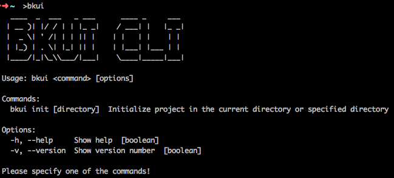

# Introduction of the scaffold for the development of blueking frontend （BKUI-CLI）

It is a scaffolding tool for building the frontend project of blueking system based on one key developed by [vue.js](https://vuejs.org/), including basic engineering capabilities (technology selection, structure building, logical division, construction performance optimization), basic mock services, blueking front-end / design specifications (code management, style unification), [bk-magic-vue Component library](https://magicbox.bk.tencent.com/components_vue/2.0/example/index.html#/), blueking frontend common logic, best practices and development examples can help you build blueking SaaS more easily and quickly based on the pattern of frontend and backend separation and cooperation.

In the project of using blueking frontend to develop scaffold initialization, it combines the latest technologies, such as [Vue.js 2.x](https://cn.vuejs.org/), [Vue Router 3.x](https://router.vuejs.org/zh/), [Vuex 3.x](https://vuex.vuejs.org/zh/guide/), [webpack 4.32.x](https://webpack.js.org/), [@babel 7.4.x](https://babeljs.io/) , etc., and integrates the best practices in our daily development process, including basic architecture performance optimization, mock request, common components, code specification, AJAX encapsulation, etc., aiming to make The user can focus on the development of business logic with no need to be distracted by other things in the project.

For use with the blueking SaaS development framework, see [Use guide in combination with BKUI](../BKUI.md)。

## Installation and use

### Installation

`BKUI-CLI` has been published to [npm](https://www.npmjs.com/package/bkui-cli). You only need to execute the following command in any directory to install `BKUI-CLI`.

```bash
npm install -g bkui-cli
```

### use

After the global installation of `BKUI-CLI`, you can enter the `bkui` global command.

```bash
bkui
```

You will see the following output:



### help

After each command  `<command>`  of `BKUI-CLI` , add `-h`  or `--help` parameter `[options]` to display the help of the current command.

**Next, we will introduce each command and parameter of  `BKUI-CLI`  in detail**。

## bkui -h command

Command line input `bkui -h` or  `bkui --help`  will output the help information of `BKUI-CLI`.

```bash
$ bkui -h
$ bkui --help
```


## bkui init command

`bkui init` is one of the important commands of `BKUI-CLI`. We know from the previous chapters that any command with the `-h` or `--help` parameter will output the help information of the current command. Enter  `bkui init -h` on the command line, and the help information of the `bkui init` command is as follows:


The `bkui init` command supports an optional parameter `DIRECTORY_NAME`, which indicates the name of the project to be created.

- If `DIRECTORY_NAME` is not set, the project will be initialized under the current command line execution directory by default, and the project name is the name of the current directory;
- If `DIRECTORY_NAME` is set, a `DIRECTORY_NAME` will be created in the current command line execution directory and a project template will be generated in the `DIRECTORY_NAME` directory. The project name is `DIRECTORY_NAME`.

During the execution of the `bkui init` command, we will ask the user several questions in the form of interactive Q &amp; A, and obtain the answers as the parameters of the initialization project. **Next, we will explain the roles of these questions**.

## bkui init Command line problem description

> The purpose of blueking frontend development scaffolding is to make developers more convenient and faster to build blueking SaaS based on the mode of frontend separation and cooperation. Building a complete blueking SaaS application requires front and back collaboration. Therefore, there are several questions in the command-line Q & A interaction, such as `AJAX_URL_PREFIX`, `LOGIN_URL`, `USER_INFO_URL`, which need to be negotiated and specified with the backend.

>> In order to make the frontend and backend separation and cooperation mode feasible, these settings are all local analog addresses by default (`http://localhost`), so that the frontend page function development can be relatively independent. Secondly, when the back-end interface is ready, the frontend only needs to modify the corresponding configuration in the code to perform function joint debugging.

### Generate project in current directory?
If you want to initialize the project **in the current directory and run `bkui init` directly in the current directory and the current directory is empty, this problem will occur**.

### The current directory is not empty. Continue?
If you want to initialize the project **in the current directory and run `bkui init` directly in the current directory and the current directory is not empty, this problem will occur**.

### Target directory exists. Will create a new directory and add the `.bak` suffix to the existing directory. Continue?
If you want to initialize the project in the existing directory, this problem will occur when you **run `bkui init DIRECTORY_NAME` and `DIRECTORY_NAME` already exists**. After you continue, you will add a timestamp suffix to the existing directory, create a new `DIRECTORY_NAME` directory, and initialize the project in the new directory `DIRECTORY_NAME`.

### Is it a SaaS Application?
Is it a blueking SaaS application? The default is yes. **In addition to building the SaaS application of blueking, the frontend development scaffold of blueking also supports building the single page web application**.

### Project name
The project name is the `DIRECTORY_NAME` set in `bkui init` by default. If there is no `DIRECTORY_NAME` parameter, it is the name of the current directory.

### Project description
Project description, default to `Project description` string.

### Author
By default, `git config --get user.name` and `git config --get user.email` under your project will be displayed as `name <email>`. If there is no current project, the global `git` configuration will be taken. If the global `git` is not obtained, then `name` will be set to `os.hostname()` which is the host name of the operating system, and `email` will be set to `''`.

### PostCSS or Scss
At present, the processing engine of CSS only supports `postcss`.

> [postcss](https://postcss.org/) is a tool that uses JS tools and plug-ins to transform CSS code. These plug-ins can support the use of variables, mixins, conversion of future CSS syntax, inline pictures and other operations. Compared with SCSS, we prefer to use postcss, because postcss uses JS to transform CSS code. Plug-ins written based on JS can theoretically complete any operation without limitation. As long as you can think of it, you can basically use js to realize it. Moreover, postcss will not make any changes to CSS code, it just provides interfaces for plug-ins, which is convenient for them to complete each Self function. If you need to use SCSS with webpack, see [postcss-loader](https://webpack.js.org/loaders/postcss-loader/).

### LOCAL_DOC_URL
When `bkui init` initializes a project, it will bring a document sample project with it. This parameter is to set the local access URL of the document sample project, which is `http://localhost` by default. If you need to set it yourself, please enter the absolute address. **(the document sample project will not have any impact on the actual project, and the content of the document sample project will not be incorporated into the actual project when it is packaged and built.)**.
> The document sample project only runs locally, so it does not involve online deployment. Usually, the default setting of `http://localhost` is used. If you need to deploy the document online, you can run `npm run build:doc` to package and build the document sample project, and then deploy by yourself.
##### How to modify this configuration

- **This configuration is the `localDocUrl` field in `${ROOT}/doc/build/config.js`, which can be modified according to your own needs.**

### LOCAL_DOC_PORT
The local access port of the document sample project, which is `8081` by default.

##### How to modify this configuration

- **This configuration is the `localDocPort` field in `${ROOT}/doc/build/config.js`, which can be modified according to your own needs.**

### LOCAL_DEV_URL
The address of local development. The default value is `http://localhost`. If you need to set it yourself, please enter the absolute address (this configuration is independent of online deployment).
> We recommend setting `LOCAL_DEV_URL` to be consistent with the online domain name of the blueking community/enterprise or non blueking SaaS application you deployed, only adding a child prefix of `local-dev`.

> For example, if the corresponding domain name of the blueking community/enterprise version you deployed is: `http://www.bking.com`, then `LOCAL_DEV_URL` is set to `http://local-dev.bking.com`. Then configure host, `127.0.0.1 local-dev.bking.com`. You can use `http://local-dev.bking.com:${LOCAL_DOC_PORT}` to develop locally.

##### How to modify this configuration

- **This configuration is the `LOCAL_DEV_URL` field in `${ROOT}/build/dev.env.js`. It can be modified according to your own needs.**

### LOCAL_DEV_PORT
Local development port. The default value is `8080`.

##### How to modify this configuration

- **This configuration is the `LOCAL_DEV_PORT` field in `${ROOT}/build/dev.env.js`. It can be modified according to your own needs.**

### AJAX_URL_PREFIX
Ajax request address prefix. We use this configuration to splice the prefix of Ajax request, which is set to `baseURL` of `axios`. If you need to set it yourself, please enter the absolute address. Typically, this value needs to be specified in consultation with the backend.

**Blueking SaaS application and non blueking SaaS application Ajax request prefix：**

- SaaS application of blueking
  - The default value of this configuration is `http://localhost:8080`（`${LOCAL_DEV_URL}:${LOCAL_DEV_PORT}`）
  - The complete Ajax request address prefix is `AJAX_URL_PREFIX`
- Non blueking SaaS applications
  - The default value of this configuration is `http://localhost:8080/api`（`${LOCAL_DEV_URL}:${LOCAL_DEV_PORT}/api`）
  - The complete Ajax request address prefix is `AJAX_URL_PREFIX`

##### How to modify this configuration

- **In local development, this configuration is the `AJAX_URL_PREFIX` field in `${ROOT}/build/dev.env.js`, which can be modified according to your own needs.**
- **In the production environment, this configuration is the `AJAX_URL_PREFIX` field in `${ROOT}/build/prod.env.js`, which can be modified according to your own needs. When packaging and building, we usually set the `AJAX_URL_PREFIX` field in `${ROOT}/build/prod.env.js` to' `''`. The reason for this is that the Ajax asynchronous request address prefix is directly consistent with the domain name information of the browser access path.**

### AJAX_MOCK_PARAM
We have integrated the simple and convenient `mock` function. Any request with the URL parameter represented by the value of `AJAX_MOCK_PARAM` in the URL parameter will enter the `mock` logic. The value of this URL parameter is a path like `/a/b/c`. It corresponds to the file in the `${ROOT}/mock/ajax` folder. At the same time, there is an `invoke` parameter, indicating the method name in this file. The default value of `AJAX_MOCK_PARAM` is `mock-file`.

Examples are as follows：

- This parameter is set to `mock-file`. The request on the URL line is `/app/project/list`
- You need to set the URL to `/app/project/list?mock-file=/app/project&invoke=list`
- At the same time, create the app folder under `${ROOT}/mock/ajax`, create the project file in the folder, and return the corresponding mock data when the file judges that the invoke is list
- In the process of local development, if the `AJAX_MOCK_PARAM` changes, modify the value of `AJAX_MOCK_PARAM` in the file `${ROOT}/build/dev.env.js`, and then restart the local devserver.

##### How to modify this configuration

- **This configuration is the `AJAX_MOCK_PARAM` field in `${ROOT}/build/dev.env.js`, which can be modified according to your own needs.**
- **There is also a `AJAX_MOCK_PARAM` field in `${ROOT}/build/prod.env.js`. Normally, mocks are not used in the production environment. However, in order to prevent the `AJAX_MOCK_PARAM` variable from appearing directly in the file after package and construction, we also set the `AJAX_MOCK_PARAM` field in the `${ROOT}/build/prod.env.js` file.**

### LOGIN_URL (this configuration is only available when building non blueking SaaS applications)
The default value of the login address is `${LOCAL_DEV_URL}:${LOCAL_DEV_PORT}/login`. If you need to set it yourself, please enter the absolute address. In applications with login logic, when the **refresh page** detects no login, the page will automatically jump to the login page represented by this value. Typically, this value needs to be specified in consultation with the backend.

The example is as follows (**assuming that your local development address is http://local-dev.bking.com**):

| Production environment configuration | Local development configuration |
|---------------|---------------|
|http://www.bking.com/login （Negotiate with the backend to specify, then set in the command line Q & A）| http://local-dev.bking.com:8080/login （Determined jointly by `LOCAL_DEV_URL` and `LOCAL_DEV_PORT`） |

- If the `LOGIN_URL` has not been determined at the time of project initialization, the default value can be used directly. After the `LOGIN_URL` is determined, only the value of `LOGIN_URL` in the file `${ROOT}/build/prod.env.js` needs to be modified.
- In local development, we seldom involve the login logic (the detection of login logic is mainly the back-end verification). If we need to verify the login logic in the local development, we can use the mock httpstatuscode of 401. At this time, you can change the login address of the local development by modifying the value of `LOGIN_URL` in the `${ROOT}/build/dev.env.js` file.

##### How to modify this configuration

- **This configuration is the `LOGIN_URL` field in `${ROOT}/build/dev.env.js`, which can be modified according to your own needs**

### USER_INFO_URL
This configuration represents the interface for obtaining user information. We use this interface to determine whether the current user is logged in. If you need to set it yourself, please enter the absolute address. Typically, this value needs to be specified in consultation with the backend.

- SaaS application of blueking
  - The default value of this configuration is `account/get_user_info/`
  - A complete asynchronous interface for obtaining user information is spelled out through the `SITE_URL`  in index.html (online) or index-dev.html (local development).
  - In the example project, this configuration uses the local mock interface. If you want to obtain asynchronous data from the back-end during local development, you only need to change the `SITE_URL` in index-dev.html to the address provided by the backend.
- Non blueking SaaS applications
  - The default value of this configuration is `user`
  - During local development, a complete asynchronous interface for obtaining user information is spelled out through `AJAX_URL_PREFIX`.
  - In the example project, this configuration uses the local mock interface. If you need to obtain asynchronous data from the back end during local development, modify the value of `AJAX_URL_PREFIX` in `${ROOT}/build/dev.env.js`, and then restart the local devserver.
- To modify the value of this configuration, modify the value of `USER_INFO_URL` in `${ROOT}/build/dev.env.js` and `${ROOT}/build/prod.env.js`, and then restart the local devserver.

##### How to modify this configuration

- **In local development, this configuration is the `USER_INFO_URL` field in `${ROOT}/build/dev.env.js`, which can be modified according to your own needs.**
- **In the production environment, this configuration is the `USER_INFO_URL` field in `${ROOT}/build/prod.env.js`, which can be modified according to your own needs.**
- **After the back-end interface is ready, we recommend that the configuration of this field is consistent in both the files of `${ROOT}/build/dev.env.js` and `${ROOT}/build/prod.env.js`.**

## webpack4 Type project directory structure

After initialization with `BKUI-CLI`, the project directory structure is as follows：

```bash
|-- ROOT/               # project root
    |-- .babelrc        # babel configuration
    |-- .eslintignore   # eslintignore configuration
    |-- .eslintrc.js    # eslint configuration
    |-- .gitignore      # gitignore configuration
    |-- README.md       # README of project
    |-- index-dev.html  # html for local development
    |-- index.html      # Build html for deployment
    |-- package-lock.json # package-lock file
    |-- package.json    # package.json We provide basic scripts such as Doc, dev, build, etc. for details, please refer to the file
    |-- postcss.config.js # postcss configuration file. We provide some commonly used postcss plug-ins. Please refer to the file for details
    |-- build/            # A directory for packaging build scripts, webpack plug-ins, and so on
    |   |-- ajax-middleware.js #The implementation of Ajax mock
    |   |-- build-dll.js    # webpack package dll
    |   |-- build.js        # webpack build
    |   |-- check-dll.js    # Check whether the dll exists. If it does not exist, it will package automatically. It is convenient to package the dll every time in dev
    |   |-- check-versions.js   # Check the version of node and NPM. The version is limited in the package.json file
    |   |-- config.js       # Some configuration of local development and webpack construction
    |   |-- dev-client.js   # webpack-hot-middleware The script injected into the page will automatically refresh the browser when the file changes in dev
    |   |-- dev-server.js   # Implementation of local dev server
    |   |-- dev.env.js      # Environment configuration during local development
    |   |-- prod.env.js     # Environment configuration during the construction of Web pack
    |   |-- replace-css-static-url-plugin.js # The webpack plug-in is used to replace BK_STATIC_URL in the asset css. __webpack_public_path__ cannot solve the URL of static resources in the asset
    |   |-- util.js         # Common methods in build
    |   |-- webpack.base.conf.js # Webpack base configuration for dev and build
    |   |-- webpack.dev.conf.js  # Webpack dev configuration
    |   |-- webpack.prod.conf.js # Webpack build configuration
    |-- doc/            # The details here are not related to the actual project. If you are interested, you can check it yourself (the content in doc will not affect the actual project)
    |   ......
    |-- mock/           # mock Directory of data storage
    |   |-- ajax/       # mock Directory of data storage
    |       |-- index.js    # index Mock data file of module
    |       |-- util.js     # mock Common methods of data storage module
    |-- src/            # Source directory of actual project
    |   |-- App.vue     # App components
    |   |-- main.js     # Main entrance
    |   |-- public-path.js  # __webpack_public_path__ configuration
    |   |-- api/        # Directories encapsulated with Axios
    |   |   |-- cached-promise.js # Promise cache
    |   |   |-- index.js          # Axios encapsulation
    |   |   |-- request-queue.js  # Request queue
    |   |-- common/     # Catalog of common modules in the project
    |   |   |-- auth.js     # auth
    |   |   |-- bkmagic.js  # The introduction of bk-magic-vue component
    |   |   |-- bus.js      # Global event bus
    |   |   |-- demand-import.js    # Introduce components of bk-magic-vue on demand
    |   |   |-- fully-import.js     # Components with full introduction of bk-magic-vue
    |   |   |-- preload.js  # Page public request is the request that must be sent every time the router is switched
    |   |   |-- util.js     # Common methods in projects
    |   |-- components/     # Storage directory of components in the project
    |   |   |-- auth/       # auth component
    |   |   |   |-- index.css   # auth Style of component
    |   |   |   |-- index.vue   # auth component
    |   |   |-- exception/      # exception component
    |   |       |-- index.vue   # exception component
    |   |-- css/            # The directory in which CSS is stored for general use in the project. The style of each component is usually in its own directory.
    |   |   |-- app.css     # App.vue Style used
    |   |   |-- reset.css   # Global reset style
    |   |   |-- variable.css    # Styles for storing CSS variables
    |   |   |-- mixins/     # mixins storage directory
    |   |       |-- scroll.css  # scroll mixin
    |   |-- images/         # Catalog of pictures used in the project
    |   |   |-- 403.png     # 403 wrong picture
    |   |   |-- 404.png     # 404 wrong picture
    |   |   |-- 500.png     # 500 wrong picture
    |   |   |-- building.png # Pictures under construction
    |   |-- router/         # Project router storage directory
    |   |   |-- index.js    # index router
    |   |-- store/          # Project store directory
    |   |   |-- index.js    # store main module
    |   |   |-- modules/    # Storage directory of other store modules
    |   |       |-- example.js  # Example store module
    |   |-- views/          # Project page component storage directory
    |       |-- 404.vue     # 404 page components
    |       |-- index.vue   # For the main entry page component, we use an extra layer of router-view to carry it, which is convenient for later expansion
    |       |-- example1/   # example1 page component storage directory
    |       |   |-- index.css   # example1 page component style
    |       |   |-- index.vue   # example1 page component
    |       |-- example2/   # example2 page component
    |       |   |-- index.css   # example2 page component style
    |       |   |-- index.vue   # example2 page component
    |       |-- example3/   # example3 Page component
    |           |-- index.css   # example3 page component style
    |           |-- index.vue   # example3 Page component
    |-- static/             # Static resource storage directory. Usually, this directory will not be changed artificially
    |   |-- lib-manifest.json   # The files generated by the webpack DLL plug-in will be generated automatically by running npm run DLL or npm run build
    |   |-- lib.bundle.js       # The files generated by the webpack DLL plug-in will be generated automatically by running npm run DLL or npm run build
    |   |-- images/         # Picture static resource storage directory
    |       |-- favicon.ico # Website favicon
```


## Configuration description

Here, I'd like to introduce some points to be noted in the initialization project

### index.html configuration description

The blueking frontend development scaffold is used to help us build the community version / enterprise version of SaaS applications, and it also supports us to build general web single page applications.

In the initialization project, there are two html files, `index-dev.html` and `index.html`. The differences between the two HTML are as follows:

- index.html For production environment, rendered by backend server
- index-dev.html For local development, rendered by local devserver

There are several variables in the html file （`SITE_URL`, `BK_STATIC_URL`, `REMOTE_STATIC_URL`). The configuration instructions are as follows:

#### SITE_URL

The router mode used by the front-end is `history`. Therefore, the frontend routing needs to set **the root path** and **Ajax asynchronous request address prefix** according to the value of this variable.

- In both blueking SaaS applications and non blueking SaaS applications, SITE_URL is used to **set the root path of the route**.

Here's a simple example to understand（**Suppose that the corresponding domain name of the community / enterprise version of blueking you deployed is http://www.bking.com, and the local development address is http://local-dev.bking.com**）：

|             | Production environment SITE_URL configuration（index.html）| Production environment access address | Local development SITE_URL configuration（index-dev.html）| Local development access address |
|-------------|---------------|---------------|---------------|---------------|
| SaaS application of blueking | /t/open-v214/（Page injection by backend service）| http://www.bking.com/t/open-v214/ | /（The default value is：/）| http://local-dev.bking.com |
| Non blueking SaaS applications | /（The frontend development scaffolding of blueking is directly generated, and non blueking SaaS applications are usually not injected into the page by the backend services）| http://www.bking.com | /（The default value is：/）|  http://local-dev.bking.com |

##### How to modify this configuration
- **In local development, this configuration is the value of `SITE_URL` in `${ROOT}/index-dev.html`', which can be modified according to your own needs.**
- **In the production environment, this configuration is the value of `SITE_URL` in `${ROOT}/index.html`. It can be modified according to your own needs.**

**In the application of blueking SaaS, we suggest not to modify the value of `SITE_URL` in `${ROOT}/index.html`. The production environment should be injected into the page from the back end.**

#### BK_STATIC_URL

The frontend needs to determine the path of static resources according to this value (including lib.bundle.js written on HTML by default and JS and CSS of webpack dynamic inject)

Let's take a simple example（**Suppose that the corresponding domain name of the community / enterprise version of blueking you deployed is http://www.bking.com, and the local development address is http://local-dev.bking.com**）：

|             | Production environment BK_STATIC_URL configuration（index.html）| Path prefix of static resources loaded by production environment | Local development BK_STATIC_URL configuration（index-dev.html）| Path prefix of local development loading static resources |
|-------------|---------------|---------------|---------------|---------------|
| SaaS application of blueking | /t/open-v214/static/dist/（Page injection by backend service）| http://www.bking.com/t/open-v214/static/dist/ | /（The default value is：/）| http://local-dev.bking.com/ |
| Non blueking SaaS applications | /（The frontend development scaffolding of blueking is directly generated, and non blueking SaaS applications are usually not injected into the page by the backend services）| http://www.bking.com/ | / （The default value is：/）| http://local-dev.bking.com/|

##### How to modify this configuration

- **In local development, this configuration is the value of `BK_STATIC_URL` in `${ROOT}/index-dev.html`, which can be modified according to your own needs.**
- **In the production environment, this configuration is the value of `BK_STATIC_URL` in `${ROOT}/index.html`, which can be modified according to your own needs.**

**In the application of blueking SaaS, we suggest not to modify the value of `BK_STATIC_URL` in `${ROOT}/index.html`. The production environment should be injected into the page from the backend.**

#### REMOTE_STATIC_URL

In blueking SaaS applications and non blueking SaaS applications, it may be necessary to introduce static resource files of other CDNs. This value is used to set the static resource paths of other CDNs. The production environment is injected into the page by back-end services, and the local development environment is empty by default.

##### How to modify this configuration

- **In local development, this configuration is the value of `REMOTE_STATIC_URL` in `${ROOT}/index-dev.html`, which can be modified according to your own needs.**
- **In the production environment, this configuration is the value of `REMOTE_STATIC_URL` in `${ROOT}/index.html`, which can be modified according to your own needs.**

**In the application of blueking SaaS, we suggest not to modify the value of `REMOTE_STATIC_URL` in `${ROOT}/index.html`. The production environment should be injected into the page from the back end.**

### Switch between on demand and full load of component library

Blueking frontend development scaffolding integrates our [bk-magic-vue](https://magicbox.bk.tencent.com/components_vue/2.0/example/index.html#/) component library. The component library supports on-demand loading and full load. The writing methods of the two methods are different. See `${ROOT}/src/common/demand-import.js` (Load on demand) and `${ROOT}/src/common/fully-import.js` (Full load).
We switch in `${ROOT}/src/common/bkmagic.js`. If full load is required, we will introduce `fully-import`' and `demand-import` if required.

### Instructions for use of mock

The blueking frontend development scaffolding provides a simple and convenient asynchronous request mock function. Through a simple configuration (only need to add URL parameters) to simulate the data return of the backend, it is helpful to separate the frontend and backend cooperation. A simple example is as follows (**suppose that the corresponding domain name of the community / enterprise version of blueking you deployed is http://www.bking.com, the root path of online Ajax asynchronous request is http://www.bking.com/api, and the request to obtain user information is http://www.bking.com/api/user**):

- Command line Q & A `AJAX_MOCK_PARAM` is set to the default value of `mock-file`. If you need to change it after initializing the project, just modify the value of `AJAX_MOCK_PARAM` in `${ROOT}/build/dev.env.js`
- At the same time, create the app folder in the `${ROOT}/mock/ajax` directory, create the index file in the folder, refer to the writing method of the existing content in the file, and return the corresponding mock data when the invoke is judged as getUserInfo
- For mock the `http://www.bking.com/api/user` request, you only need to add this parameter after the request to `?mock-file=/index&invoke=getUserInfo`; if you remove this parameter, you will really request the back-end data

::: info How to modify this configuration？
This configuration is the `AJAX_MOCK_PARAM` field in `${ROOT}/build/dev.env.js`, which can be modified according to your own needs.

There is also a `AJAX_MOCK_PARAM` field in `${ROOT}/build/prod.env.js`. Normally, mocks are not used in the production environment. However, in order to prevent the `AJAX_MOCK_PARAM` variable from appearing directly in the `${ROOT}/build/prod.env.js` file after package and construction, we also set the `AJAX_MOCK_PARAM` field in the file.
:::

### Modify the build catalog for the build end product
By modifying the `build.assetsRoot` field in `${ROOT}/build/config.js`, you can change the build directory of the final product.

|             | Default value |
|-------------|---------------|
| SaaS application of blueking | `path.resolve(__dirname, '../../static/dist')`（Dist directory under the static directory of the same level as the current project directory, outside the current project directory）|
| Non blueking SaaS applications | `path.resolve(__dirname, '../dist')`（Dist directory under the current project directory, which is in the current project directory）|
