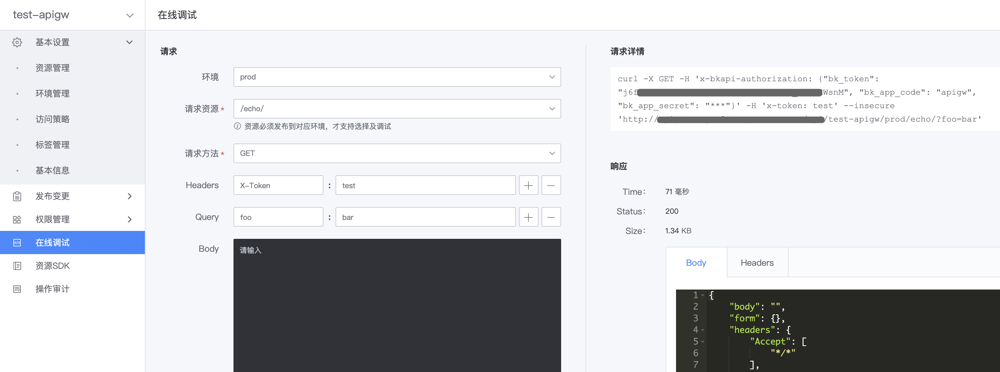

# 在线调试网关 API

新建网关资源、生成并发布版本后，可对资源对应的网关 API 进行在线调试，以确认网关 API 服务是否正常。
在线调试时，网关将使用提供的参数，真实的请求该网关 API，并展示请求的参数和响应内容，方便排查问题。

## 设置测试数据

在网关的管理页，点击左侧菜单**在线调试**，打开在线调试页。
在线调试需提供的数据包括：待测试的网关 API、请求参数、应用及用户认证配置。

### 待测试的网关 API

- 环境：选择待测试的网关环境
- 请求资源：待测试资源的请求路径，资源必须已发布到对应环境
- 请求方法：待测试资源的 HTTP Method

### 请求参数

- Headers：请求网关 API 时，发送的请求头
- Query：请求网关 API 是，发送的 querystring 参数
- Body：请求网关 API 时，发送的 Request Body 参数

### 应用及用户认证配置

- 应用认证：
  - 若选择`API 网关的测试应用`，则使用默认的测试应用账号，网关将自动为该应用添加短期（1天）的访问网关 API 权限
  - 若选择`自定义应用`，则需先创建应用，获取应用账号，并为该应用主动授权
- 用户认证：若网关 API 需认证用户，则从浏览器 Cookies 中获取用户登录态并添加到请求中

## 发送测试请求

点击**发送请求**，即可利用配置的参数，请求选定的网关 API，在页面右侧，可查看请求的参数及响应。

