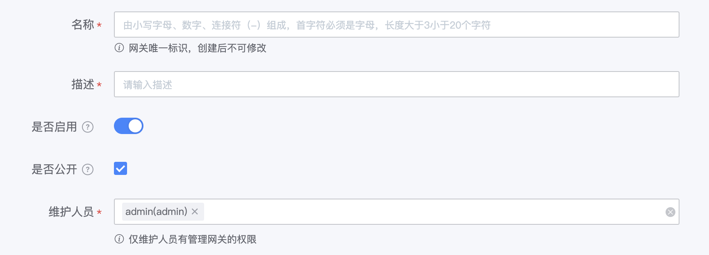
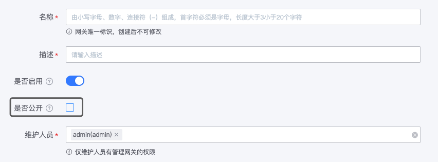

# 创建网关

网关是一组资源的集合，需要先创建网关，然后才能在网关下，新建环境、新建资源。

## 创建公开的网关

公开的网关，用户可在`蓝鲸开发者中心`申请网关 API 的权限，可在 `API 帮助中心`查看网关 API 的文档。

访问`蓝鲸 API 网关`，在**我的网关**菜单下，点击**创建网关**，填入网关名称及描述，勾选`是否公开`（默认已勾选），点击**创建**，即可创建公开的网关。

## 创建非公开的网关

非公开的网关，则网关对用户隐藏，在蓝鲸开发者中心、API 帮助中心不展示。

在**我的网关**菜单下，点击**创建网关**，填入网关名称及描述，取消勾选`是否公开`，点击**创建**，即可创建非公开的网关。

