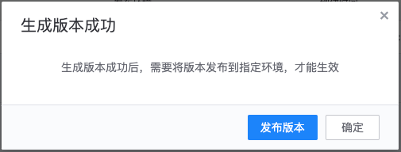

# 生成和发布版本

资源版本中，存储了生成版本时，网关下所有资源的配置。
新建或更新资源后，都需要生成的新版本，并将版本发布到环境，才能生效。

## 生成版本

在网关的管理页，展开左侧菜单**发布变更**，点击**版本管理**，在版本管理页，点击**生成版本**。

填写版本标题，方便对版本进行区分，点击**生成**即可生成新的版本。

## 发布版本

上一步骤中，生成版本成功后，将会弹出提示，点击提示框中的**发布版本**，即可跳转到版本发布页。

也可在网关管理页，展开左侧菜单项**发布变更**，点击**版本发布**，进入版本发布页。

- 环境：版本只有发布到环境，才能在该环境生效，可选择多个环境批量发布
- 发布版本：待发布的版本，如果版本在某环境已发布，则不可重复发布，需调整环境或待发布版本

