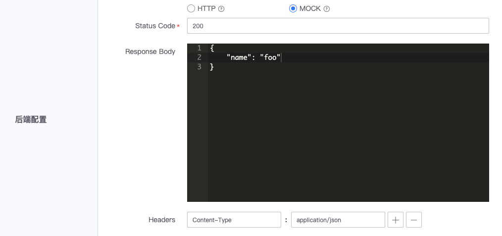

# 新建资源

资源是注册到网关的接口，配置主要包括：基本信息，前端配置，后端配置，安全设置。

在网关的管理页，展开左侧菜单**基本设置**，点击**资源管理**，进入网关的资源管理页，点击**新建资源**。

## 基本信息

- 资源名称：资源名称将用作网关 SDK 中的方法名，请设置一个含义明确的名称 
- 是否公开：若勾选，则表示公开，用户可查看文档、申请权限，否则，对用户隐藏
- 允许申请权限：若勾选，则蓝鲸应用可主动申请权限，否则，申请权限中不展示，只能网关主动为蓝鲸应用授权

## 前端配置

前端配置，用于设置用户请求该网关 API 的接口协议。
- 请求方法：请求网关 API 的 HTTP Method，可选择 GET、POST、PUT、PATCH、DELETE、HEAD、OPTIONS、ANY 
- 请求路径：请求网关 API 的路径部分，请求路径和后端接口的实际 Path 可以不同。请求路径中可配置路径变量

## 后端配置

后端配置为网关请求后端接口的配置，支持 HTTP、MOCK 两种类型。

### 后端配置 - HTTP

HTTP 类型时，后端接口为 HTTP 协议接口，可配置后端接口的请求方法、Path、Hosts、超时时间、请求头等。
- Method: 后端接口的 HTTP Method，可选择 GET、POST、PUT、PATCH、DELETE、HEAD、OPTIONS、ANY 
- Path: 后端接口地址的 Path 部分，不包含域名，例如后端接口地址为 http://backend.example.com/echo/，则 Path 应配置为 /echo/
- Hosts：若选择`使用环境配置`，将使用环境中配置的 Hosts，若选择`覆盖环境配置`，则使用资源当前配置的 Hosts
- 超时时间：若选择`使用环境配置`，将使用环境中配置的超时时间，若选择`覆盖环境配置`，则使用资源当前配置的超时时间 
- Header 转换：若选择`使用环境配置`，将使用环境中配置的 Header 转换，若选择`追加环境配置`，则将环境、资源的 Header 转换配置合并后，发送给后端接口

### 后端配置 - MOCK

MOCK 类型时，不实际请求后端接口，而是直接响应配置中指定的数据。
- Status Code: 合法的 HTTP 响应状态码，例如，响应成功，可设置为 200
- Response Body: 响应体中的内容，将作为响应体原样返回给调用方
- Headers：可设置`key:value`形式的响应头，将添加到响应头中

## 安全设置

安全设置主要定义了访问网关 API 时的几项要求：
- 应用认证：是否需要提供蓝鲸应用账号，若勾选，需先申请一个蓝鲸应用账号，才可访问该网关 API
- 校验访问权限：是否校验蓝鲸应用访问网关 API 的权限，若勾选，则网关需给应用授权，或应用需申请访问该网关 API 的权限，才可访问
- 用户认证：若勾选，则需要提供用户登录态或 access_token，以校验用户身份

