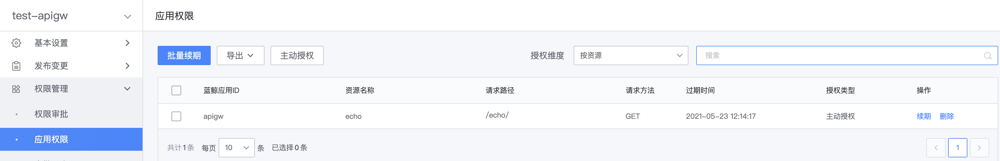

# 网关 API 主动授权

网关可主动为蓝鲸应用添加网关 API 的访问权限。

## 主动授权

在网关的管理页，展开左侧菜单**权限管理**，点击**应用权限**，打开权限管理页，点击**主动授权**。

填写授权信息：
- 蓝鲸应用ID：待授权蓝鲸应用的`bk_app_code`，可参考[获取蓝鲸应用账号](../use-api/bk-app.md)
- 有效时间：授权的有效期，可设置有限的时间，或永久有效
- 要授权的资源：
  - 所有资源：包括网关下所有资源，包括未来新创建的资源
  - 部分资源：仅包含当前选择的资源

点击**保存**，即可对应用添加权限。

## 查看网关已添加的授权

在网关的管理页，展开左侧菜单**权限管理**，点击**应用权限**，可查看网关已添加的权限列表。

- 授权维度：
  - 按网关：查询应用对应所有资源的权限
  - 按资源：查询应用对应单个资源的权限

