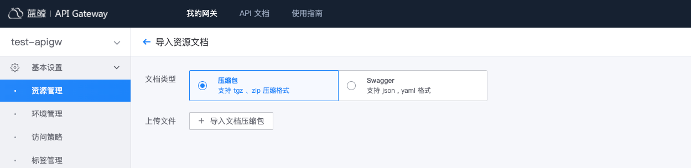
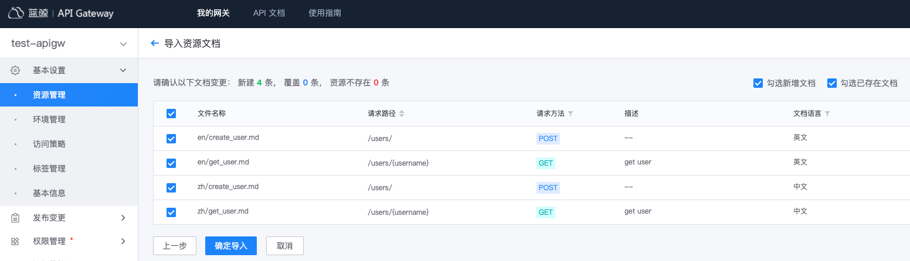
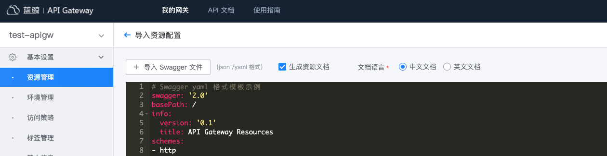

# 导入网关 API 文档

除在网关管理端创建、更新资源文档外，网关还支持导入 markdown 格式的资源文档或根据 Swagger 描述文件生成 markdown 格式的资源文档。

## 导入 markdown 格式的资源文档

导入 markdown 格式资源文档时，需先将文档文件归档为压缩包，然后使用归档的压缩包，导入资源文档。

### 准备资源文档压缩包

> 资源文档为 markdown 格式，文档规范可参考[API 资源文档规范](../reference/api-doc-specification.md)。

资源文档的文件名，应为 `资源名称` + `.md` 格式，假如资源名称为 get_user，则文档文件名应为 get_user.md。
将资源的中文文档放到目录 `zh` 下，英文文档放到目录 `en` 下，如果某语言文档不存在，可忽略对应目录。

> 更多 markdown 格式资源文档说明，请参考 [编写并归档 markdown 格式文档](../reference/import-resource-docs-by-archive.md)

压缩包中的文件目录样例如下：
```
.
├── en
│   ├── create_user.md
│   └── get_user.md
└── zh
    ├── create_user.md
    └── get_user.md
```

压缩包支持 tgz, zip 两种格式。在 Linux 系统中，你可以执行以下命名创建压缩包：
```
# 可将 my-gateway-name 替换为具体的网关名
zip -rq my-gateway-name.zip zh en
tar czf my-gateway-name.tgz zh en
```

### 导入压缩包中的资源文档

在网关的管理页，展开左侧菜单**基本设置**，点击**资源管理**，在按钮组**导入**中，选择**资源文档**。

文档类型选择"压缩包"，并选择上一步创建的文档压缩包。



文档变更预览，可选择需更新的资源文档，点击**确认导入**。



导入资源文档后，可在**资源管理**中，查看已导入的资源文档。


## 根据 Swagger 描述生成 markdown 格式资源文档

Swagger 协议中描述了接口说明，网关可利用其内容为资源生成 markdown 格式的文档。

通过 Swagger 描述生成资源文档，网关提供了两种方式：
- 导入资源文档时，文档类型选择 “Swagger”
- 导入资源时，勾选“生成资源文档”

### 直接根据 Swagger 描述生成资源文档

在网关的管理页，展开左侧菜单**基本设置**，点击**资源管理**，在按钮组**导入**中，选择**资源文档**。

文档类型选择"Swagger"，并选择“文档语言”，导入或填写 Swaager 描述。


文档变更预览，可选择需更新的资源文档，点击**确认导入**。


导入资源文档后，可在**资源管理**中，查看已导入的资源文档。


### 导入资源时，生成资源文档

在网关的管理页，展开左侧菜单**基本设置**，点击**资源管理**，在按钮组**导入**中，选择**资源配置**。

导入或填写 Swagger 描述，并勾选“生成资源文档”，选择“文档语言”



资源变更预览中，选择待更新的资源，同时选中资源的文档，也将会更新。


导入资源文档后，可在**资源管理**中，查看已导入的资源文档。


