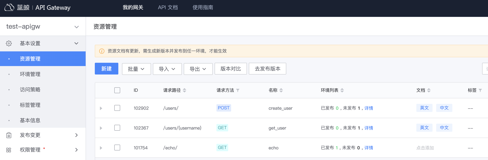

# 提供网关 API 文档

网关通过 `API 帮助中心`提供网关 API 的在线文档，方便用户使用网关 API。
为提供网关 API 在线文档，需要先更新网关资源文档，生成并发布版本，才能生效。

## 更新资源文档

在网关的管理页，展开左侧菜单**基本设置**，点击**资源管理**，在资源列表列“文档”下，点击添加文档，右侧弹出资源文档管理页。

选择对应的文档语言，点击**立即创建**，编辑文档内容并**提交**。资源文档为 markdown 格式，更多详情可参考[资源文档规范](../reference/api-doc-specification.md)

## 生成和发布版本

具体可参考[生成和发布版本](./create-resource-version-and-release.md)

发布版本后，即可在 API 帮助中心在线查看网关 API 文档。
注意：只有网关、资源均为公开时，可在线查看文档，若网关或资源为非公开，则不能查看该资源对应网关 API 的文档。

## 查看网关 API 文档

在 `API 帮助中心`，点击**网关 API 文档**菜单项，打开网关列表，可根据网关名称搜索，然后，点击具体的网关名称，进入网关 API 文档。

