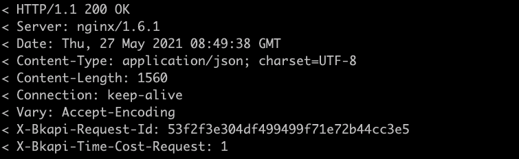
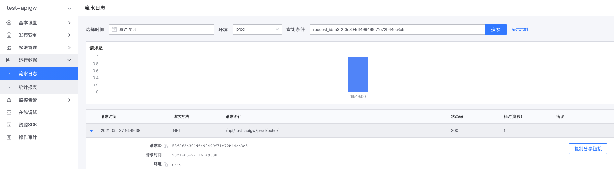

# RequestID

请求网关 API 时，网关将为每个请求，生成一个 RequestID，并通过头`X-Bkapi-Request-Id`传递给后端接口及网关 API 调用方。
建议网关 API 调用方及后端接口记录此 RequestID，便于排查问题。
- 网关 API 请求方，可通过响应 Header`X-Bkapi-Request-Id` 获取 RequestID
- 资源后端接口，可通过请求 Header `X-Bkapi-Request-Id` 获取 RequestID

响应 Header 中的 RequestID 样例

## 根据 RequestID 查询请求流水日志

在网关的管理页，展开菜单项**运行数据**，点击**流水日志**，打开日志查询页。

在流水日志中，可通过 RequestID 快速定位请求信息，便于排查问题，也可将日志分享给其他用户。

