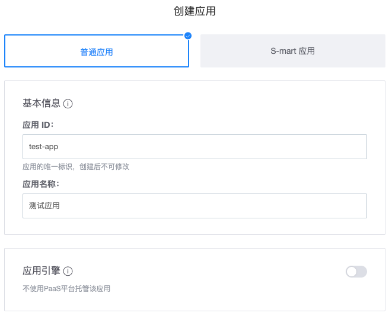
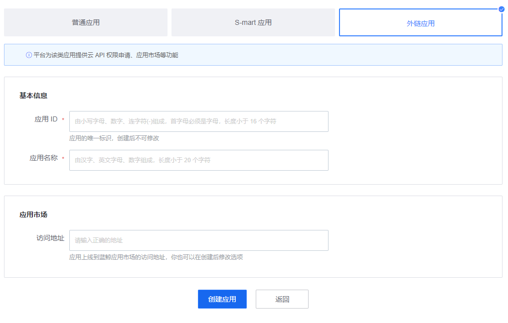

# 获取蓝鲸应用账号

访问云 API 时，若认证应用，则需要提供蓝鲸应用账号。

本文将引导您创建蓝鲸应用，并获取蓝鲸应用账号（应用ID：bk_app_code、应用秘钥：bk_app_secret）。

## 确定应用类型

`蓝鲸开发者中心` 提供以下3中基本的应用类型：
- 普通应用：平台为该类应用提供应用引擎、增强服务、云 API 权限、应用市场等功能；适用于自主基于PaaS平台开发SaaS的场景。
- 外链应用：平台为该类应用提供云 API 权限申请、应用市场等功能。

如仅需调用网关接口，创建外链应用即可，但后续有应用开发和部署需求的，可以选择普通应用。

## 普通应用

### 创建应用

访问`蓝鲸开发者中心`，点击**创建应用**，打开应用创建页，选择**普通应用**。

填写配置，并点击页面下方的**创建应用**按钮，即可创建一个蓝鲸应用：
- 应用 ID：应用的唯一标识，即 bk_app_code
- 应用名称：表示应用用途的名称
- 应用引擎：若不使用 PaaS 平台托管应用，可关闭应用引擎
- 应用市场：访问地址可设置为"暂不设置"

### 获取应用账号

访问`蓝鲸开发者中心`，点击导航菜单**应用开发**，搜索应用，并进入应用的管理页。

在应用管理页，展开左侧菜单**基本设置**，点击**基本信息**。
右侧页面鉴权信息中的`bk_app_code`和`bk_app_secret`，即为访问云 API 所需的蓝鲸应用账号。

## 外链应用

### 创建应用

访问`蓝鲸开发者中心`，点击**创建应用**，打开应用创建页，选择**外链应用**。

填写配置，并点击页面下方的**创建应用**按钮，即可创建一个蓝鲸应用：
- 应用 ID：应用的唯一标识，即 bk_app_code
- 应用名称：表示应用用途的名称

其余内容可以根据实际填写。

### 获取应用账号

类似于普通应用，进入外链应用的管理页面。

在应用管理页，展开左侧菜单**基本设置**，点击**基本信息**。
右侧页面鉴权信息中的`bk_app_code`和`bk_app_secret`，即为访问云 API 所需的蓝鲸应用账号。

