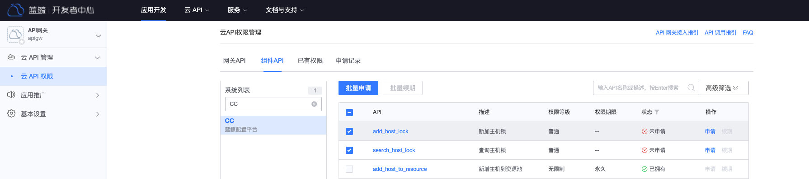
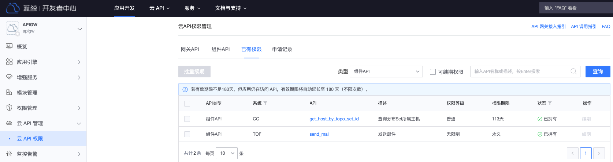

# 申请组件 API 权限

本文将引导您为蓝鲸应用申请组件 API 的访问权限。如何创建蓝鲸应用请参考[获取蓝鲸应用账号](../../apigateway/use-api/bk-app.md)。

## 申请组件 API 访问权限

访问`蓝鲸开发者中心`，进入应用管理页，展开左侧菜单**云 API 管理**，点击**云 API 权限**，进入云 API 权限管理页，切换到**组件 API**页。

在系统列表中，筛选出待申请权限的组件系统，点击系统名，然后，在右侧页面选中需访问的组件 API，点击**批量申请**。
在申请记录中，可查看申请单详情。待权限审批通过后，即可访问组件 API。

## 查看应用的组件 API 权限

参考上一部分，进入云 API 权限管理页，切换到**已有权限**页，类型选择`组件 API`，可查看应用当前拥有的组件 API 权限列表。

