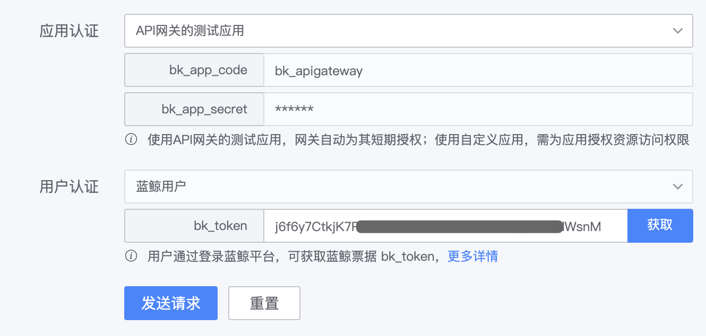

# Online debugging gateway API

After creating a new gateway resource, generating and publishing the version, you can debug the gateway API corresponding to the resource online to confirm whether the gateway API service is normal.
During online debugging, the gateway will use the provided parameters to actually request the gateway API, and display the requested parameters and response content to facilitate troubleshooting.

## Set test data

On the gateway's management page, click **Online Debugging** on the left menu to open the online debugging page.
The data required for online debugging includes: gateway API to be tested, request parameters, application and user authentication configuration.

### Gateway API to be tested

- Environment: Select the gateway environment to be tested
- Request resource: the request path of the resource to be tested, the resource must have been published to the corresponding environment
- Request method: HTTP Method of the resource to be tested

### Request parameters

- Headers: Request headers sent when requesting the gateway API
- Query: Requesting the gateway API is the querystring parameter sent
- Body: Request Body parameter sent when requesting the gateway API

### Application and user authentication configuration

- Application certification:
   - If you select `API Gateway Test Application`, use the default test application account, and the gateway will automatically add short-term (1 day) access to the gateway API permissions to the application.
   - If you choose `custom application`, you need to create an application first, obtain an application account, and actively authorize the application
- User authentication: If the gateway API needs to authenticate the user, the user login status is obtained from the browser cookies and added to the request.

## Send test request

Click **Send Request** to request the selected gateway API using the configured parameters. On the right side of the page, you can view the requested parameters and response.

