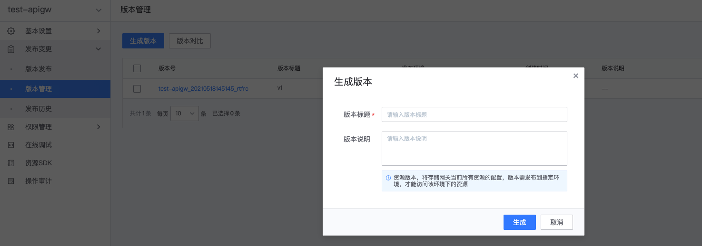
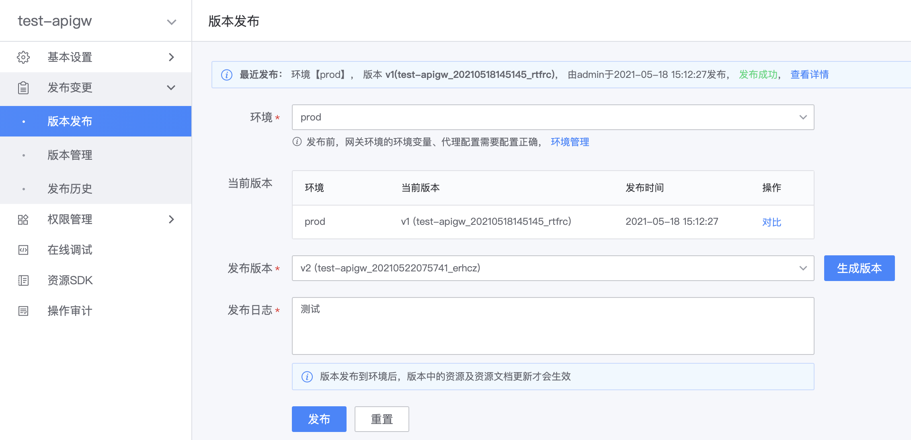

# Build and release versions

In the resource version, the configuration of all resources under the gateway is stored when the version is generated.
After creating or updating a resource, you need to generate a new version and publish the version to the environment for it to take effect.

## Generate version

On the gateway's management page, expand the left menu **Publish Changes**, click **Version Management**, on the version management page, click **Generate Version**.

Fill in the version title to facilitate the differentiation of versions, and click **Generate** to generate a new version.

## release version

In the previous step, after the version is successfully generated, a prompt will pop up. Click **Release Version** in the prompt box to jump to the version release page.

You can also expand the left menu item **Publish Changes** on the gateway management page and click **Version Release** to enter the version release page.

- Environment: Only when the version is released to the environment can it take effect in that environment. Multiple environments can be selected for batch release.
- Release version: The version to be released. If the version has been released in a certain environment, it cannot be released again. The environment or the version to be released needs to be adjusted.

