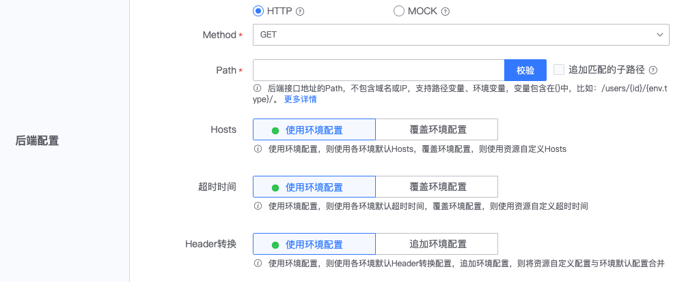

# Create new resource

The resource is the interface registered to the gateway. The configuration mainly includes: basic information, front-end configuration, back-end configuration, and security settings.

On the gateway's management page, expand the left menu **Basic Settings**, click **Resource Management**, enter the gateway's resource management page, and click **New Resource**.

## Basic Information

- Resource name: The resource name will be used as the method name in the gateway SDK. Please set a clear name
- Whether it is public: If checked, it means it is public and users can view the document and apply for permissions. Otherwise, it is hidden from users.
- Allow application for permissions: If checked, the BlueKing application can actively apply for permissions. Otherwise, it will not be displayed in the application permissions, and the gateway can only actively authorize the BlueKing application.

## Front-end configuration

Front-end configuration, used to set the interface protocol for users to request the gateway API.
- Request method: HTTP Method for requesting the gateway API, you can choose GET, POST, PUT, PATCH, DELETE, HEAD, OPTIONS, ANY
- Request path: The path part of the request gateway API. The request path and the actual Path of the backend interface can be different. Configurable path variables in the request path

## Backend configuration

The backend configuration is the configuration of the gateway request backend interface, which supports HTTP and MOCK.

### Backend Configuration - HTTP

When the HTTP type is used, the backend interface is an HTTP protocol interface, and the request method, Path, Hosts, timeout, request headers, etc. of the backend interface can be configured.
- Method: HTTP Method of the backend interface, you can choose GET, POST, PUT, PATCH, DELETE, HEAD, OPTIONS, ANY
- Path: The Path part of the backend interface address, excluding the domain name. For example, the backend interface address is http://backend.example.com/echo/, then the Path should be configured as /echo/
- Hosts: If you select `Use environment configuration`, the Hosts configured in the environment will be used. If you select `Override environment configuration`, the Hosts currently configured for the resource will be used.
- Timeout: If you select 'Use environment configuration', the timeout configured in the environment will be used. If you select 'Override environment configuration', the timeout currently configured for the resource will be used.
- Header conversion: If you select 'Use environment configuration', the Header conversion configured in the environment will be used. If you select 'Append environment configuration', the Header conversion configuration of the environment and resources will be combined and sent to the back-end interface.

### Backend configuration - MOCK

When using the MOCK type, it does not actually request the backend interface, but directly responds to the data specified in the configuration.
- Status Code: Legal HTTP response status code, for example, the response is successful, which can be set to 200
- Response Body: The content in the response body will be returned to the caller as the response body.
- Headers: Response headers in the form of `key:value` can be set and will be added to the response headers

## Security Settings

Security settings mainly define several requirements for accessing the gateway API:
- Application authentication: Do you need to provide a BlueKing application account? If checked, you need to apply for a BlueKing application account before you can access the gateway API.
- Verify access permissions: Whether to verify the BlueKing application's permission to access the gateway API. If checked, the gateway needs to authorize the application, or the application needs to apply for permission to access the gateway API before it can access
- User authentication: If checked, user login status or access_token needs to be provided to verify user identity.

