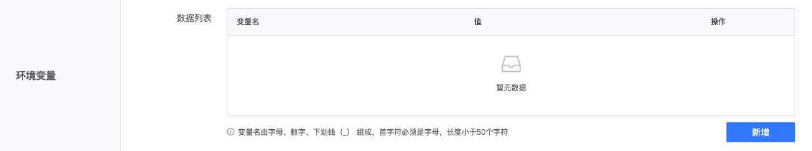
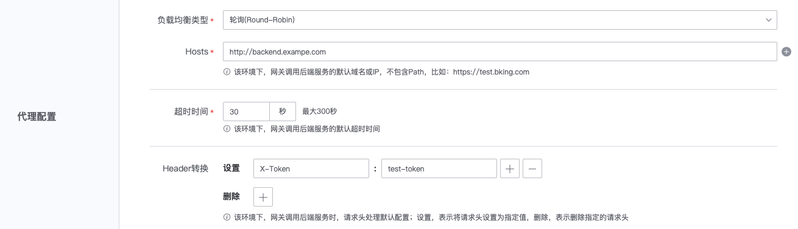

# Create a new environment

The gateway supports the creation of environments to meet API calling requirements in different scenarios. For example, a test environment can be created that corresponds to the test environment of the back-end interface, thereby ensuring that the same set of resource configurations can be used in different scenarios to use the gateway API.

On the gateway's management page, expand the left menu **Basic Settings**, click **Environment Management**, enter the gateway's environment management page, and click **New Environment**.

## Basic Information

Configure the environment name. The environment name will be used as part of the gateway API interface address. Please set a name with a clear meaning. For example, for a test environment, you can use `test`.

## Environment variables

Configure environment variables in the form of `key:value`. The same `key` can be configured with different `value` in different environments. These environment variables can be referenced in resource configuration.
Please refer to [Template Variables](../reference/template-vars.md) for details.

## Agent configuration

### Configure the default backend interface Hosts of the environment

In this environment, the gateway calls the default domain name or IP of the backend service, which does not include the Path part, for example: http://backend.example.com.

Note: The initial value of Hosts in the environment `prod` created by the gateway is a placeholder, which needs to be modified to the correct back-end interface domain name.

### Configure the default timeout of the environment

In this environment, the default timeout for the gateway to call the backend service can be set according to needs.
If set to 30 seconds, if a resource takes more than 30 seconds, a separate timeout can be set in the resource configuration.

### Pass fixed request headers to the backend interface

The `setting` part of the Header conversion can set the request header in the form of `key:value`. In this environment, when the gateway calls the backend interface, it will pass the configured request header to the backend interface.

