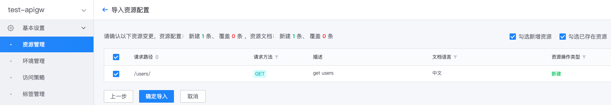

# Import gateway API documentation

In addition to creating and updating resource documents on the gateway management side, the gateway also supports importing resource documents in markdown format or generating resource documents in markdown format based on the Swagger description file.

## Import resource documents in markdown format

When importing markdown format resource documents, you need to archive the document files into a compressed package first, and then use the archived compressed package to import the resource documents.

### Prepare resource document compression package

> Resource documents are in markdown format. For document specifications, please refer to [API Resource Document Specification](../reference/api-doc-specification.md).

The file name of the resource document should be in the format of `resource name` + `.md`. If the resource name is get_user, the document file name should be get_user.md.
Place the Chinese documents of the resource under the directory `zh`, and the English documents under the directory `en`. If a certain language document does not exist, the corresponding directory can be ignored.

> For more descriptions of markdown format resource documents, please refer to [Writing and Archiving Markdown Format Documents](../reference/import-resource-docs-by-archive.md)

An example of the file directory in the compressed package is as follows:
```
.
├── en
│ ├── create_user.md
│ └── get_user.md
└── en
     ├── create_user.md
     └── get_user.md
```

The compressed package supports two formats: tgz and zip. On a Linux system, you can create a compressed package by executing the following naming:
```
# My-gateway-name can be replaced with the specific gateway name
zip -rq my-gateway-name.zip en
tar czf my-gateway-name.tgz zh en
```

### Import resource documents in the compressed package

On the gateway's management page, expand the left menu **Basic Settings**, click **Resource Management**, and in the button group **Import**, select **Resource Document**.

Select "Compressed Package" as the document type, and select the document compressed package created in the previous step.


To preview document changes, you can select the resource document to be updated and click **Confirm Import**.


After importing resource documents, you can view the imported resource documents in **Resource Management**.


## Generate markdown format resource documents based on Swagger description

The interface description is described in the Swagger protocol, and the gateway can use its content to generate markdown format documentation for the resource.

The gateway provides two ways to generate resource documents through Swagger description:
- When importing resource documents, select "Swagger" as the document type
- When importing resources, check "Generate resource documents"

### Generate resource documents directly based on Swagger description

On the gateway's management page, expand the left menu **Basic Settings**, click **Resource Management**, and in the button group **Import**, select **Resource Document**.

Select "Swagger" as the document type, select "Document Language", and import or fill in the Swaager description.


To preview document changes, you can select the resource document to be updated and click **Confirm Import**.


After importing resource documents, you can view the imported resource documents in **Resource Management**.


### When importing resources, generate resource documents

On the gateway's management page, expand the left menu **Basic Settings**, click **Resource Management**, and in the button group **Import**, select **Resource Configuration**.

Import or fill in the Swagger description, check "Generate Resource Document" and select "Document Language"


In the resource change preview, select the resource to be updated, and the document of the selected resource will also be updated.



After importing resource documents, you can view the imported resource documents in **Resource Management**.

