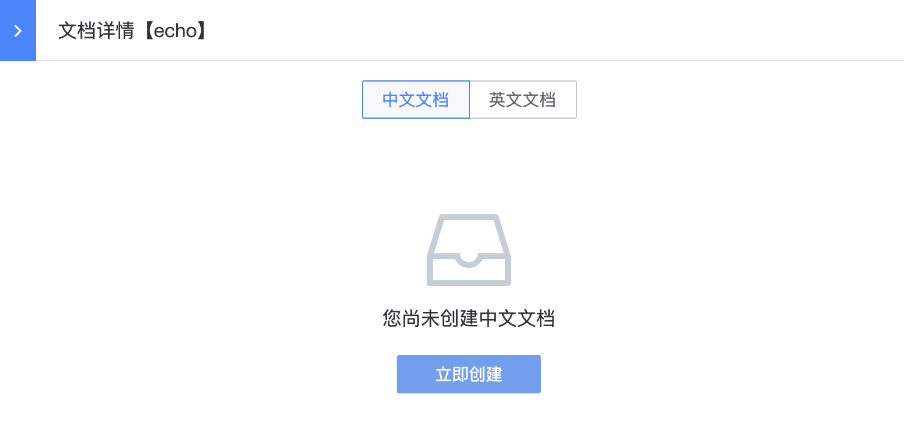
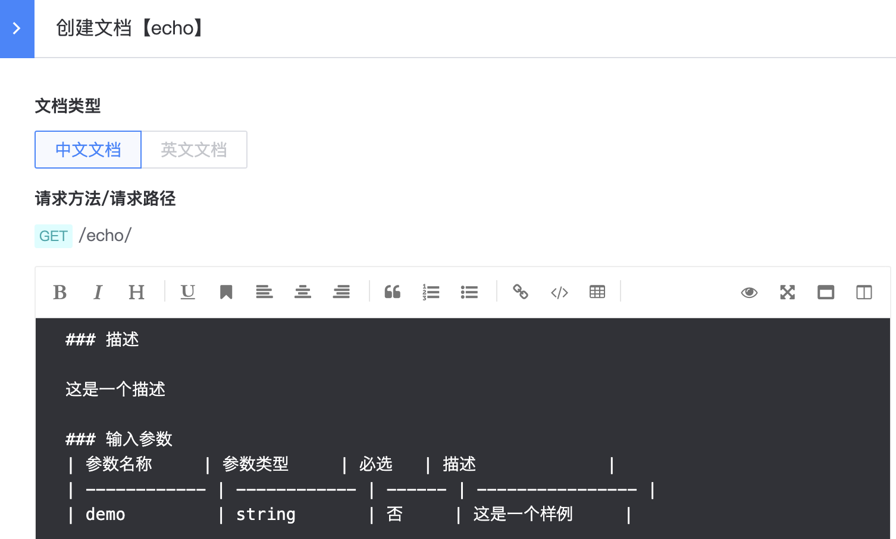

# Provide gateway API documentation

The gateway provides online documentation of the gateway API through the `API Help Center` to facilitate users to use the gateway API.
In order to provide gateway API online documentation, you need to update the gateway resource documentation, generate and publish the version before it can take effect.

## Update resource document

On the gateway's management page, expand the left menu **Basic Settings**, click **Resource Management**, under the resource list column "Documents", click Add Document, and the resource document management page will pop up on the right.

Select the corresponding document language, click **Create Now**, edit the document content and **Submit**. The resource document is in markdown format. For more details, please refer to [Resource Document Specification](../reference/api-doc-specification.md)

## Build and release versions

For details, please refer to [Generate and Release Version](./create-resource-version-and-release.md)

Once a version is released, the gateway API documentation will be available online in the API Help Center.
Note: Only when the gateway and resources are public, you can view the documentation online. If the gateway or resource is private, you cannot view the documentation for the gateway API corresponding to the resource.

## View gateway API documentation

In the `API Help Center`, click the **Gateway API Documentation** menu item to open the gateway list. You can search based on the gateway name. Then, click on the specific gateway name to enter the gateway API documentation.

