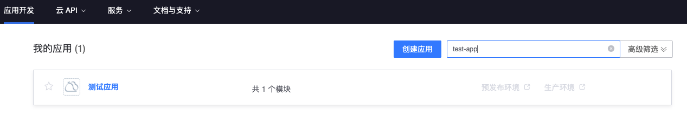
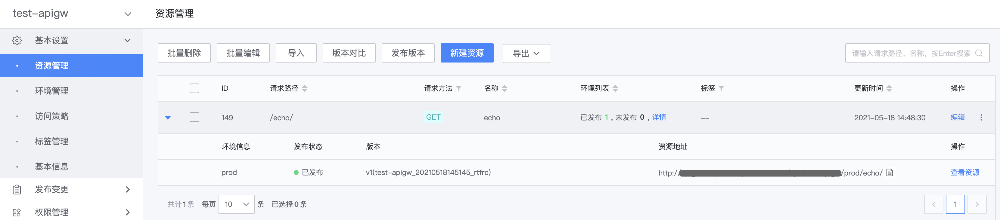

# Create gateway API

This article will guide you in the API gateway to connect the back-end interface of the HTTP protocol to the gateway, and use the BlueKing application account to access the gateway API.

## Overview

The main steps in this article are as follows:
- Create gateway
- Create a new environment
- Create new resources
- Build and release versions
- Online debugging
- Create and authorize BlueKing applications
- Call gateway API

## Create gateway

A gateway is a collection of resources. You need to create a gateway first, and then create a new environment and resources under the gateway.

Visit `BlueKing API Gateway`, under the **My Gateway** menu, click **Create Gateway**. Enter the gateway name. In the example, we use the name `test-apigw` and use the default value for the user type.


## Create a new environment

On the management page of the gateway `test-apigw`, expand the left menu **Basic Settings**, click **Environment Management**, and enter the gateway's environment management page.

When creating the gateway in the previous step, the system created the environment `prod` by default. You can use this environment directly. Click **Edit** to enter the environment editing page.

Change `Hosts` in the environment **proxy configuration** to the domain name of the backend interface. In the example, the address of the backend interface is: http://test.example.com/echo/, then Hosts should be set to: http://test.example.com.


## Create new resource

This step will configure the back-end interface information to the gateway, which mainly includes several parts: basic information, front-end configuration, back-end configuration, and security settings.

On the management page of the gateway `test-apigw`, expand the left menu **Basic Settings**, click **Resource Management**, enter the resource management page of the gateway, and click **New Resource**.

### Create new resource - basic configuration

Configure the resource name. The resource name will be used as the method name in the SDK and as the unique identifier of the resource when displaying documents. In the example, the resource name is configured as `echo`.


### Create new resource - front-end configuration

The front-end configuration includes request method and request path, which are used to set the interface protocol for users to request the gateway API. `Gateway domain name` + `Environment name` + `Resource request path` is the complete interface address of the gateway API.

For example, if the desired gateway API interface protocol is GET http://{domain}/{stage-name}/echo/, the request method should be set to GET and the request path should be set to /echo/.


### Create new resource - backend configuration

The backend configuration is the configuration of the gateway request backend interface, including the request method, Path, Hosts, timeout, etc. of the backend interface.

Path contains only the path portion of the backend interface address, not the domain name. In the example, the complete backend interface address is: http://test.example.com/echo/, then the Path should be configured as: /echo/

Hosts select `Use environment configuration`. When the gateway requests the backend interface, it will obtain the Hosts in the environment proxy configuration and combine it with the Path in the resource configuration to obtain the complete backend interface address.
In the step of creating an environment in this example, the Hosts configuration of the environment `prod` is: http://test.example.com, then the backend interface address combined by the resource Hosts and Path is: http://test.example.com/ echo/.


### New Resource - Security Settings

Security settings mainly define several requirements for accessing the gateway API:
- Application authentication: Do you need to provide a BlueKing application account? If checked, you need to apply for a BlueKing application account before you can access the gateway API.
- Verify access permissions: Whether to verify the BlueKing application's permission to access the gateway API. If checked, the gateway needs to authorize the application, or the application needs to apply for permission to access the gateway API before it can access
- User authentication: Do you need to provide user login status or access_token to verify user identity?

In the example, uncheck **User Authentication** and the user will not be authenticated temporarily.


## Build and release versions

After you create a new resource, it will not take effect directly. Instead, you need to generate a version and publish it to the environment before you can provide the gateway API to the outside world.

On the management page of gateway `test-apigw`, expand the left menu **Publish Changes**, click **Version Management**, on the version management page, click **Generate Version**.

Fill in the version title to facilitate the differentiation of versions, and click **Generate** to generate the version.


After the version is successfully generated, a prompt will pop up. Click **Release Version** in the prompt box.


On the version release page, select the environment to be released. In the example, the environment creation step configures the environment `prod`. Select this environment, fill in the release log, and click **Publish** to release the version to the environment `prod`.


So far, we have created the gateway, environment, resources, and generated and released the version. Once the version is released, the complete creation process of the gateway API is completed. Next, we will conduct online debugging and call the gateway API.

## Online debugging

On the management page of the gateway `test-apigw`, expand the left menu **Online Debugging**, select `prod` for the environment, and select the newly created resource `/echo/` for the resource request. Click **Send Request**. On the right side of the page are the request details, including request parameters and response.


## Create a BlueKing application and authorize the BlueKing application

Since when creating a new resource, the security settings are configured with **Application Authentication** and **Access Permission Verification**, therefore, you need to apply for a BlueKing application account and authorize the application to access the gateway API before you can access it. The gateway API.

### Create a BlueKing application

Visit `BlueKing Developer Center` to create an application.

- Application ID: It is the unique identification of the application. In the example, it can be set to: test-app.
- Application engine: To simplify the creation process, turn off the application engine
- App Market: The access address can be set to "Not set yet"


### Get BlueKing App Account

Visit `BlueKing Developer Center`, click on the navigation menu **Application Development**, search and enter the application created in the previous step.



On the application management page, expand the left menu **Basic Settings** and click **Basic Information**. The `bk_app_code` and `bk_app_secret` in the authentication information are the BlueKing application account required to access the gateway API.


### Authorize the BlueKing application

On the management page of the gateway `test-apigw`, expand the left menu **Permission Management**, open the **Application Permissions** page, and click **Active Authorization**.

In the right page that pops up, fill in the BlueKing application `test-app` created in the previous step with the BlueKing application ID, and click Save to authorize the application.


## Call gateway API

On the management page of gateway `test-apigw`, expand the left menu **Basic Settings** and open the **Resource Management** page. In the resource list, find the resource created in the previous step and click **Details**.
Expand the resource address in the page, which is the interface access address of the gateway API.



When requesting the gateway API, put the BlueKing application account (`bk_app_code + bk_app_secret`) information in the request header **X-Bkapi-Authorization**, and the value is a JSON format string.
Assume that the request address of the gateway API is: http://bkapi.example.com/api/test-apigw/prod/echo/, then the example of using curl to access the gateway API is as follows:

```powershell
curl 'http://bkapi.example.com/api/test-apigw/prod/echo/' \
     -H 'X-Bkapi-Authorization: {"bk_app_code": "test-app", "bk_app_secret": "test-app-secret"}'
```