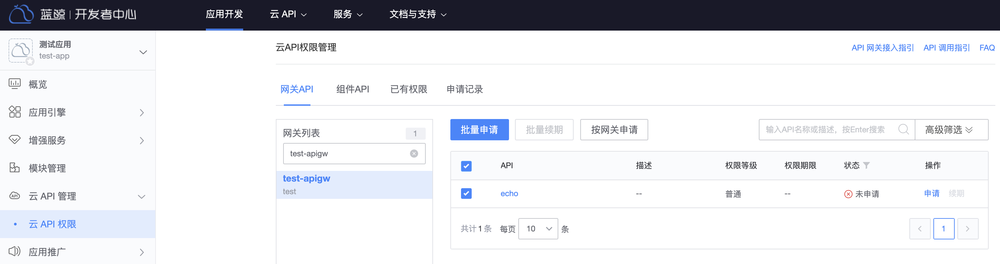

# Apply for gateway API permissions

This article will guide you in applying for gateway API access for your BlueKing application. For how to create a BlueKing application, please refer to [Get a BlueKing application account](./bk-app.md).

## Apply for gateway API access permission

There are two options for applying for gateway API access: application by the application leader, and active authorization by the gateway administrator.

### Application manager application

Visit `BlueKing Developer Center`, enter the application management page, expand the left menu **Cloud API Management**, click **Cloud API Permissions**, and enter the cloud API permissions management page.

In the gateway list, filter out the gateways for which permissions are to be applied, click on the gateway name, then select the gateway API to be accessed on the right page, and click **Batch Application**.
In the application record, you can view the application details. After the permission is approved, you can access the gateway API.

### Gateway administrator actively authorizes

The person in charge of the application provides the BlueKing application ID (i.e. `bk_app_code`) and the list of gateway APIs for which permissions are to be applied, and contacts the gateway administrator for proactive authorization.
For gateway administrator active authorization, please refer to [Gateway API Active Authorization](../howto/grant-api-permissions.md)

## View the gateway API permissions of the application

Visit `BlueKing Developer Center`, enter the application management page, expand the left menu **Cloud API Management**, click **Cloud API Permissions**, and enter the cloud API permissions management page.

Click **Existing Permissions** and select `Gateway API` as the type to view the list of gateway API permissions currently owned by the application.

