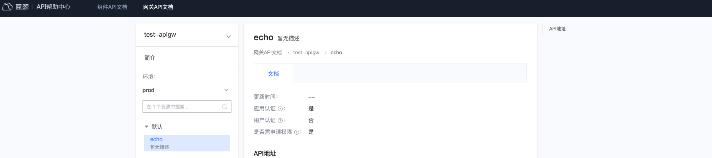

# Call the gateway API

This article will guide you in calling an existing gateway API, which requires authenticating applications, authenticating users, and verifying application access permissions.

## Overview

The main steps in this article are as follows:
- Apply for a BlueKing app account
- Apply for gateway API access
- Determine user authentication scheme
- Call gateway API

Visit the API Help Center and click the navigation menu **Gateway API Documentation** to search and view the documentation for the Gateway API.
Understand the gateway API authentication configuration, calling address, request parameters and other instructions.



## Apply for a BlueKing app account

To access the gateway API, you need a BlueKing application account. You can use an existing application account or create a new application.

Visit `BlueKing Developer Center`, click on the navigation menu **Application Development**, search and enter the BlueKing application you are using.


On the application management page, expand the left menu **Basic Settings** and click **Basic Information**. The `bk_app_code` and `bk_app_secret` in the authentication information are the BlueKing application account required to access the gateway API.


## Apply for gateway API access permission

Refer to the previous step and enter the BlueKing application management page. On the application management page, expand the left menu **Cloud API Management**, click **Cloud API Permissions**, and enter the Cloud API Permissions Management page.

In the gateway list, filter out the gateways for which permissions are to be applied, click on the gateway name, then select the gateway API to be accessed on the right page, and click **Batch Application**.
In **Application Record**, you can view the details of the application form. After the permission is approved, you can access the gateway API.


## Determine user authentication scheme

User authentication is used to confirm the true identity of the current operator, usually through user login state verification.

- Login state: User login state. After the user logs in, it is stored in browser cookies. The login state is generally valid for no more than 24 hours.

*Note: If the gateway API requires user authentication, but the caller cannot provide user login status, you can contact the gateway administrator to inquire whether you can apply for a user authentication-free application whitelist*

## Call gateway API

To call the gateway API, you can use the gateway SDK or other tools.

### Use the gateway SDK to access the gateway API

Visit the API Help Center and click the menu **Gateway API SDK** to search for the gateway's SDK. If the gateway does not provide an SDK, you can contact the gateway administrator to generate the gateway SDK.
For instructions on using the gateway SDK, refer to the API Help Center, **SDK Description** under the menu **Gateway API SDK**.


### Use tools to access the gateway API

Request parameters:
- Request protocol: request method and request address, which can be viewed in the gateway API documentation
- Authentication information: application information (`bk_app_code + bk_app_secret`), user information (`User login status`), passed through the request header `X-Bkapi-Authorization`, and the value is a JSON format string.
- Gateway API parameters: can be viewed in the Gateway API documentation

Curl call example:
```powershell
curl 'http://bkapi.example.com/prod/users/' \
     -d '{"bk_biz_id": 1}' \
     -H 'X-Bkapi-Authorization: {"bk_app_code": "x", "bk_app_secret": "y", "bk_token": "z"}'
```

Python call example:
```python
import json
import requests

requests.post(
     "http://bkapi.example.com/prod/users/",
     json={"bk_biz_id": 1},
     headers={
         "X-Bkapi-Authorization": json.dumps({
             "bk_app_code": "x",
             "bk_app_secret": "y",
             "bk_token": "z"
         })
     },
)
```