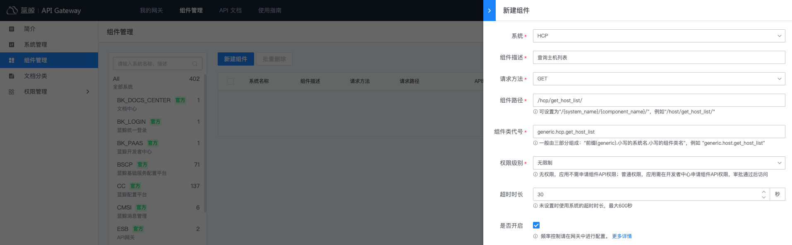

# Create component API

When the interface [access gateway API](../../apigateway/quickstart/create-api-with-http-backend.md) cannot be directly connected, for example, it is a non-HTTP interface and the interface needs to be customized,
You can write code to connect the interface to the component API to provide a unified cloud API for easy management and use.

This article will guide you to create a component API through coding in the API gateway, and use the BlueKing application account to access the component API.

## Overview

The main steps in this article are as follows:
- Prepare development environment
- Write component code
- Publish component code
- Create a new system
- Create new components
- Call component API

## Prepare development environment

Currently, the gateway supports the development of custom components using the Python language. Before starting development, please prepare a Python virtual environment.
And download the component development template to facilitate development and debugging.

### Prepare Python virtual environment

Python version supports 3.6.x, you can use [pyenv](https://github.com/pyenv/pyenv), [pyenv-virtualenv](https://github.com/pyenv/pyenv-virtualenv) to manage Python virtual environment .

```
# Assume pyenv, pyenv-virtualenv are installed

# Install python 3.6.6
pyenv install 3.6.6

#Create virtualenv
pyenv virtualenv 3.6.6 api_dev_template

# Activate virtualenv
pyenv activate api_dev_template
```

### Download component development template and install dependent packages

Download <a href="../../assets/component/file/api_dev_template.tar.gz" target="_blank">Component development template</a>,
Unzip and install dependent packages.

```
# Unzip
tar xzvf api_dev_template.tar.gz

# Enter the template directory
cd api_dev_template

#Install dependency packages
pip install -r requirements.txt
```

## Write component code

It is assumed that the interface information to be accessed is as follows:
- System name: Host configuration platform, English name HCP
- Interface name: query host list, English name get_host_list
- Interface address: http://hcp.example.com/api/get_host_list/

### Create system and component files

Under the components/generic/apis/ module of the template project, create directories and files according to the following structure, please refer to <a href="../../assets/component/file/hcp.tar.gz" target="_blank ">Component sample</a>:

```
components/generic/apis/
|-- __init__.py
|-- hcp
| |-- __init__.py
| |-- toolkit
| | |-- __init__.py
| | |-- configs.py
| | |-- tools.py
| |-- get_host_list.py
```

- hcp is the component system package, and the package name is the English name of the component system in lowercase letters.
- hcp/toolkit is the component system toolkit, including component system configuration and sharing methods
- hcp/toolkit/configs.py configures the module for the component system, which can configure the system name, system interface address, etc.
- hcp/toolkit/tools.py is a common method module for component systems
- hcp/get_host_list.py is the component module corresponding to the interface "query host list", and the module name is the component name.

### Update component system configuration module

In the configuration module components/generic/apis/hcp/toolkit/configs.py, add component system configuration, as follows:

```python
# -*- coding: utf-8 -*-
from esb.utils import SmartHost


# The lower case of the component system name must be consistent with the system package name
SYSTEM_NAME = "HCP"

host = SmartHost(
     # Domain name of the formal environment of the system interface
     host_prod="http://hcp.example.com",
)
```

### Write component code

In the component module components/generic/apis/hcp/get_host_list.py, add the component code, as follows:

```python
# -*- coding: utf-8 -*-
import json

from django import forms

from common.forms import BaseComponentForm, TypeCheckField
from components.component import Component
from .toolkit import configs


# The component class name is formed by removing the underscore (_) from the English name of the component and converting the first letters of each word to uppercase. For example, the component class name of get_host_list should be GetHostList.
class GetHostList(Component):

     # The system name of the system to which the component belongs
     sys_name = configs.SYSTEM_NAME

     # Form handles parameter verification
     class Form(BaseComponentForm):
         bk_biz_id = forms.CharField(label="Business ID", required=True)
         ip_list = TypeCheckField(label="Host IP Address", promise_type=list, required=False)

         #The data returned by the clean method can be obtained through the form_data attribute of the component
         def clean(self):
             return self.get_cleaned_data_when_exist(keys=['bk_biz_id', 'ip_list'])

     #Component processing entry
     def handle(self):
         # Get the data processed by Form clean
         data = self.form_data

         # Request system backend interface
         response = self.outgoing.http_client.post(
             host=configs.host,
             path="/api/get_host_list/",
             data=json.dumps(data),
             headers={
                 # Add the current operator to the request header
                 "Bk-Username": self.current_user.username,
                 # Add the bk_app_code of the current request application to the request header
                 "Bk-App-Code": self.request.app_code,
             },
         )

         # Parse the results
         code = response["code"]
         if code == 0:
             result = {
                 "result": True,
                 "data": response["data"],
             }
         else:
             result = {
                 "result": False,
                 "message": result["message"]
             }

         #Set the component to return the result. The payload content is the actual response result of the component.
         self.response.payload = result
```

For more information on writing custom component classes, please refer to [Component Class Development](../reference/component-development.md)

### Local test component API

Start the local service and use curl to test the written component code
```
# Start the local service. The default address of the service is: http://127.0.0.1:8000
python manage.py runserver

# Use curl to test the component API. In the component request path, /api/c/compapi/ is the unified prefix, hcp is the lowercase English name of the system, and get_host_list is the English name of the component.
curl "http://127.0.0.1:8000/api/c/compapi/hcp/get_host_list/" \
     -d '{"bk_biz_id": 1, "ip_list": ["10.0.0.1"]}'
```
## Publish component code

In the above steps, the component code has been written using the component development template. These customized component codes need to be published to the component project `bk-esb` in order to truly provide component API services to the outside world.

Currently, the project `bk-esb` adopts a containerized deployment solution. The specific steps for publishing component code are as follows:

TODO: Because the plan needs to be updated, this part of the document needs to be updated, 2021-06-28

## Create a new system

Visit `BlueKing API Gateway`, under the top navigation menu **Component Management**, click the left menu **System Management**, click **New System**, fill in the required configuration, and then save it to create a new one. system.


## Create new component

Under the **Component Management** menu, click **Component Management** on the left menu to open the component management page, click **New Component**, fill in the required configuration, and then save to create a new component.



So far, we have written and published the component code, and created a new component system and component configuration. The complete creation process of the component API has been completed. Next, we will call the component API.

## Call component API

To call the component API, you need to apply for a BlueKing application account. However, since the permission level is set to "unrestricted" when creating a new component, there is no need to authorize the application to access the component API.

### Create a BlueKing application

Visit `BlueKing Developer Center` to create an application.

- Application ID: It is the unique identification of the application. In the example, it can be set to: test-app.
- Application engine: To simplify the creation process, turn off the application engine
- App Market: The access address can be set to "Not set yet"


### Get BlueKing App Account

Visit `BlueKing Developer Center`, click on the navigation menu **Application Development**, search and enter the application created in the previous step.


On the application management page, expand the left menu **Basic Settings** and click **Basic Information**. The `bk_app_code` and `bk_app_secret` in the authentication information are the BlueKing application account required to access the gateway API.


### Access component API

On the component management page, first filter the system HCP. In the component list, you can view the API address of the component.


When requesting the component API, put the BlueKing application account (`bk_app_code + bk_app_secret`) information in the request header **X-Bkapi-Authorization**, and the value is a JSON format string.

Assume that the request address of the component API is: http://bkapi.example.com/api/c/compapi/hcp/get_host_list/, then the example of using curl to access the component API is as follows:

```powershell
curl 'http://bkapi.example.com/api/c/compapi/hcp/get_host_list/' \
     -H 'X-Bkapi-Authorization: {"bk_app_code": "test-app", "bk_app_secret": "test-app-secret"}'
```