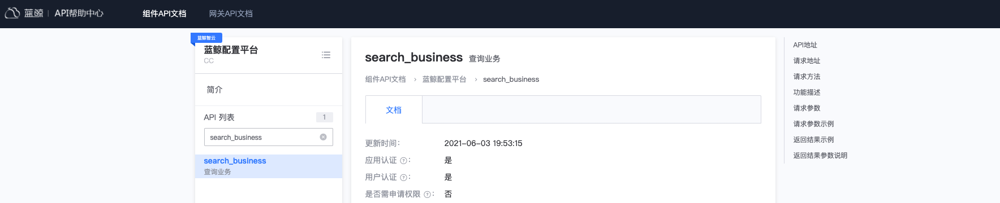

# Call component API

This article will guide you in calling an existing component API. It is assumed that the component API needs to authenticate the application, authenticate the user, and verify application access permissions.

To call the gateway API, please refer to [Calling the gateway API](../../apigateway/use-api/use-apigw-api.md)

## Overview

The main steps in this article are as follows:
- Apply for a BlueKing app account
- Apply for component API access
- Determine user authentication scheme
- Call component API

Visit the `API Help Center` and click the navigation menu **Component API Documentation** to search and view the documentation of the component API and learn about the component API calling address, request parameters and other instructions.



## Apply for a BlueKing app account

To access the component API, you need a BlueKing application account. You can use an existing application account, or create a new application and obtain `bk_app_code` and `bk_app_secret` as application account information.

For details on creating an application and obtaining an application account, please refer to [Obtain a BlueKing application account](../../apigateway/use-api/bk-app.md)

## Apply for component API access permissions

Visit `BlueKing Developer Center`, on the management page of the BlueKing application, expand the left menu **Cloud API Management**, click **Cloud API Permissions**, enter the Cloud API Permissions Management page, and switch to **Components API** page.

In the system list, filter out the component system for which permissions are to be applied, click the system name, then select the component API to be accessed on the right page, and click **Batch Application**.
In the application record, you can view the application details. After permission approval is passed, you can access the component API.


## Determine user authentication scheme

User authentication is used to confirm the true identity of the current operator. It is generally verified through the user login state. For details, please refer to [Get BlueKing User Identity] (../../apigateway/use-api/bk-user.md) .

- Login state: User login state. After the user logs in, it is stored in browser cookies. The login state is generally valid for no more than 24 hours.

> Note: If the user login status cannot be provided, you can provide the demand background, bk_app_code, component API list and other information, and contact the component API administrator.
> Apply for user authentication-free permission for component API. At this time, when requesting the component API, you can provide the parameter bk_username to specify the current user (this method has the risk of unauthorized access, and BlueKing applications need to do a good job in user rights management).

## Call component API

To call the component API, you can use the component SDK or other appropriate tools.

### Use component SDK to access component API

Visit the `API Help Center` and click on the menu **Component API SDK**
- On the **SDK List** page, you can view or download the latest version of the currently provided component SDK
- On the **SDK Description** page, you can view how to use the component SDK


### Use tools to access component APIs

Request parameters:
- Request protocol: request method and request address, which can be viewed in the component API document
- Authentication information: application information (`bk_app_code + bk_app_secret`), user information (`User login status`), passed through the request header `X-Bkapi-Authorization`, and the value is a JSON format string.
- Component API parameters: can be viewed in the Component API documentation

curl call example:
```powershell
curl 'http://bkapi.example.com/demo/users/' \
     -d '{"bk_biz_id": 1}' \
     -H 'X-Bkapi-Authorization: {"bk_app_code": "x", "bk_app_secret": "y", "bk_ticket": "z"}'
```

Python call example:
```python
import json
import requests

requests.post(
     "http://bkapi.example.com/demo/users/",
     json={"bk_biz_id": 1},
     headers={
         "X-Bkapi-Authorization": json.dumps({
             "bk_app_code": "x",
             "bk_app_secret": "y",
             "bk_ticket": "z"
         })
     },
)
```