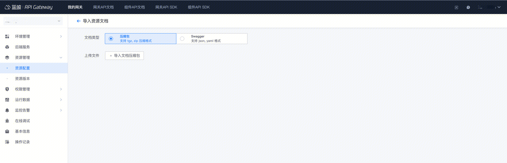

## 1. API resource document specification

API resource documents are edited using markdown syntax

### 1.1 Document composition

1. **Resource description**: Describe the current resource to facilitate users to understand the resource

2. **Input parameters**: Use a table to describe the request parameters. It is recommended to use the header: field, type, required, description

3. **Call example**: Give an example of request parameters

4. **Response example**: Description of the result returned by the resource. Fill in the return field according to the actual situation

5. **Response parameter description**: Fill in the corresponding table items according to the actual output. It is recommended to use the header: field, type, description

### 1.2 Examples

#### 1.2.1 Chinese document example:

````markdown
### Description

This is a description

### Input parameters
| Parameter name | Parameter type | Required | Description |
| ------------ | ------------ | ------ | ---------------- |
| demo | string | No | This is a sample |

### Call example
```python
from bkapi.smoke.shortcuts import get_client_by_request

client = get_client_by_request(request)
result = client.api.api_test({}, path_params={}, headers=None, verify=True)
```

### Response example
```json
```

### Response parameter description
| Parameter name | Parameter type | Description |
| ------------ | ---------- | ------------------------------ |
| | | |
````

#### 1.2.2 English document example:

````markdown
### Description

This is a description

### Parameters

| Name | Type | Required | Description |
| ------------ | ------------ | ---------- | ---------------- |
| demo | string | Yes | This is a demo |

### Request Example
```python
from bkapi.smoke.shortcuts import get_client_by_request

client = get_client_by_request(request)
result = client.api.api_test({}, path_params={}, headers=None, verify=True)
```

### Response Example
```python

```

### Response Parameters
| Name | Type | Description |
| ------------ | ---------- | ------------------------------ |
| | | |
````

## 2. Document maintenance method

Two ways to maintain documents:

1. In the gateway management end - resource list, edit and maintain the corresponding interface document
- If the gateway **does not have external requirements**, only in the current environment, and **the number of resources is not large**, then this method can be used for maintenance

2. Maintain document markdown files in the code repository and import them using compressed packages
- If the gateway has external requirements (for example, if there is an external version, it also needs to be released to environments such as bkop/sg), then it is recommended to use this method for maintenance
- Supports jinja2 template rendering, and text editors can be edited in batches, which is more efficient
- When sending out, you can directly maintain a doc directory in the open source project through [automatic access](./auto-connect-gateway.md), and use [apigw-manager](https://github.com/TencentBlueKing/bkpaas-python-sdk/tree/master/sdks/apigw-manager#3-apidocs%E5%8F%AF%E9%80%89) SDK/mirror to complete document import

## 3. Solution: Maintain document markdown files and import them using compressed packages

### 3.1 Write resource documents in markdown format

#### 3.1.1 Document directory and naming

The resource document is in markdown format, and the file name should be in the format of `resource name` + `.md`. For example, if the resource name is get_user, then its document file name should be get_user.md.

The Chinese and English documents of the resource should be placed in the directories `zh` and `en` respectively. If the document of a certain language does not exist, the corresponding directory can be ignored.

The directory structure of the gateway resource document is as follows:
```
.
├── en
│   ├── create_user.md
│   └── get_user.md
└── zh
├── create_user.md
└── get_user.md
```

#### 3.1.2 Reference public document fragments in resource documents

> Use jinja2 include to reuse public parts

The gateway uses [Jinja templates](https://jinja.palletsprojects.com/en/3.0.x/templates/) to support document file references. For resource documents that need to be rendered using Jinja templates, the file name suffix needs to be set to `.md.j2`; for referenced public document fragments, the file name can start with an underscore (\_).

When the gateway imports documents, it will enter the zh and en directories respectively to process Chinese and English documents. Different types of documents are processed differently:
- Documents with a suffix of `.md` will directly read the document content
- Documents with a suffix of `.md.j2` will be rendered using the Jinja template based on the directory where the document is located
- Documents starting with an underscore (\_) will skip parsing. Such documents are public document fragments, not specific resource documents

For example, when the resource get_user is rendered using the Jinja template, its document file name should be `get_user.md.j2`, and its reference to other documents is as follows:
```
...

{# Reference public document fragment _user_model.md.j2 #}

```

When the resource document contains a Jinja template file, the directory structure of the document is as follows:
```
.
├── en
│   ├── create_user.md
│   ├── get_user.md.j2
│   └── _user_model.md.j2
└── zh
├── create_user.md
├── get_user.md.j2
└── _user_model.md.j2
```

### 3.2 Archive into a compressed package

When importing documents, you need to archive the resource documents into a compressed package. The compressed package supports two formats: tgz and zip. When archiving a compressed package, you need to directly package the zh and en document directories into the compressed package.

In Linux system, you can create a compressed package by executing the following command:
```
# Replace my-gateway-name with the specific gateway name
zip -rq my-gateway-name.zip zh en
tar czf my-gateway-name.tgz zh en
```

### 3.3 Import the compressed package

On the gateway management page, expand the left menu **Click** Resource Management**, and select **Resource Document** in the button group **Import**.

Select "Compressed Package" for the document type, and select the document compressed package created in the previous step.



Preview the document changes, select the resource document to be updated, and click **Confirm Import**.


After importing the resource document, you can view the imported resource document in **Resource Management**.


### 3.4 Reference example

- BlueKing Permission Center:

- [Document Repository](https://github.com/TencentBlueKing/bk-iam-saas/tree/master/saas/resources/apigateway/docs)

Effect:

