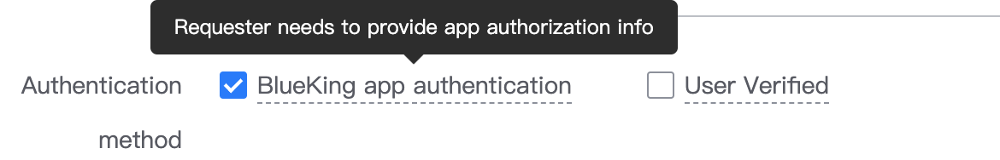
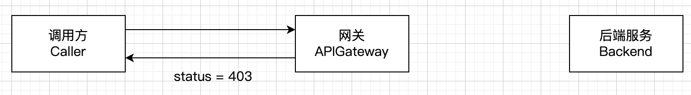
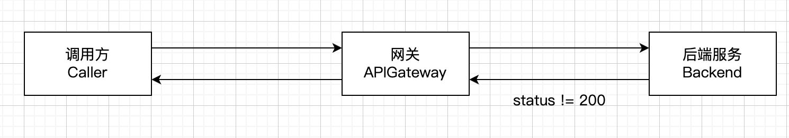

## Background

When calling ESB API or ESB API, the response may prompt that the user does not have permission.

[How to confirm whether the error response is returned by the gateway or the backend service? ](../FAQ/gateway-error-or-backend-error.md) The document explains how to determine which link the response is from.

According to the response, there are two cases of no permission:

1. The application does not have the permission to call **API**

2. The application or user does not have the **data permission** of the business system

## API permission

> The gateway determines the permission

When registering the API to the gateway, if `Application authentication` + `Verify access rights` are checked



Then, when the caller calls the corresponding API

1. `bk_app_code/bk_app_secret` needs to be provided when calling to verify the application identity. For details, please refer to [Authentication](./authorization.md)

2. It will verify whether the application has the permission to call the API



If there is no permission, it will return [Gateway error response description: App has no permission to the resource](../FAQ/gateway-error-or-backend-error.md)

```json
{
"code": 1640301,
"data": null,
"code_name": "APP_NO_PERMISSION",
"message": "App has no permission to the resource",
"result": false
}
```

**Solution**: Go to the BlueKing Developer Center to find the corresponding application, click in, `Cloud API Management - Cloud API Permission Application` corresponding interface permissions or renew permissions

## Data permissions

> Judged by the business system or permission center

At this point, the situation has **passed the gateway** and reached the backend service, and the **response is returned by the backend service** (not returned by the gateway)



At this time, there are two situations:

### If the business system is connected to the permission center

then it will return `9900403`, **The corresponding user needs to have relevant permissions**

```json
{
"code": 9900403,
"permission": {
"system_name": "Configuration platform",
"system_id": "bk_cmdb",
"actions": [
{
"related_resource_types": [
{
"system_name": "Configuration platform",
"type": "biz",
"type_name": "Business",
"system_id": "bk_cmdb",
"instances": [
[
{
"type_name": "Business",
"type": "biz",
"id": "36",
"name": "abc"
}
]
]
}
],
"id": "find_business_resource",
"name": "Business access"
}
]
}
}
```

**Solution**: The user applies for relevant permissions at the permission center, or the administrator actively authorizes at the permission center

### If the business system is not connected to the permission center

It may return **any custom response body**

It may be

```json
{
"result": false,
"message": "you have no permission to call this api.",
"code": 3540100,
"trace_id": "5ddbc49db2554edbbdf26e6c15ca6884",
"request_id": "c9d7fe1fcade42869f4ec6b4ac6434f1",
"data": null
}
```

It may also be

```html
<html>
<head><title>403 Forbidden</title></head>
<body>
<center><h1>403 Forbidden</h1></center>
<hr><center>nginx/1.15.5</center>
</body>
</html>
```

**Solution**: Resource business system developer identified the problem