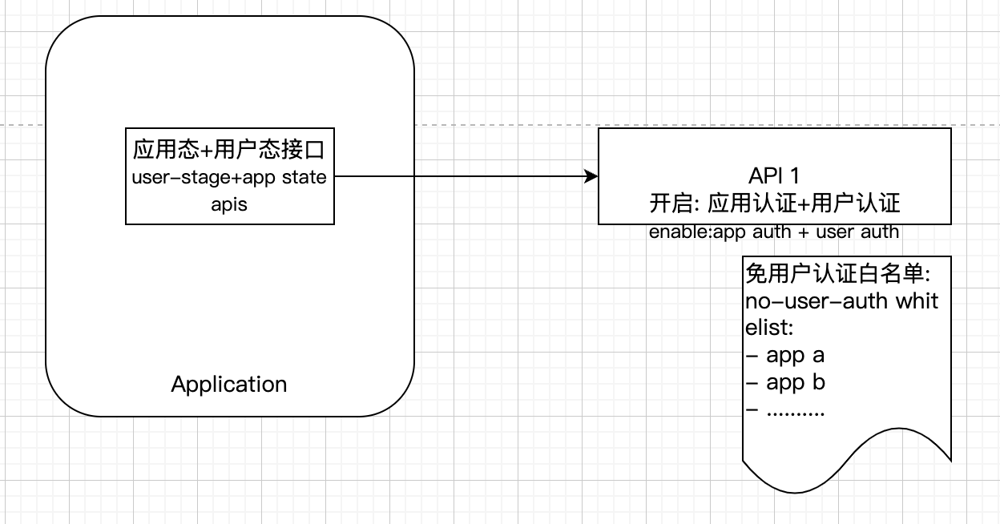
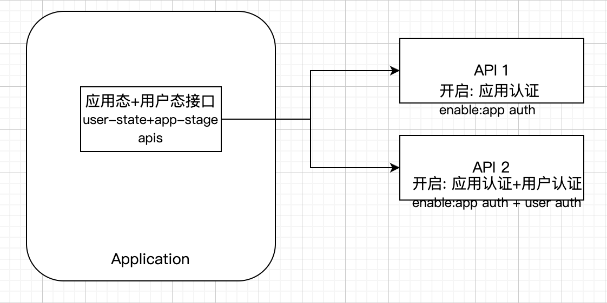
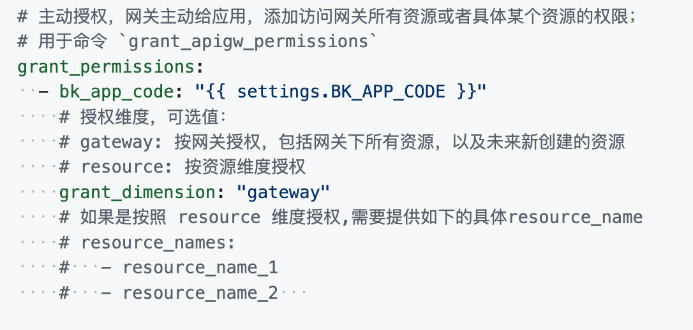
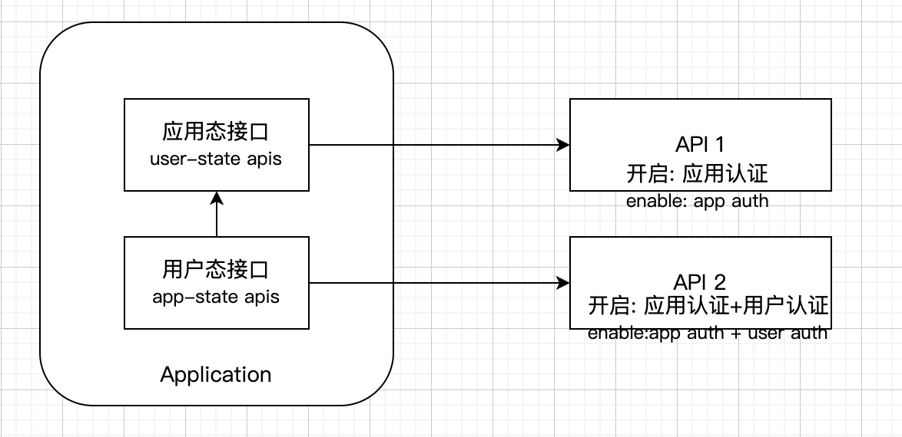

## Background

Currently, many systems are connecting interfaces to gateways, or migrating interfaces originally connected to `ESB` to gateways.

Due to historical reasons and the current limitations of the BlueKing system, the interfaces of many systems are originally a set, that is, enable `application authentication` + `user authentication` (related documents: [Authentication](./authorization.md))

There are two ways to use cross-system calls:

1. Use `admin` directly

2. Use a virtual account

However, the calling interface requires the caller's `bk_app_code` to be added to the `user-free authentication application whitelist`, which is equivalent to not verifying the user. The caller passes `bk_username` without restrictions. For example, passing `admin` has all business permissions, which is very risky

We hope to optimize this mechanism, so in the new version of gateway access, the `user-free authentication application whitelist` is no longer supported, and this usage will be completely removed

Future:

1. bkauth supports complete access_token logic and no longer requires the `user-free authentication application whitelist`
2. If user management supports more complete virtual accounts, or the permission center supports application-based permission control (currently only supports natural persons), then the calls between systems will support `permission control`

## Recommendations

- `Application state interface` verifies the application, not the user

- **If the interface accessing the gateway does not use the bk_username in the jwt after the gateway verification for business logic, then please use ·Application state interface·**, that is, turn off ·User authentication·

- `User state interface` verifies the application and also verifies the user

### Distinguish `Application state interface` and `User state interface` at the gateway level

> Equivalent to one interface, accessing two APIs of gateway variables

> Original **User authentication-free application whitelist** = `Application state interface` + **Precise authorization**

`Application state interface` requires:

1. **Not public/application permission not allowed**

2. Self-service access uses grant_permission to directly grant **precise authorization** to bk_app_code (bk_app_code + specific resources)

### System level distinguishes between `application state interface` and `user state interface`

> It is equivalent to having two interfaces

