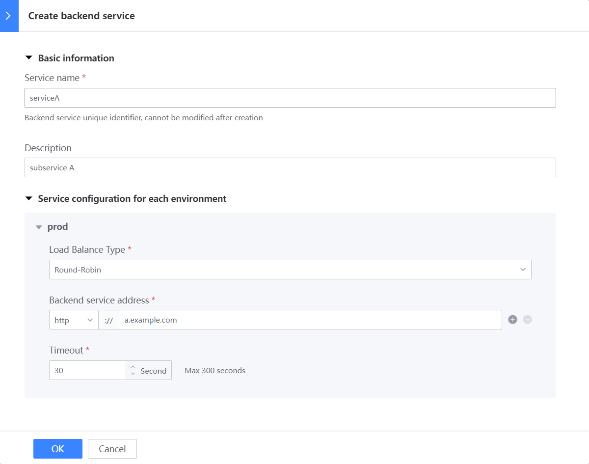

## Usage scenario

A system is a microservice architecture, and there are three sub-services A/B/C that need to provide interfaces for external system calls; in this case, the same gateway needs to be used, so the backend service can be used to support the same gateway proxy request to multiple services

## How to use

### Create a new backend service

Left menu [Backend Service]

If there are multiple environments, such as Prod (official)/Stag (pre-release), you need to fill in the address of the corresponding environment sub-service A;

### When creating a new resource, select the backend service

Then, when the caller calls through the gateway resource address `/get`, it will be proxied to the corresponding address of the backend service `serviceA` `http://a.example.com/get`

### Resources associated with each backend service

On the [Backend Service] list page, you can see the number of resources currently associated with each backend service. Clicking this number will jump to the [Resource List] page and filter out the resource list associated with the corresponding backend service

## More explanation

### What is the relationship between environment and backend service?

It is a matrix relationship

For example: there are 2 environments prod/stag, and 3 backend services serviceA/serviceB/serviceC, then you actually need to fill in `2*3=6` addresses

Enter from the [Backend Service] menu. From the perspective of the backend service, you need to fill in the [Backend Service Address] of each backend service in each environment

Enter the environment editing page from the [Environment Overview] menu. From the perspective of the environment, you need to fill in the [Backend Service Address] of each backend service in this environment

### `default` backend service

When creating a new gateway, a backend service named `default` will be automatically created; most gateways with only one backend service can be used directly.

`default` cannot be modified/deleted, but you can use your own newly created backend service in the actual configuration

### Can the same backend service in multiple environments be filled in with the same address?

There is no restriction on [Backend Service Address], but it is strongly not recommended.

It is recommended to strictly isolate the environment to ensure that gateway call requests from different environments fall into the corresponding environment to avoid possible bugs and accidents.

### Does import and export support multiple backend services?

Versions before 1.13 implement the scenario of one gateway with multiple backend services by configuring environment variables and then referencing them in resources;

Starting from 1.13, automated import will support multiple backend services (under development, coming soon)