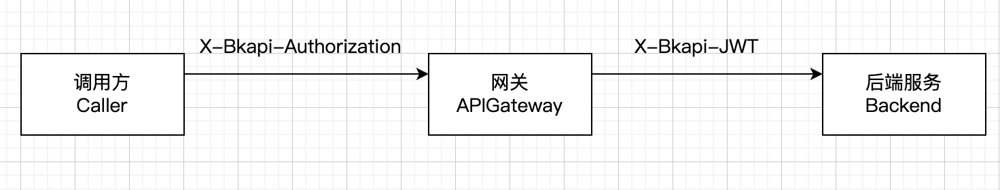

[toc]

## Background

When the backend service is connected to the gateway, the interface may have enabled `application authentication`/`user authentication`. At this time, the caller needs to pass the authentication header `X-Bkapi-Authorization`. After the gateway authentication is passed, an `X-Bkapi-JWT` header will be generated and given to the backend service, which contains the authentication result information. This is a jwt token



- Why do we need to parse JWT?

- How do backend services obtain and parse it?

## Why parse JWT

1. You can determine whether the request comes from the gateway. If not, reject it directly

2. After parsing JWT, you can get information about whether the user/user is authenticated and whether the application/application is authenticated, which is used for business logic

## Get X-Bkapi-JWT

The backend service gets `X-Bkapi-JWT` from the request header

Note: This header will only appear if the request passes through the gateway; if this header is missing, it means that the request did not pass through the gateway

## X-Bkapi-JWT format

```
"X-Bkapi-Jwt": "eyJpYXQiOjE3MDE4MzQ1NDYsInR5cCI6IkpXVCIsImFsZyI6IlJTNTEyIiwia2lkIjoiaHR0cGJpbiJ9.eyJleHAiOjE3MDE4MzYwNDYsIm5iZiI6MTcwMTgzNDI0NiwiaXNzIjoiQVBJR1ciLCJh cHAiOnsidmVyaWZpZWQiOnRydWUsImFwcF9jb2RlIjoiYXBpZ3ctYXBpLXRlc3QiLCJleGlzdHMiOnRydWUsInZlcnNpb24iOj EsInZhbGlkX2Vycm9yX21lc3NhZ2UiOiIiLCJ2YWxpZF9zZWNyZXQiOnRydWUsInZhbGlkX3NpZ25hdHVyZSI6ZmFsc2V9LCJ1c2VyIjp7InZlcmlmaWVkIjpmYWxzZSwidXNlcm5hbWUiOi IiLCJ2ZXJzaW9uIjoxLCJ2YWxpZF9lcnJvcl9tZXNzYWdlIjoidXNlciBhdXRoZW50aWNhdGlvbiBmYWlsZWQsIHBsZWFzZSBwcm92aW RlIGEgdmFsaWQgdXNlciBpZGVudGl0eSwgc3VjaCBhcyBia191c2VybmFtZSwgYmtfdGlja2V0LCBhY2Nlc3NfdG9rZW4iLCJzZWFyY2hlZF9ydHgiOiIiLCJzb3VyY2VfdHlwZSI6Ii J9fQ.G8yDU6CIwxezr1WZg8bhrbMWtpw6DP5oxrrCo1ctP8CWCax7dTh6D2h0ad9rETR40ViowTaiuOWLE4GztgwxSyw3BZ6oZ0Tai7qg4-Z 90Qw6wKPcm7e-fVt0gRTwwJVR8axG3kJdi256auoTJjilxPa76Vorm-6j-cL2P5o0HEvNJbiLNdMO-44u1ISsTR3HgLHbhb3bcDBw8iKF3xl9iB93Vqsujpt8hbFcf2Et9RVZII9CVxOuw- use After parsing by jwt library

jwt Header

```json
{
"iat": 1701834546, #Issuance time
"kid": "httpbin", #Gateway name
"alg": "RS512", #Encryption algorithm
"typ": "JWT"
}
```

jwt Payload

```
{
"exp": 1701836046, #Expiration time
"nbf": 1701834246,
"iss": "APIGW",
"app": { #Application information
"verified": true, #Application authentication passed
"app_code": "apigw-api-test", #Application bk_app_code
......
},
"user": { #User information
"verified": true, #User authentication passed
"username": "tom", #User username
......
}
}
```

## How to parse

Steps:

1. Get the public key

2. Use the jwt library to parse

### Get the public key

The gateway public key can be found in the basic information of the gateway management end, which can be copied and configured in the project configuration file

Or, query and obtain the public_key through the API interface (note that after obtaining, put it in storage/cache/memory to avoid real-time pull)

```bash
# curl -X GET 'https://bkapi.example.com/api/bk-apigateway/prod/api/v1/apis/{gateway_name}/public_key/' \
-H 'X-Bkapi-Authorization: {"bk_app_code": "my-app", "bk_app_secret": "secret"}

{
"data": {
"issuer": "",
"public_key": "your public key"
}
}
```

Or, use the gateway apigw-manager, you can read about obtaining public_key in [apigw-manager documentation](https://github.com/TencentBlueKing/bkpaas-python-sdk/tree/master/sdks/apigw-manager)

### Parsing

Different languages ​​use different libraries

golang uses [golang-jwt](https://github.com/golang-jwt/jwt)

```golang
var (
ErrUnauthorized = errors.New("jwtauth: token is unauthorized")

ErrExpired = errors.New("jwtauth: token is expired")
ErrNBFInvalid = errors.New("jwtauth: token nbf validation failed")
ErrIATInvalid = errors.New("jwtauth: token iat validation failed")
)

func parseBKJWTToken(tokenString string, publicKey []byte) (jwt.MapClaims, error) { keyFunc := func(token *jwt.Token) (interface{}, error) { pubKey, err := jwt.ParseRSAPublicKeyFromPEM(publicKey) if err != nil { return pubKey, fmt.Errorf("jwt parse fail, err=%w", err) } return pubKey, nil } claims := j wt.MapClaims{} token, err := jwt.ParseWithClaims(tokenString, claims, keyFunc) if err != nil { if verr, ok := err.(*jwt.ValidationError); ok { switch { case verr.Errors&jwt.ValidationErrorExpired > 0: return nil, ErrExpired case verr.Errors&jwt.ValidationErrorIssuedAt > 0: return nil, ErrIATInvalid case verr.Errors&jwt.ValidationErrorNotValidYet > 0: return nil, ErrNBFInvalid } } return nil, err } if !token.Valid { return nil, ErrUnauthorized } return claims, nil } ```` python uses the standard library ````python import j wt def decode_jwt(jwt_token, public_key): try: return jwt.decode(jwt_token, public_key, options={"verify_iss": False}) except Exception: # pylint: disable=broad-except logger.exception("decode jwt fail, jwt: %s", content) return None ``` ### From payload Get data and judge

Get the caller's bk_app_code:

```python
app = jwt_payload.get("app", {})
if not app.get("verified", False):
raise exceptions.AuthenticationFailed("app is not verified")

# Compatible with multiple versions (Enterprise Edition/TE Edition/Community Edition) and compatible with APIGW/ESB
app_code = app.get("bk_app_code", "") or app.get("app_code", "")
```

Get a valid bk_username:

```python
user = jwt_payload.get("user", {})
if not user.get("verified", False):
# username is untrustworthy and has not been verified (equivalent to the caller can fill it in at will)
username = user.get("bk_username", "") or user.get("username", "")
```