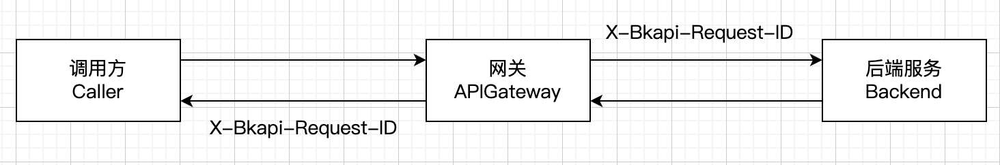
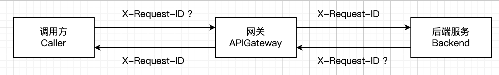

When calling the gateway interface, the gateway returns two headers in the response `header`:

```
# Call directly
curl -v ...

< X-Bkapi-Request-ID: 8a7e599d-0320-452b-b817-760149262621
< X-Request-ID: 8a7e599d0320452bb817760149262621

# Set the business request_id
curl -v -H "X-Request-ID: 123456" ...

< X-Bkapi-Request-ID: 23bfd9de-7787-43f1-b7aa-b1c236f9ded5
< X-Request-ID: 123456
```

| header | X-Bkapi-Request-ID | X-Request-ID |
| ------ | ------ | ------ |
| Description | Gateway request_id | Business request_id |
| Generation logic | Each request passing through the gateway will generate a unique `request_id`, which is used to identify the uniqueness of this request in the gateway; | If the caller passes `X-Request-ID`, this value will be used; If the caller does not pass `X-Request-ID`, `$(X-Bkapi-Request-ID).replace("-", "")` will be used; |
| Example | 8a7e599d-0320-452b-b817-760149262621 | 8a7e599d0320452bb817760149262621 |
| Format | 36-bit uuid | Format set by the caller / 32-bit uuid |
| Is it unique on the gateway side | Yes | Not necessarily, depends on the caller |
| Gateway log query syntax | `request_id: 8a7e599d-0320-452b-b817-760149262621` | `x_request_id: 8a7e599d0320452bb817760149262621` |

## Gateway request_id: X-Bkapi-Request-ID

When a request passes through the gateway, the gateway will generate a unique `request_id` and put it into the request header to pass it to the backend service, and also put it into the response header.

Through this `request_id`, the logs of the caller/gateway/callee are linked together. For example, the log of the current request can be queried through the `request_id` in the gateway.

It is recommended that the caller and the callee record this `X-Bkapi-Request-ID` in the flow log and exception log to facilitate troubleshooting. Refer to [Request Log Query Syntax](./access-log.md)



## Business request_id: X-Request-ID

The caller and the upstream proxy layer may preset a header `X-Request-ID` to track their own requests due to business needs

And this value may not be globally unique**. For example, in some scenarios, the gateway interface is called three times in one operation, and the same `X-Request-ID` is used to mark the requests generated by the same operation



## FAQ

### Why is `X-Request-ID` not set when initiating a call, and `X-Request-ID` in the returned response is not `$(X-Bkapi-Request-ID).replace("-", "")`

The initiated request passes through some proxies (such as nginx), and these proxies will also perform the same operation, checking if there is no `X-Request-ID` in the request header and adding one; At this time, when it reaches the BlueKing API Gateway, the `X-Request-ID` is already there and will not be reset

### Why is the `X-Request-ID` in the response not the value I set after the call was initiated and the `X-Request-ID` was set?

The caller goes to the gateway, and the gateway is the `X-Request-ID` in the `respect` request (will not be reset), and then passes it to the backend service;

If the backend service does not have the `X-Request-ID` in the `respect` request, and sets its own `X-Request-ID` in the response, then this `X-Request-ID` will be `respect`ed by the gateway and returned to the caller

This causes the `X-Request-ID` set in the call to be inconsistent with the `X-Request-ID` in the response;

Suggestions:

1. The backend service should not set the `X-Request-ID` in the response body;

2. If the backend service wants to set the `X-Request-ID`, it must use the `X-Request-ID` in the current request request