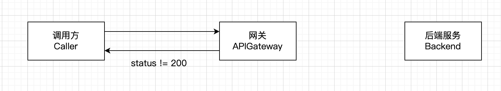
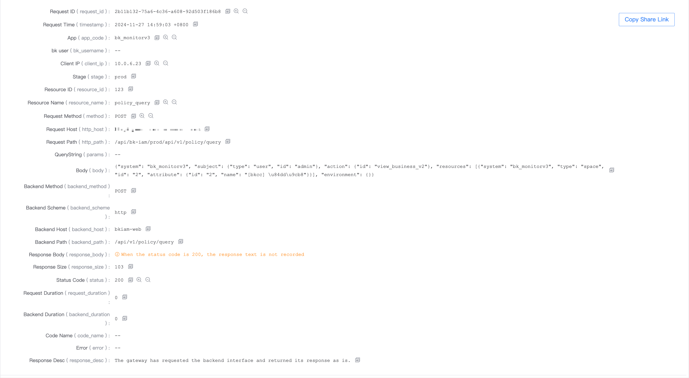
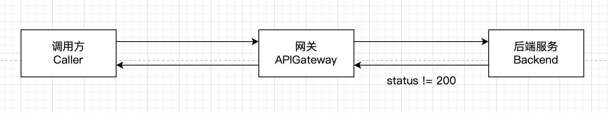
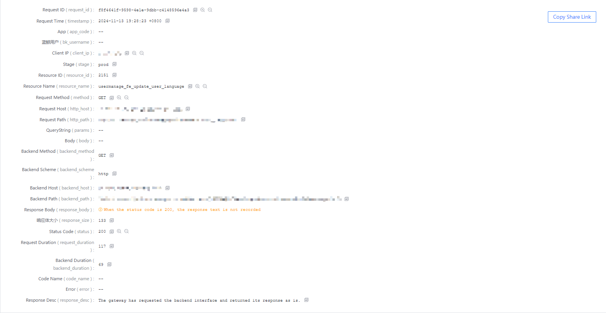

# How to confirm whether the wrong response is returned by the gateway or the backend service?

[TOC]

## Troubleshooting steps

1. Get the status code/response body of the response

2. Use the following questions to confirm whether it is the response returned by the **gateway** or the response returned by the **backend access layer or backend service**

3. If it is the response returned by the **gateway**

- 3.1 You can find all the non-200 error details/possible causes and solutions currently returned by the gateway in [Gateway Error Response Description](./error-response.md) and handle them according to the solution

4. If it is the response returned by the **backend access layer or backend service**

- 4.1 The general status code 40x means that the request does not meet the interface requirements. Check the gateway interface document to confirm whether the request passes data as required

- 4.2 For status code 50x, you can contact the **gateway person in charge** to assist in handling and provide the necessary information. The gateway person in charge confirms whether there is a problem with its **backend access layer or backend service** (the request record should be found in the log of its access layer and backend service)

- Gateway API document, enter the gateway name to search, the third column of the result table is the gateway person in charge

## Gateway returns response



When a request passes through the gateway, it will pass through a series of plug-ins, which contain some logic such as application authentication, user authentication, frequency control, etc. The official plug-in may return a non-200 response body

However, all non-200 response bodies are uniformly captured and encapsulated by the gateway, so there will be fixed features

For example, an example of returning status code 400 when application authentication fails:

```json
{
"code": 1640001,
"data": null,
"code_name": "INVALID_ARGS",
"message": "Parameters error [reason=\"app code cannot be empty\"]",
"result": false
}
```

**Features**:
- The format is `json`
- Error code `code`, starting with `16`
- Fields `code`, `data`, `code_name`, `message`, `result`
- The response header contains `X-Bkapi-Error-Code` and `X-Bkapi-Error-Message`

In addition, you can view it through the log in the Gateway Management Page - Operation Data - Flow Log. The response description is `The gateway did not request or the request backend interface is abnormal, and the response content is provided by the gateway. `



## Response returned by the backend access layer or backend service



If it does not meet the characteristics of `Gateway returns response`, it is most likely **Response returned by the backend access layer or backend service**

Confirmation:

1. There are request records in the log of the backend access layer and the backend service

2. In the Gateway Management Page - Operation Data - Log, check the log and see that the response description is `The gateway has requested the backend interface and returned its response as is. `



> In actual debugging, you can use curl -vv -L http://xxxx to view the actual call details/redirect jump process, etc.

### 1. Return an html page, and there is no corresponding request record in the backend service flow log

**Generally, it is the response returned by the smart gateway/backend service access layer, and there will be keywords such as nginx/openresty/apisix**

```json
<html>
<head><title>404 Not Found</title></head>
<body>
<center><h1>404 Not Found</h1></center>
<hr><center>nginx/1.15.5</center>
</body>
</html>

<html>
<head><title>503 Service Temporarily Unavailable</title></head>
<body>
<center><h1>503 Service Temporarily Unavailable</h1></center>
<hr><center>stgw</center>
</body>
</html>

<html>
<head><title>504 Gateway Time-out</title></head>
<body>
<center><h1>504 Gateway Time-out</h1></center>
<hr><center>nginx</center>
</body>
</html>

```

### 2. Return an html page or json, and the backend service log has the corresponding request record

**Response returned by the backend service framework**

For example, if the domain name of the gateway is not configured in Django's [ALLOWED_HOSTS](https://docs.djangoproject.com/en/3.2/ref/settings/#allowed-hosts), 400 will appear, and the response body is

```html
<h1>Bad Request (400)</h1>
```

For example, some backend services directly return a json, But the error code does not start with `16`: **Returned by the backend service, you can find the corresponding request record in the backend service flow log**

```json
# Example 1
{
  "code": 9900403,
  "permission": {
    "system_name": "CMDB",
    "system_id": "bk_cmdb",
    "actions": [
      {
        "related_resource_types": [
          {
            "system_name": "CMDB",
            "type": "biz",
            "type_name": "business",
            "system_id": "bk_cmdb",
            "instances": [
              [
                {
                  "type_name": "business",
                  "type": "biz",
                  "id": "36",
                  "name": "abc"
                }
              ]
            ]
          }
        ],
        "id": "find_business_resource",
        "name": "Business Visit"
      }
    ]
  }
}
# Example 2
{
  "result": false,
  "message": "you have no permission to call this api.",
  "code": 3540100,
  "trace_id": "5ddbc49db2554edbbdf26e6c15ca6884",
  "request_id": "c9d7fe1fcade42869f4ec6b4ac6434f1",
  "data": null
}
```

### 3. The backend returns status code 415

- `415 Unsupported Media Type`

- `415 Unsupported media type in request`

Returning status code 415 means that the backend does not support the corresponding `content-type`, and the client needs to specify the correct `content-type` when initiating the request. For example, if the server requires the use of json, then the header `content-type: application/json` needs to be added to the request when calling

### 4. The backend returns status code 308

If the backend service address is configured as `http://xxx.com` in the load balancing Host in `[Environment Management] - [Proxy Configuration]` of the gateway, and `xxx.com` **only supports https access**, it may have redirected at the access layer, or directly denied access

At this time, the call will have a status code such as 308 (if the caller's client supports redirect, will continue to request the redirected interface, the status code is returned by the redirected interface)

Processing: Confirm the real scheme of the backend service

### 5. The backend service or its access layer has an IP whitelist

This will cause the request forwarded by the gateway to be rejected.

At this time, the gateway's exit IP needs to be configured to the corresponding backend service before access.