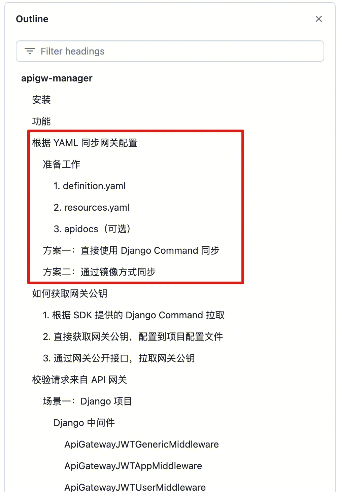

Using the SDK/image provided by the gateway, each system can automatically create a new gateway/register an interface/import resources/import documents/publish a version, etc. when publishing.

Scenario:
- k8s containerized deployment, perform interface synchronization + publishing for each release, so that the API gateway can be updated at the same time as the version is released.

For details, see: [apigw-manager ](https://github.com/TencentBlueKing/bkpaas-python-sdk/tree/master/sdks/apigw-manager) document

Suggestions:
1. For projects using Django, directly install the apigw-manager SDK and use the django command to synchronize
2. For non-Django projects, use the mirror method to synchronize
3. Refer to [How to maintain gateway documents](manage-document.md) to maintain the `doc` directory in the open source repository
4. **If it is a system that was originally connected to esb, it is recommended to evaluate the system capacity and the main caller when connecting to the gateway. QPS, configure frequency control (to avoid burst traffic from an upstream system filling up the system and affecting other systems**

