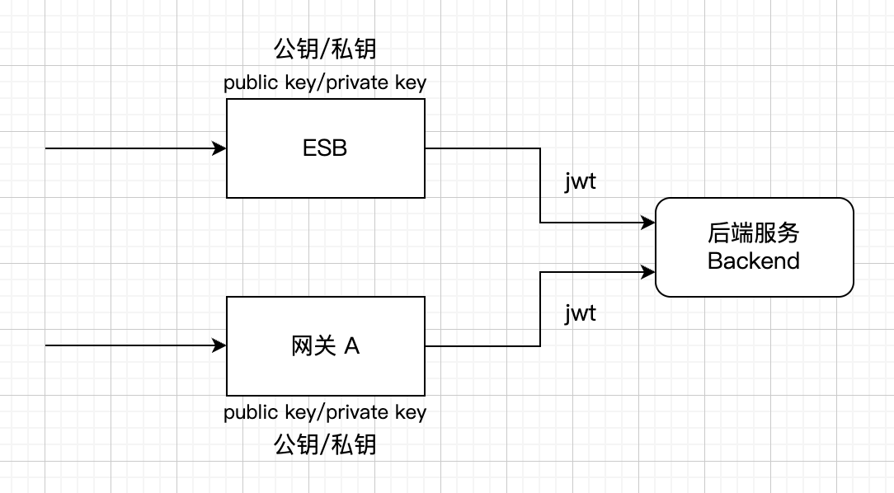
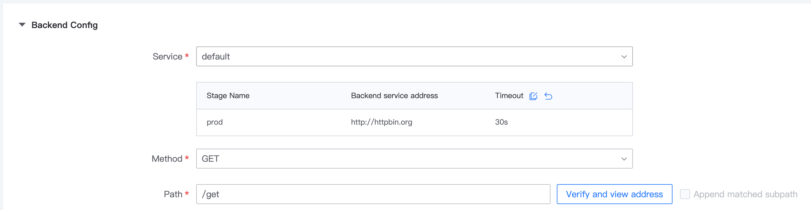
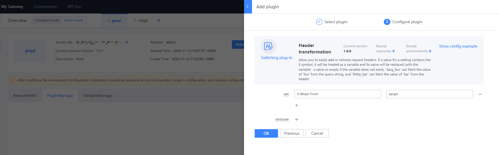
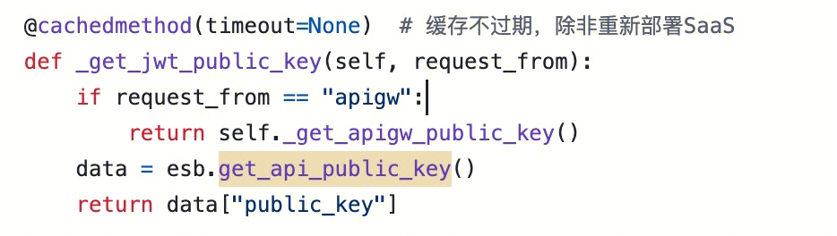

## Background

Some systems have already been connected to ESB. Now they want to connect to APIGateway and support the original calls from ESB. How should they do it?

## Mechanism

There is no essential difference between connecting to ESB and connecting to an independent gateway (such as Gateway A). ESB can be understood as a `special` gateway that provides services after encoding and encapsulating a series of interfaces



The only difference is that the public and private keys held by ESB are different from those of Gateway A. The difference brought about by this is that after the request passes through the gateway, the JWT issued by the private key is different. (For more information about JWT, please refer to [Conceptual Description: X-Bkapi-JWT](../../Explanation/jwt.md))

This means that if the backend service wants to connect to ESB and Gateway A at the same time,

then the requirements are:

1. Distinguish whether the request comes from ESB or gateway

2. According to the source of the request, call different interfaces to obtain the public key and parse JWT

## Processing

### 1. Distinguish whether the request comes from the gateway or ESB

If it is the old version of the 1.12 gateway, after creating a new gateway, edit the environment in `Environment Management`, and in `Proxy Configuration`, add a custom `header` to identify the request as coming from the gateway



If it is the new version 1.13, edit the environment in `Environment Overview`, and bind a `Header in `Plugin Management` Conversion plugin`



In this way, when the backend service is called, the request header can be used to determine whether it is a request from the gateway. If there is no such header, it is a request from the ESB

### 2. According to the request source, determine where to get the public key and then perform JWT parsing

In Django, you can judge like this

```python
request.META.get("HTTP_X_BKAPI_FROM", "") == "apigw"

```

- If it comes from ESB, then call the ESB's `get_api_public_key` interface to get the public key: `/api/c/compapi/v2/esb/get_api_public_key` (If you have previously connected to ESB, you should already have the corresponding code)
- If it comes from APIGateway, then call the gateway interface to obtain the public key: `https://bkapi.example.com/api/bk-apigateway/prod/api/v1/apis/{gateway_name}/public_key/` (note that `example.com` is replaced with the specific environment address, and `{gateway_name}` is replaced with your own gateway name)
- Note that it can also be configured through SDK or directly obtained. For details, refer to [How to obtain the gateway public key](https://github.com/TencentBlueKing/bkpaas-python-sdk/tree/master/sdks/apigw-manager#%E5%A6%82%E4%BD%95%E8%8E%B7%E5%8F%96%E7%BD%91%E5%85%B3%E5%85%AC%E9%92%A5)

Only the acquisition of `public_key` is different. The logical gateway of JWT parsing is different from ESB Completely consistent, no special processing required

Code example: (It is strongly recommended to cache the data obtained from the interface in memory to improve interface performance)

