# Access Gateway
## 1. Create a Gateway and Publish Resources

### 1.1 Create a Gateway

Go to the homepage of the `BlueKing APIGateway` official website and click [Create a Gateway]

Enter the gateway name, maintainer and description

Select [Yes] for Public
1. Users can view the public API of the gateway and apply for permissions in `BlueKing Developer Center` - [Cloud API Permissions]
2. Users can view the gateway introduction/person in charge and detailed documents in `Gateway API Documents`

Select [No] for Public
1. The gateway is invisible to users and cannot apply for permissions/view documents, etc.; it is only used for internal private services and can only be authorized by the gateway administrator in [Permission Management]

### 1.2 Create a New Environment

The gateway supports multiple environments, that is, you can create production/pre-release/development joint debugging environments at the same time, and then configure the backend service addresses of the corresponding environments, so that the same set of API resources can be published to different environments;

For example: Create a new one API, published to the development joint debugging environment, at this time the request will be forwarded to the corresponding backend service of the test environment, which can be used for joint debugging. After confirmation, this version can be published to the production environment.

By default, the gateway will create a `prod` environment;

- If you use the default `prod` environment, just edit it directly;

- If you need more environments, click [+] to create a new environment

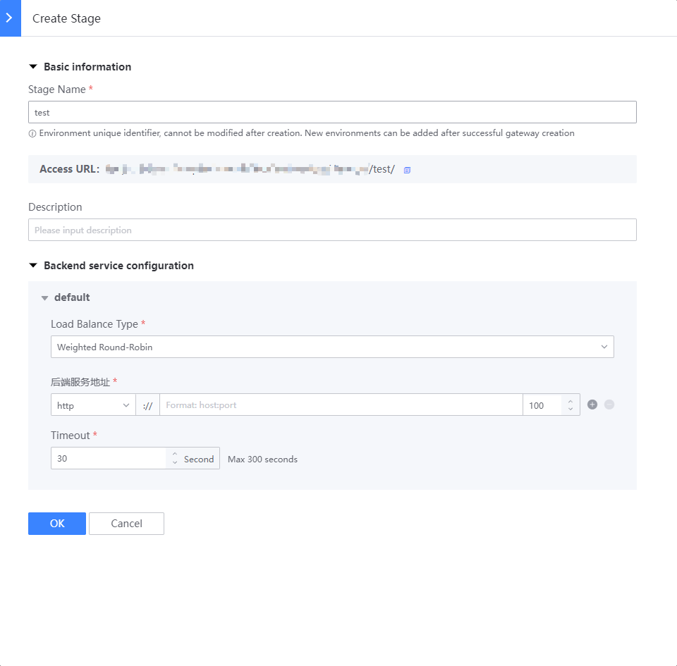
Description:
- The environment name will be used as part of the external address and cannot be changed. It is recommended to name it short and meaningful, such as development environment dev, test environment test, pre-release environment stage, production environment prod
- Description
- Backend service configuration: For details about the backend service, see [Concept Description: Backend Service](../../Explanation/backend.md)

### 1.3 Create a new backend service

[Concept Description: Backend Service](../../Explanation/backend.md)

The backend service is used to support scenarios where a gateway proxy requests to multiple backend services. It is suitable for scenarios where there are multiple modules or microservices in the backend that need to provide the same gateway to the outside.

By default, the system will create a new backend service `default`

- If you use the default `default` backend service, you can edit it directly;
- If you need more backend services, go to the left menu [Backend Service] - [New]

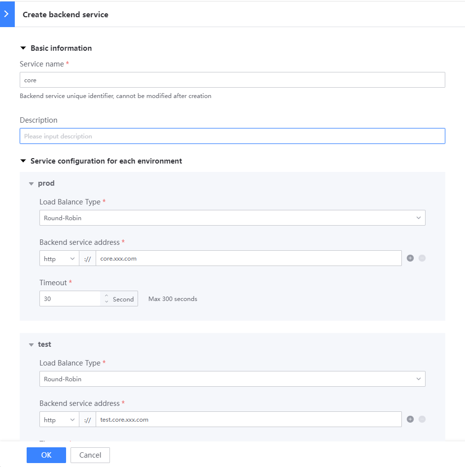

Description:
- Service name: It is recommended to name it with the module name or microservice name, so that when configuring the target backend service to which the interface is forwarded, you can clearly know which module to forward to

- Description
- Service configuration for each environment: You need to fill in the address of the backend service corresponding to each environment, for example, the core module address of the production environment is `http://core.xxx.com`, and the core module address of the test environment is `http://test.core.xxx.com`; (It can also be IP+port number)

Note:
- The service address here is `domain name` or `IP+port number`, excluding the path part
- You need to choose a suitable timeout period, and it is not recommended to be too large

### 1.4 Create a new resource

> A gateway resource is equivalent to an externally exposed API

Entrance: Left menu [Resource Management] - [Resource Configuration] - [New]

#### 1.4.1 Basic Information

Description:
- Resource name: The resource name will be used as the method name in the gateway SDK. Please set a name with a clear meaning
- Authentication method: Whether to authenticate the application and user, see [Concept Description: Authentication](../../Explanation/authorization.md)
- Verify application permissions: The application developer needs to apply for the permission of the application to call the API at the BlueKing Developer Center. After approval, the BlueKing application can call this API. Otherwise, it will return no permission. See [Concept Description: Authentication](../../Explanation/authorization.md)
- Is it public: If checked, it means public, and users can view documents and apply for permissions. Otherwise, it is hidden from users
- Allow application for permissions: If checked, the BlueKing application can actively apply for permissions. Otherwise, it will not be displayed in the application permissions, and the gateway can only actively authorize the BlueKing application

#### 1.4.2 Front-end configuration

> User request gateway API interface address = gateway environment address + front-end configured request path

> Request gateway API interface method = front-end configured request method

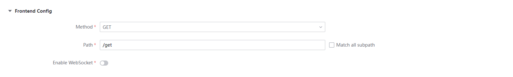

Description:
- Path variables can be configured in the request path, such as `/blog/{blog_id}`

#### 1.4.3 Back-end configuration

> Back-end configuration determines where this interface request will be forwarded, what is the target request method and path

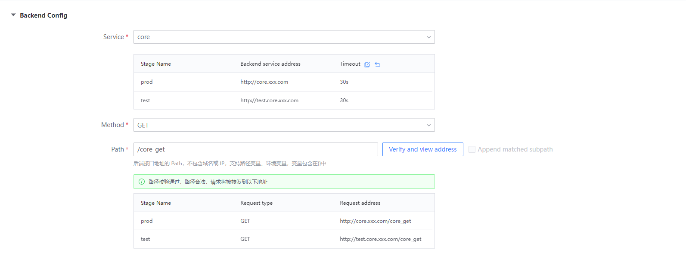

Description:
- Select the back-end service, for example, this API will be forwarded to the back-end service core (after selection, the clear back-end service address and timeout configuration will be displayed)
- Configure the request method and path. After configuration, you can click [Verify and view address] to see the final address

### 1.5 Generate version

After adding, modifying/deleting resource configuration, you need to generate a version and publish it to the target environment to take effect; (similar to git tagging, publishing the tag to the target environment); essentially, the purpose of generating a version is to generate a configuration `snapshot`, which is published to the target environment through the version to avoid changes on the management side affecting the requests being processed online

Entrance: Left menu [Resource Management] - [Resource Version] - [Generate Version]

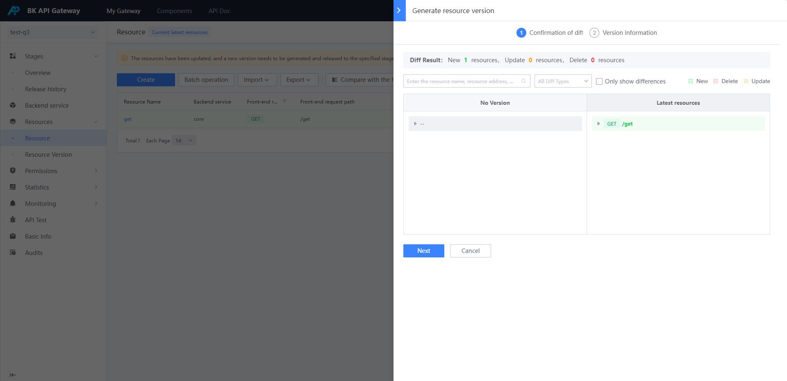

After clicking [Generate Version], the difference between the data in the current editing area and the last version will be compared first, that is, what has been changed this time (similar to git diff）

Confirm that the compared changes are within expectations, and click [Next]

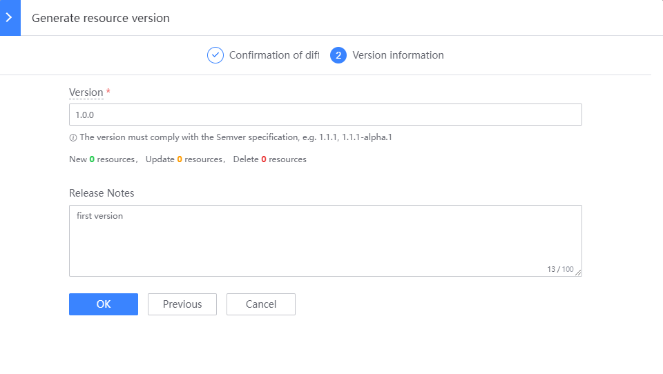

At this time, you need to confirm the version information, fill in the version number and version log, and click [OK]

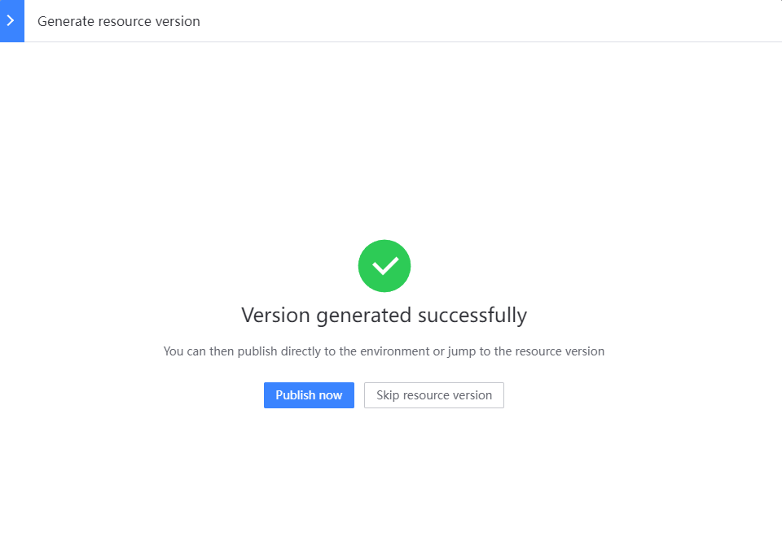

At this time, you can [Publish immediately] or [Jump to resource version] to view the latest generated version

### 1.6 Release

Entrance:

1. [Publish immediately] after generating the version

2. Find the version record in the left menu [Resource Management]-[Resource Version] and select [Publish to Environment]

3. The left menu [Environment Management]- [Environment Overview] Find the target environment and select [Publish Resources]

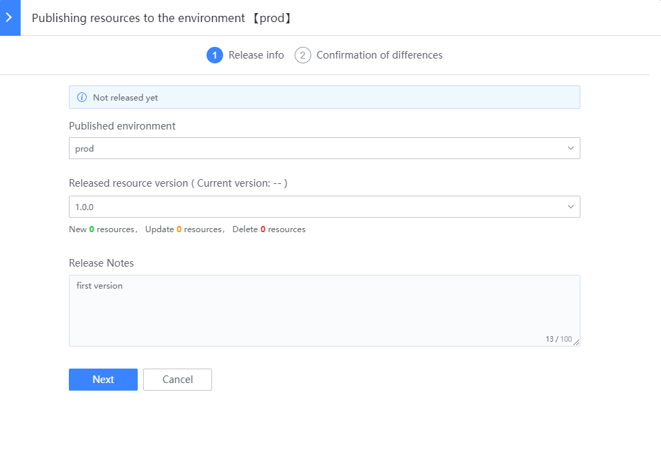

Click [Next] to start the comparison logic again, and compare the difference between the current environment effective version and the version to be released

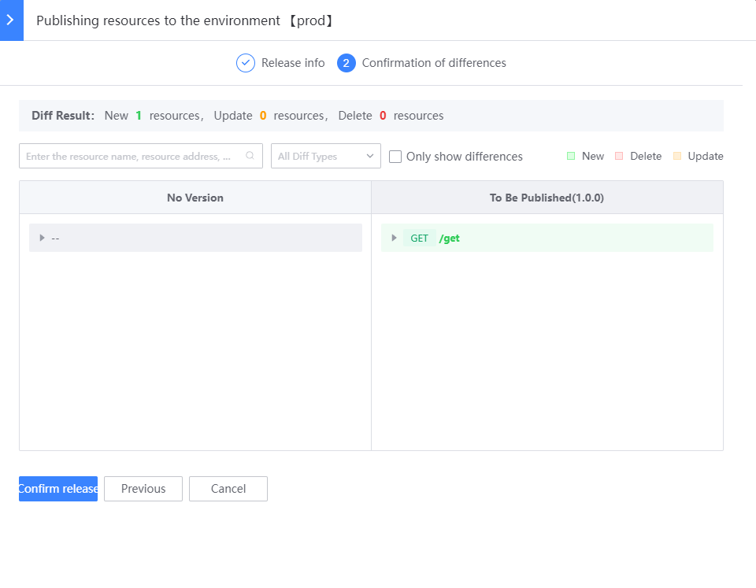

Click [Confirm Release]

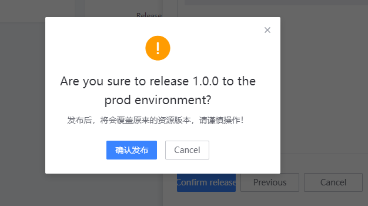

Confirm again to start publishing

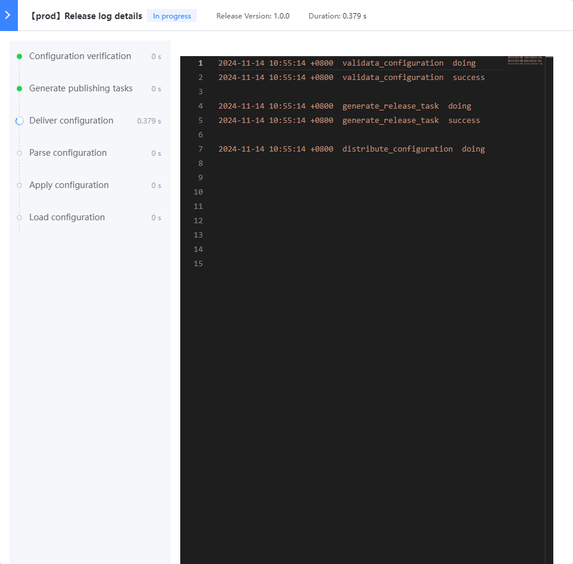

## 2. Management and Debugging

### 2.1 Permission Management

- [Permission Management]- [Permission Approval]: You can see the documents applied by the application developer in the BlueKing Developer Center - Cloud API, and approve them. Only after approval can the application have the permission to call the gateway API

- [Permission Management]- [Application Permission]: You can see the current permission information and can [actively authorize]

- [Permission Management] - [Vertical Approval]: You can see all permission approval records

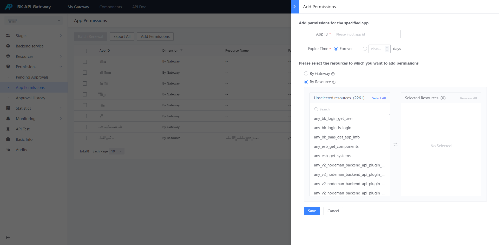

Description:
- In active authorization, you can authorize by gateway or by resource dimension. The dimension of `by gateway` means that the application has the permission to call all interfaces of the gateway (including existing and future additions); the dimension of `by resource` means that the application only has partial interface permissions

### 2.2 Online Debugging

After creating or updating resources and related plug-ins, generating a version and publishing it to the target environment, you can select the environment, request resources, and fill in the relevant parameters for debugging in [Online Debugging].

Note that the new or modified resources must be generated and published to the target environment before they can be seen/taken effect here

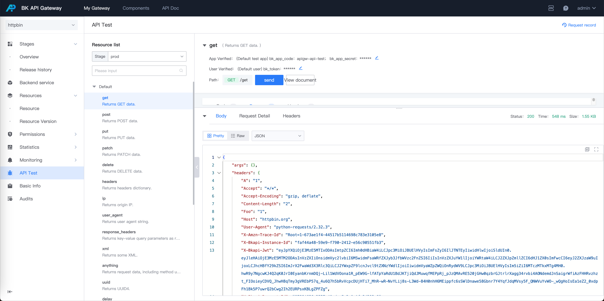

### 2.3 Running data

You can view the gateway log in [Running data] - [Log], and filter the data of interest according to time/environment/status code/request_id and other conditions

Note: Requests with status code 200 will not record the response body

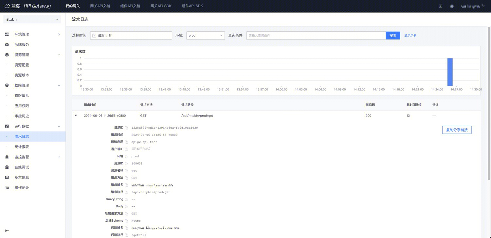

You can view the statistical chart in [Running data] - [Statistical report]

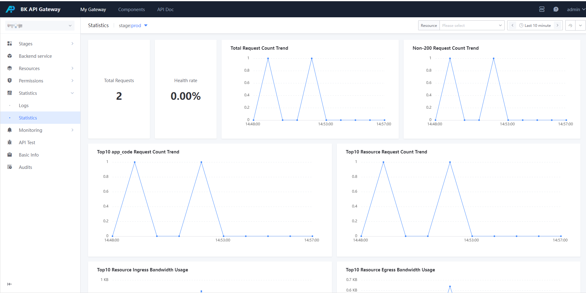

## 3. Enhanced functions

### 3.1 Configure plug-ins

If all resources relative to an environment are effective, you can create a new plug-in in the environment
Entrance: [Environment Overview] - [Details Mode] - [Plugin Management]

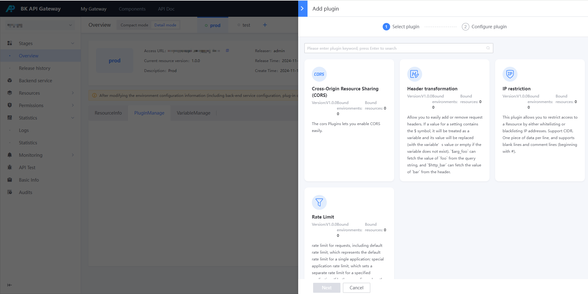

If it is only effective for a certain resource, you can create a new plugin on the resource
Entrance: [Resource Management] - [Resource Configuration] - Find the resource - Click the plugin name or plugin number - [Add plugin]

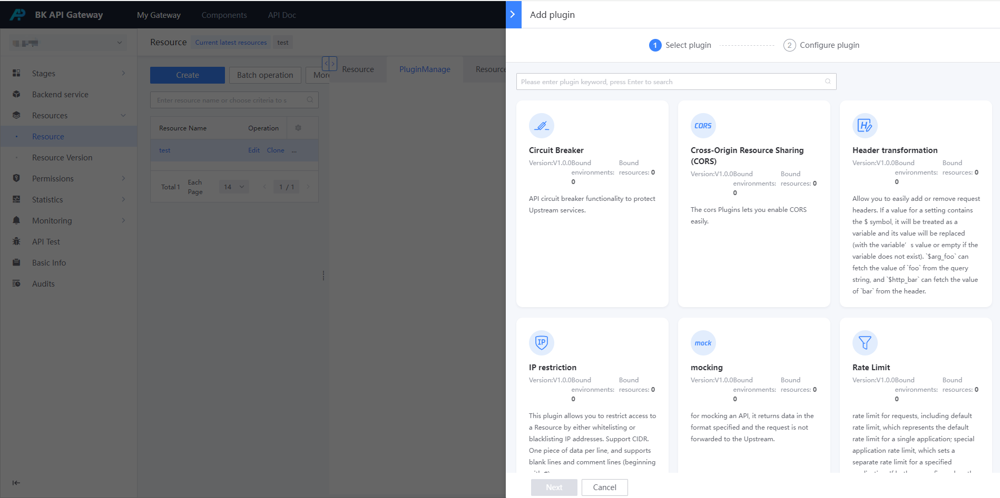

Currently supported plugins:

- [Support cross-domain CORS](../Plugins/cors.md)

- [Enable IP access control](../Plugins/ip-restriction.md)

- [Enable frequency limit](../Plugins/rate-limit.md)

- [Request header conversion](../Plugins/header-rewrite.md)

### 3.2 Provide documentation

In the left menu [Resource Management] - [Resource Configuration] - In the resource list, you can click [Add Document]

For more details, see [How to maintain gateway documents](manage-document.md)

After editing the document, you can generate and publish it, and then view it online in [[Gateway API Document]].

Note: Documents can only be viewed online when the gateway and resources are public.

### 3.3 Generate SDK

In the version list of [Resource Management]-[Resource Version] in the left menu, you can click [Generate SDK]

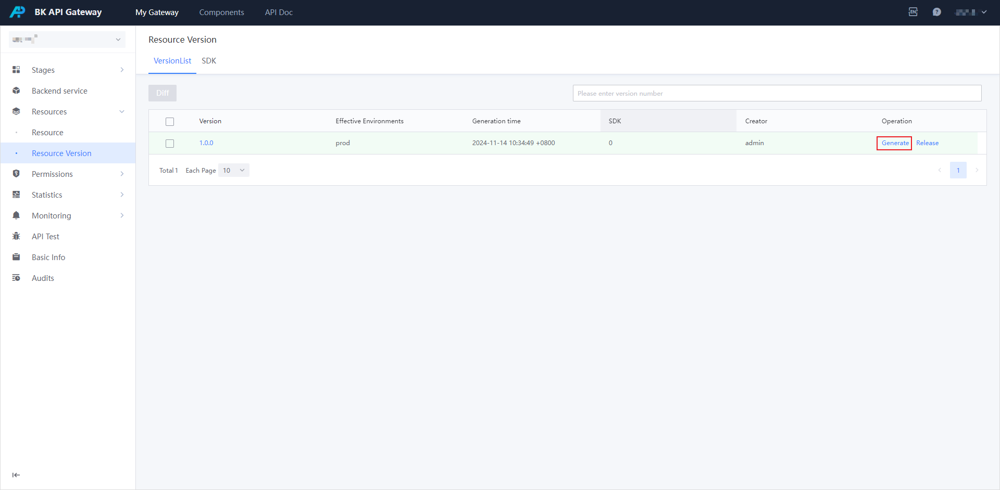

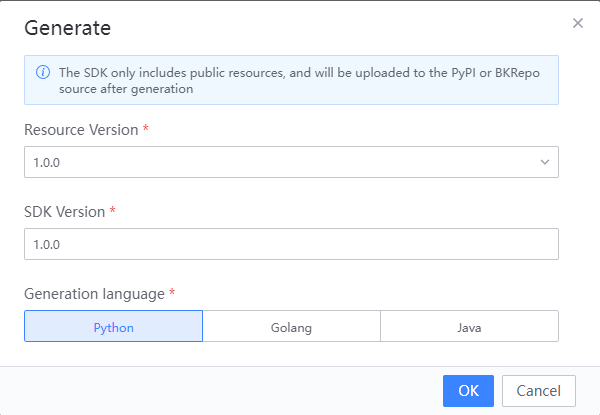

Configure relevant information, select the corresponding language, and click OK to generate the SDK;

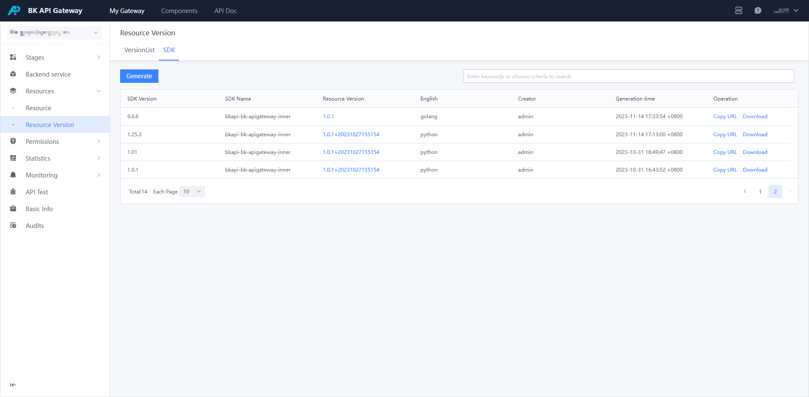

After generation,

If the gateway is public, it will be visible in the list of `Gateway API SDK`, and developers can download/install the SDK

### 3.4 Configure monitoring alarms

When the gateway fails to request the backend interface, you can configure alarm rules to alert the gateway maintainer or other notification objects.

Currently, the gateway supports configuring alarm rules for three types of backend errors
- Alarm when the backend response status code is 5xx, the backend interface responds normally, but the response status code is 500 ~ 599
- Alarm when the request backend response timeout occurs, the backend interface response time exceeds the timeout time set by the resource
- Alarm when the request backend 502 error occurs, when the backend interface is requested, a network error occurs

When creating a gateway, three types of alarm policies will be created by default.
On the gateway management page, expand the left menu **Monitoring Alarm**, click **Alarm Policy**, and open the alarm policy management page. Gateway administrators can create, edit, or disable alarm policies.

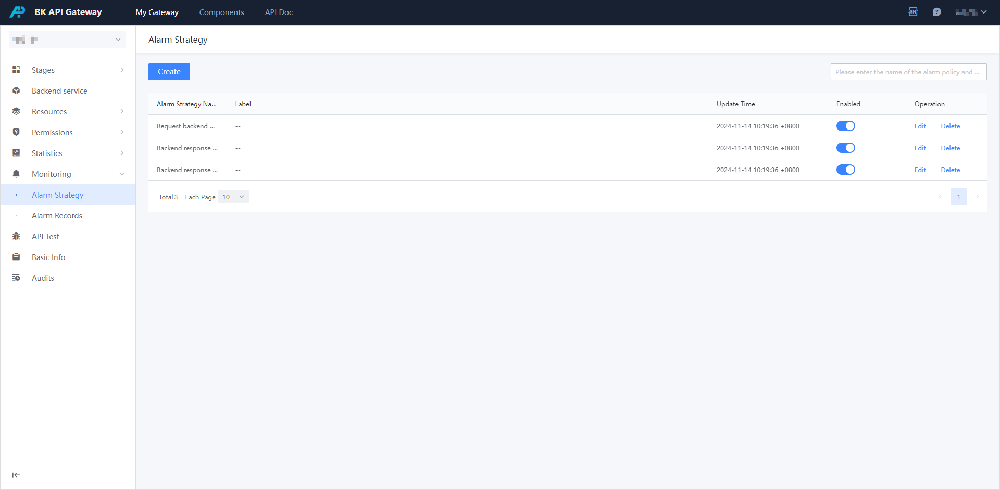

### 3.5 Self-service access and import and export

For details, see:

- [How to import and export resources](import-and-export.md)
- [Automatic access](auto-connect-gateway.md)