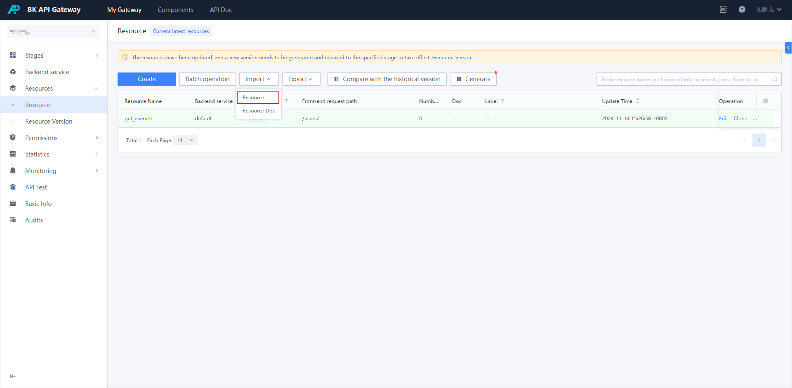
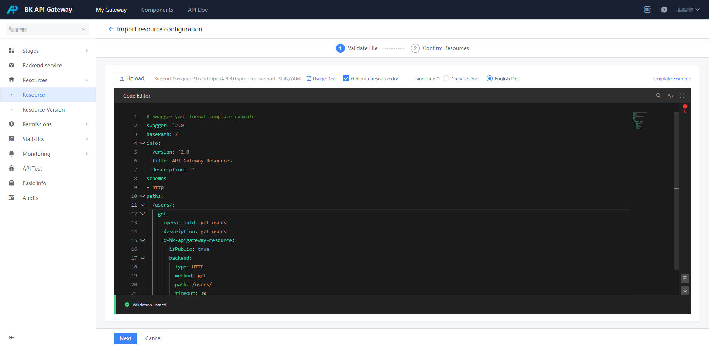
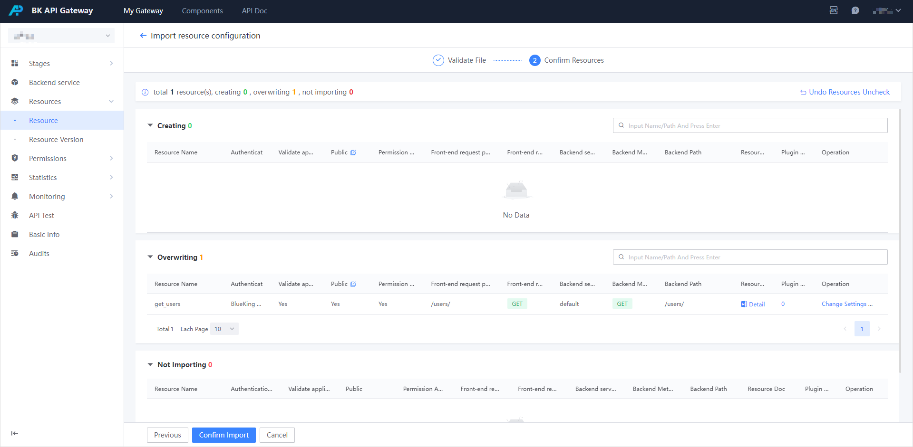
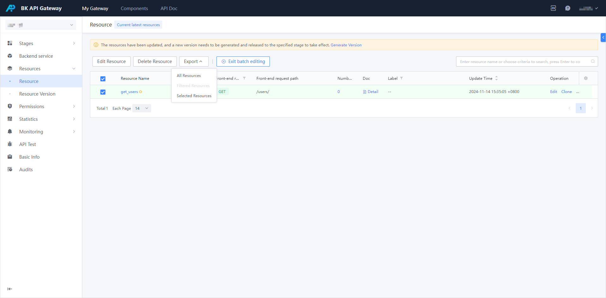
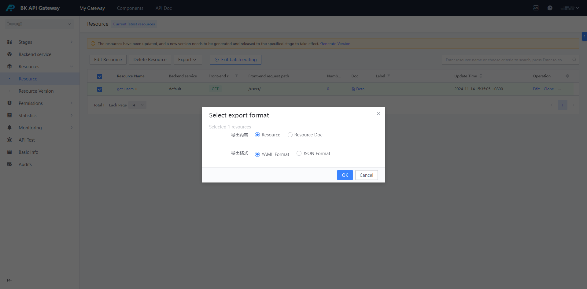

### Notes

Starting from version 1.13 of the gateway, plugin configuration export is supported, that is, the plugin configuration of the resource will be exported along with the resource, and then if this configuration file is used to import, the corresponding plugin configuration will take effect.

Therefore, **if it is an environment-related configuration, such as IP whitelist/CORS, etc., after the resource is exported, you need to edit the configuration file according to the actual situation and remove unnecessary plugin configuration**.

### Import resources

1. Select `Import`/`Resource Configuration` on the list page of resource management



2. Provide a swagger file or directly edit the swagger content of the resource configuration.



> For detailed `swagger` configuration instructions, see: [swagger](./swagger-explain.md)

3. Click Next and confirm the import.



> You can also import documents directly while importing resources. For details, see: [How to maintain gateway documents](./manage-document.md)

### Resource export

1. Select the resource you want to import on the resource list page, and then click `Export`



2. Select the export format and select Export.




```yaml

swagger: '2.0'
basePath: /
info:
  version: '2.0'
  title: API Gateway Resources
  description: ''
schemes:
- http
paths:
  /users/:
    get:
      operationId: get_users2
      description: get users
      tags:
      - test
      responses:
        default:
          description: ''
      x-bk-apigateway-resource:
        isPublic: true
        allowApplyPermission: true
        matchSubpath: false
        backend:
          name: default
          method: get
          path: /users/
          matchSubpath: false
          timeout: 30
        pluginConfigs:
        - type: bk-rate-limit
          yaml: |
            rates:
              bk_demo:
              - period: 1
                tokens: 300
              __default:
              - period: 1
                tokens: 100
        authConfig:
          userVerifiedRequired: false
          appVerifiedRequired: true
          resourcePermissionRequired: true
        descriptionEn:


```


